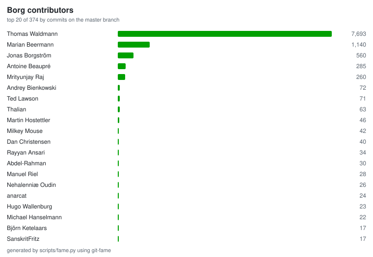

# Contributors

374 people have contributed to Borg, with 10,873 commits in total.
Thanks to everyone who helped!

Generated on 2026-08-17 by `scripts/fame.py`, which computes the statistics with
[git-fame](https://github.com/casperdcl/git-fame), from the `master` branch
only - commits that exist solely on other branches or in unmerged pull requests
are not counted.

This list is only a rough summary: it counts commits and lines, which say
nothing about reviews, bug reports, translations, documentation review, support
work or funding.  See `AUTHORS` for a manually maintained list of contributors.

"Lines" are surviving lines of code: lines of the current master that
`git blame` attributes to that author.  Code that was later rewritten does not
show up there, so the number understates early contributions.  Generated files
(such as the Excalidraw sources of the documentation figures) are excluded.

| Contributor | Commits | Lines | Files |
|:---|---:|---:|---:|
| Thomas Waldmann | 7,261 | 88,646 | 510 |
| Marian Beermann | 1,140 | 8,149 | 156 |
| Jonas Borgström | 560 | 970 | 38 |
| Antoine Beaupré | 285 | 441 | 33 |
| Mrityunjay Raj | 237 | 9,094 | 103 |
| Andrey Bienkowski | 72 | 210 | 16 |
| Ted Lawson | 71 | 4,596 | 39 |
| Thalian | 63 | 578 | 31 |
| Martin Hostettler | 46 | 2,559 | 9 |
| Milkey Mouse | 42 | 243 | 13 |
| dependabot[bot] | 41 | 12 | 3 |
| Dan Christensen | 40 | 5 | 2 |
| Rayyan Ansari | 34 | 88 | 12 |
| Abdel-Rahman | 30 | 2 | 2 |
| Manuel Riel | 28 | 94 | 6 |
| Nehalenniæ Oudin | 26 | 48 | 11 |
| anarcat | 24 | 34 | 4 |
| Hugo Wallenburg | 23 | 1,181 | 11 |
| Michael Hanselmann | 22 | 71 | 3 |
| Björn Ketelaars | 17 | 33 | 6 |
| SanskritFritz | 17 | 0 | 0 |
| Lee Bousfield | 14 | 160 | 9 |
| Alan Jenkins | 14 | 35 | 2 |
| Daniel Rudolf | 13 | 221 | 14 |
| Robin Schneider | 13 | 19 | 8 |
| Elmar Hoffmann | 12 | 90 | 6 |
| Jürg Rast | 12 | 73 | 11 |
| Ronny Pfannschmidt | 12 | 20 | 4 |
| mh4ckt3mh4ckt1c4s | 11 | 0 | 0 |
| finefoot | 10 | 18 | 3 |
| Teemu Toivanen | 10 | 14 | 2 |
| Lauri Niskanen | 10 | 5 | 2 |
| James Buren | 10 | 2 | 2 |
| Emmo Emminghaus | 9 | 60 | 9 |
| Ed Blackman | 9 | 13 | 3 |
| rugk | 9 | 13 | 5 |
| Carlo Teubner | 9 | 3 | 3 |
| Per Guth | 9 | 1 | 1 |
| Jakob Schnitzer | 8 | 35 | 1 |
| Josh Soref | 8 | 3 | 3 |
| Gianfranco Costamagna | 7 | 10 | 6 |
| Frank Sachsenheim | 7 | 2 | 1 |
| Hartmut Goebel | 7 | 0 | 0 |
| William D. Jones | 6 | 250 | 6 |
| Michael Deyaso | 6 | 168 | 14 |
| Peter Gerber | 6 | 103 | 9 |
| Alf Mikula | 6 | 19 | 1 |
| Felix Schwarz | 6 | 4 | 2 |
| Alexander-N | 6 | 0 | 0 |
| Paul D | 5 | 185 | 46 |
| Simon Frei | 5 | 132 | 3 |
| Dominik Stadler | 5 | 77 | 1 |
| elandorr | 5 | 40 | 3 |
| remyabel | 5 | 25 | 3 |
| Alexander 'Leo' Bergolth | 5 | 24 | 3 |
| infectormp | 5 | 18 | 2 |
| Mark Edgington | 5 | 10 | 3 |
| step21 | 5 | 1 | 1 |
| Radu Ciorba | 5 | 0 | 0 |
| Charlie Herz | 4 | 628 | 5 |
| Robert Blenis | 4 | 90 | 4 |
| Ebuzer Celil Durmaz | 4 | 80 | 5 |
| Franco Ayala | 4 | 39 | 6 |
| Suryansh Pal | 4 | 36 | 9 |
| 8bit | 4 | 30 | 5 |
| Steve Groesz | 4 | 22 | 1 |
| Ryan Polley | 4 | 12 | 4 |
| Artem Sheremet | 4 | 10 | 1 |
| Thomas Kluyver | 4 | 8 | 2 |
| Josh Holland | 4 | 3 | 2 |
| Narendra Vardi | 4 | 3 | 1 |
| Alexander Pyhalov | 4 | 0 | 0 |
| oxiedi | 4 | 0 | 0 |
| Parman Mohammadalizadeh | 3 | 343 | 5 |
| ThomasWaldmann | 3 | 153 | 1 |
| Stephan Herbers | 3 | 49 | 2 |
| Charmi Kadi | 3 | 46 | 2 |
| Martin Richtarsky | 3 | 34 | 4 |
| ntova | 3 | 27 | 8 |
| Daniel Reichelt | 3 | 25 | 5 |
| Lukas Fleischer | 3 | 23 | 2 |
| Michael Gajda | 3 | 23 | 2 |
| eoli3n | 3 | 22 | 1 |
| Will | 3 | 21 | 4 |
| Andrea Gelmini | 3 | 17 | 12 |
| Oleg Drokin | 3 | 16 | 1 |
| kmq | 3 | 15 | 1 |
| jungle-boogie | 3 | 13 | 1 |
| Helmut Grohne | 3 | 11 | 1 |
| Stephen | 3 | 10 | 2 |
| Dmitry Astapov | 3 | 8 | 1 |
| Gregor Kleen | 3 | 8 | 3 |
| valtron | 3 | 7 | 1 |
| Luke Dashjr | 3 | 4 | 1 |
| Stefan Tatschner | 3 | 3 | 1 |
| Divyesh | 3 | 1 | 1 |
| Thomas Harold | 3 | 1 | 1 |
| Danny Edel | 3 | 0 | 0 |
| Jeff Rizzo | 3 | 0 | 0 |
| Piotr Pawlow | 3 | 0 | 0 |
| Simon Heath | 3 | 0 | 0 |
| William Bonnaventure | 3 | 0 | 0 |
| Zhuoyun Wei | 3 | 0 | 0 |
| jhemmje | 3 | 0 | 0 |
| Thomas Portmann | 2 | 185 | 5 |
| Ken Kundert | 2 | 149 | 4 |
| trxvorr | 2 | 103 | 7 |
| Syed Ali Ghazi Ejaz | 2 | 90 | 4 |
| David Rambo | 2 | 87 | 3 |
| Soumik Dutta | 2 | 80 | 3 |
| Divyansh Agrawal | 2 | 43 | 4 |
| Eric Wolf | 2 | 38 | 3 |
| Ioannis Cherouvim | 2 | 30 | 2 |
| zDEFz | 2 | 27 | 1 |
| Atharva Varpe | 2 | 23 | 1 |
| Lapinot | 2 | 23 | 4 |
| ReethuVinta | 2 | 20 | 2 |
| Matthew Glazar | 2 | 18 | 3 |
| Joachim Breitner | 2 | 15 | 1 |
| Max-Julian Pogner | 2 | 15 | 1 |
| Łukasz Stelmach | 2 | 14 | 2 |
| Jerry Jacobs | 2 | 12 | 3 |
| Jonas Schäfer | 2 | 12 | 1 |
| kmille | 2 | 11 | 2 |
| jetchirag | 2 | 9 | 3 |
| Kurt Yoder | 2 | 8 | 1 |
| nain | 2 | 6 | 1 |
| Vaskebjoern | 2 | 5 | 1 |
| wormingdead | 2 | 5 | 1 |
| Fabian Fröhlich | 2 | 4 | 1 |
| Samuel | 2 | 4 | 3 |
| a1346054 | 2 | 4 | 3 |
| snsmac | 2 | 4 | 2 |
| Andreas Gruhler | 2 | 3 | 1 |
| Markus Engelbrecht | 2 | 3 | 1 |
| bbx0 | 2 | 3 | 1 |
| jan | 2 | 3 | 1 |
| AJ Jordan | 2 | 2 | 1 |
| MultisampledNight | 2 | 2 | 1 |
| Samuel BF | 2 | 2 | 1 |
| Saurav Sachidanand | 2 | 2 | 1 |
| Sophie Herold | 2 | 2 | 2 |
| azrdev | 2 | 2 | 1 |
| Cam Hutchison | 2 | 1 | 1 |
| Cthulhux | 2 | 1 | 1 |
| Leo Famulari | 2 | 1 | 1 |
| Russell Davis | 2 | 1 | 1 |
| textshell | 2 | 1 | 1 |
| Abogical | 2 | 0 | 0 |
| Andrew Skalski | 2 | 0 | 0 |
| Brian Johnson | 2 | 0 | 0 |
| Daniel Danner | 2 | 0 | 0 |
| Donny Ward | 2 | 0 | 0 |
| Herover | 2 | 0 | 0 |
| James Clarke | 2 | 0 | 0 |
| Jan Bader | 2 | 0 | 0 |
| Janne K | 2 | 0 | 0 |
| Jeremy Maitin-Shepard | 2 | 0 | 0 |
| Mark Lopez | 2 | 0 | 0 |
| Michael Herold | 2 | 0 | 0 |
| Michael Rupert | 2 | 0 | 0 |
| Mitch Bigelow | 2 | 0 | 0 |
| Petros Moisiadis | 2 | 0 | 0 |
| Radek Podgorny | 2 | 0 | 0 |
| Stavros Korokithakis | 2 | 0 | 0 |
| Yornik Heyl | 2 | 0 | 0 |
| lyh16 | 2 | 0 | 0 |
| motwok | 2 | 0 | 0 |
| sven | 2 | 0 | 0 |
| user062 | 2 | 0 | 0 |
| Tarrailt | 1 | 371 | 8 |
| Benedikt Seidl | 1 | 116 | 1 |
| axapaxa | 1 | 105 | 2 |
| Aleksey Korol | 1 | 95 | 1 |
| ebabcock93 | 1 | 84 | 1 |
| Rohan salunke | 1 | 75 | 9 |
| mrityunjay | 1 | 75 | 5 |
| Xiaocheng Song | 1 | 60 | 4 |
| Vedant Patel | 1 | 40 | 3 |
| Mike Mason | 1 | 38 | 3 |
| borkd | 1 | 37 | 1 |
| James Vasile | 1 | 36 | 1 |
| Uriel | 1 | 30 | 1 |
| vancheese | 1 | 28 | 8 |
| Nic Donaldson | 1 | 26 | 1 |
| Mike | 1 | 23 | 1 |
| Sitaram Chamarty | 1 | 23 | 1 |
| Jonathan Zacsh | 1 | 21 | 1 |
| Sam H | 1 | 18 | 2 |
| Félix Sipma | 1 | 13 | 1 |
| remyabel2 | 1 | 13 | 1 |
| Antonio Larrosa | 1 | 12 | 1 |
| Atemu | 1 | 11 | 2 |
| Reiko Asakura | 1 | 11 | 2 |
| James Rowell | 1 | 8 | 1 |
| Graham Stockton | 1 | 7 | 1 |
| Greg Grossmeier | 1 | 7 | 1 |
| Nikolaus Rath | 1 | 7 | 1 |
| Dark Dragon | 1 | 6 | 1 |
| Jubjub | 1 | 6 | 1 |
| Mher Kazandjian | 1 | 6 | 1 |
| TawfeeqShaik | 1 | 6 | 1 |
| edvatar | 1 | 6 | 2 |
| Florent Hemmi | 1 | 5 | 1 |
| Leo Antunes | 1 | 5 | 1 |
| dataprolet | 1 | 5 | 1 |
| Alexandr Kozlinskiy | 1 | 4 | 1 |
| Eddie Carswell | 1 | 4 | 1 |
| Phil Kulin | 1 | 4 | 1 |
| abebeos | 1 | 4 | 1 |
| goebbe | 1 | 4 | 1 |
| Dominik Tugend | 1 | 3 | 1 |
| Kevin Yin | 1 | 3 | 1 |
| Mateusz Konieczny | 1 | 3 | 1 |
| Tavlor | 1 | 3 | 1 |
| Zhou Qiankang | 1 | 3 | 1 |
| Daniel Dent | 1 | 2 | 1 |
| Maltimore | 1 | 2 | 1 |
| Michael Bauer | 1 | 2 | 1 |
| Paweł Kotiuk | 1 | 2 | 1 |
| Tom Denley | 1 | 2 | 2 |
| jminer74 | 1 | 2 | 1 |
| philippje | 1 | 2 | 1 |
| tree-wall | 1 | 2 | 1 |
| vhadzhiev | 1 | 2 | 1 |
| Abhijeet | 1 | 1 | 1 |
| Andreas Vögele | 1 | 1 | 1 |
| Ceesjan Luiten | 1 | 1 | 1 |
| Christian Paul | 1 | 1 | 1 |
| Coenraad Loubser | 1 | 1 | 1 |
| Dee Newcum | 1 | 1 | 1 |
| Divyansh Singh | 1 | 1 | 1 |
| Emil M George | 1 | 1 | 1 |
| Fredrik Mikker | 1 | 1 | 1 |
| Hauke Rehfeld | 1 | 1 | 1 |
| Ivan Shapovalov | 1 | 1 | 1 |
| Jens Diemer | 1 | 1 | 1 |
| Jim Paris | 1 | 1 | 1 |
| Jonathan Rascher | 1 | 1 | 1 |
| Lars K.W. Gohlke | 1 | 1 | 1 |
| Marc Kohaupt | 1 | 1 | 1 |
| MartinKurtz | 1 | 1 | 1 |
| Matt Van Horn | 1 | 1 | 1 |
| Peter Zangerl | 1 | 1 | 1 |
| Robert Marcano | 1 | 1 | 1 |
| Stefan Majewsky | 1 | 1 | 1 |
| Svein Ove Aas | 1 | 1 | 1 |
| Vagrant Cascadian | 1 | 1 | 1 |
| ahtaarra | 1 | 1 | 1 |
| targhs | 1 | 1 | 1 |
| Adam Kouse | 1 | 0 | 0 |
| Aidan Woods | 1 | 0 | 0 |
| Aiman | 1 | 0 | 0 |
| Alex Vorona | 1 | 0 | 0 |
| Alexander Meshcheryakov | 1 | 0 | 0 |
| Andraz Brodnik | 1 | 0 | 0 |
| Andrew Engelbrecht | 1 | 0 | 0 |
| André-Patrick Bubel | 1 | 0 | 0 |
| Ashmodei | 1 | 0 | 0 |
| Ben Creasy | 1 | 0 | 0 |
| Benedikt Heine | 1 | 0 | 0 |
| Benedikt Neuffer | 1 | 0 | 0 |
| Benjamin Pereto | 1 | 0 | 0 |
| Birkhoff Lee | 1 | 0 | 0 |
| Bruno Behnken | 1 | 0 | 0 |
| Chen Yufei | 1 | 0 | 0 |
| Chris Lamb | 1 | 0 | 0 |
| Christoph Trassl | 1 | 0 | 0 |
| Christopher Klooz | 1 | 0 | 0 |
| Cyril Roussillon | 1 | 0 | 0 |
| Dan Helfman | 1 | 0 | 0 |
| Dan Hipschman | 1 | 0 | 0 |
| David Fries | 1 | 0 | 0 |
| DifficultDerek | 1 | 0 | 0 |
| Eli Schwartz | 1 | 0 | 0 |
| Ellis Michael | 1 | 0 | 0 |
| Endareth | 1 | 0 | 0 |
| Evan Hempel | 1 | 0 | 0 |
| Fabian Weisshaar | 1 | 0 | 0 |
| Fabio Pedretti | 1 | 0 | 0 |
| Flachz | 1 | 0 | 0 |
| Florian Klink | 1 | 0 | 0 |
| Hans-Peter Jansen | 1 | 0 | 0 |
| Henry-Joseph Audéoud | 1 | 0 | 0 |
| Jakub Wilk | 1 | 0 | 0 |
| Jan | 1 | 0 | 0 |
| Jens Rantil | 1 | 0 | 0 |
| Jesus Fernandez Manzano | 1 | 0 | 0 |
| Joey | 1 | 0 | 0 |
| Johann Bauer | 1 | 0 | 0 |
| Johann Klähn | 1 | 0 | 0 |
| Johannes Wienke | 1 | 0 | 0 |
| Jonas Wunderlich | 1 | 0 | 0 |
| Julian Andres Klode | 1 | 0 | 0 |
| Julian Picht | 1 | 0 | 0 |
| Julien Lamy | 1 | 0 | 0 |
| Jürgen Gmach | 1 | 0 | 0 |
| KN4CK3R | 1 | 0 | 0 |
| Kevin | 1 | 0 | 0 |
| Kevin Puetz | 1 | 0 | 0 |
| Lars-Magnus Skog | 1 | 0 | 0 |
| Laurent | 1 | 0 | 0 |
| Lauri Alanko | 1 | 0 | 0 |
| Luke Murphy | 1 | 0 | 0 |
| Marcin Zajączkowski | 1 | 0 | 0 |
| Martin Stone | 1 | 0 | 0 |
| Marvin Gaube | 1 | 0 | 0 |
| Matthew R. Trower | 1 | 0 | 0 |
| Michael G. Noll | 1 | 0 | 0 |
| Nathan Musoke | 1 | 0 | 0 |
| Nick Cleaton | 1 | 0 | 0 |
| Niels Ole Salscheider | 1 | 0 | 0 |
| Niklas Meinzer | 1 | 0 | 0 |
| Nils Steinger | 1 | 0 | 0 |
| OEM Configuration (temporary user) | 1 | 0 | 0 |
| Ori Livneh | 1 | 0 | 0 |
| Pankaj Garg | 1 | 0 | 0 |
| Patrick Goering | 1 | 0 | 0 |
| Philip Kozeny | 1 | 0 | 0 |
| Philip Waritschlager | 1 | 0 | 0 |
| Philippe MIOSSEC | 1 | 0 | 0 |
| Profpatsch | 1 | 0 | 0 |
| RR | 1 | 0 | 0 |
| Ricardo M. Correia | 1 | 0 | 0 |
| Roberto Polli | 1 | 0 | 0 |
| Romain Vimont | 1 | 0 | 0 |
| Ruben Rodriguez | 1 | 0 | 0 |
| Sebastiaan Lokhorst | 1 | 0 | 0 |
| Serghei Iakovlev | 1 | 0 | 0 |
| Stefano Probst | 1 | 0 | 0 |
| Swanand01 | 1 | 0 | 0 |
| Thiago Macieira | 1 | 0 | 0 |
| Thomas Deutschmann | 1 | 0 | 0 |
| Thomas Schwinge | 1 | 0 | 0 |
| Tiago Donato | 1 | 0 | 0 |
| Tim Düsterhus | 1 | 0 | 0 |
| Timothy Burchfield | 1 | 0 | 0 |
| Tommy Nguyen | 1 | 0 | 0 |
| Tomás Andrighetti | 1 | 0 | 0 |
| TuXicc | 1 | 0 | 0 |
| Tung Dao | 1 | 0 | 0 |
| Viktor Bale | 1 | 0 | 0 |
| Vlad | 1 | 0 | 0 |
| Vladimir Malinovskii | 1 | 0 | 0 |
| Wladimir Palant | 1 | 0 | 0 |
| Yuri D'Elia | 1 | 0 | 0 |
| adrian5 | 1 | 0 | 0 |
| alex3d | 1 | 0 | 0 |
| alexskc | 1 | 0 | 0 |
| ash | 1 | 0 | 0 |
| ashmodei | 1 | 0 | 0 |
| bobthebadguy | 1 | 0 | 0 |
| cornop | 1 | 0 | 0 |
| eike-fokken | 1 | 0 | 0 |
| henfri | 1 | 0 | 0 |
| hiijoshi | 1 | 0 | 0 |
| jenkins | 1 | 0 | 0 |
| jeroen tiebout | 1 | 0 | 0 |
| kannes | 1 | 0 | 0 |
| klemens | 1 | 0 | 0 |
| lexa-a | 1 | 0 | 0 |
| lumbric | 1 | 0 | 0 |
| mirobertod | 1 | 0 | 0 |
| nain-F49FF806 | 1 | 0 | 0 |
| newtonne | 1 | 0 | 0 |
| nod0n | 1 | 0 | 0 |
| nyuszika7h | 1 | 0 | 0 |
| ololoru | 1 | 0 | 0 |
| pamaron | 1 | 0 | 0 |
| petrcech | 1 | 0 | 0 |
| schuft69 | 1 | 0 | 0 |
| sothix | 1 | 0 | 0 |
| sw9719 | 1 | 0 | 0 |
| viq | 1 | 0 | 0 |
