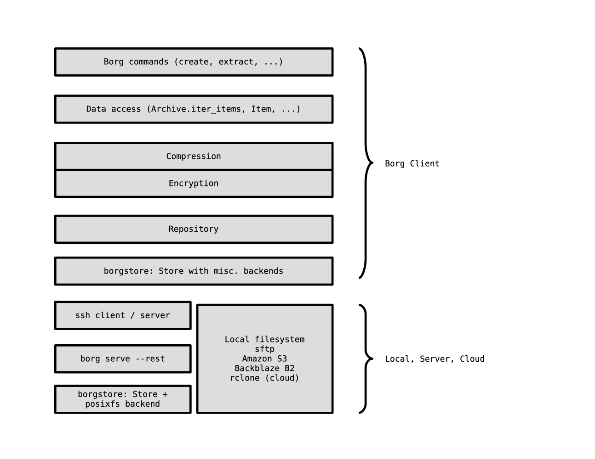

.. include:: global.rst.inc
.. _internals:

Internals
=========

The internals chapter describes and analyzes most of the inner workings
of Borg.

Borg uses a low-level, key-value store, the :ref:`repository`, and
implements a more complex data structure on top of it, which is made
up of the :ref:`manifest <manifest>`, :ref:`archives <archive>`,
:ref:`items <item>` and data :ref:`chunks`.

Each repository can hold multiple :ref:`archives <archive>`, which
represent individual backups that contain a full archive of the files
specified when the backup was performed.

Deduplication is performed globally across all data in the repository
(multiple backups and even multiple hosts), both on data and file
metadata, using :ref:`chunks` created by the chunker using a
content-defined chunking algorithm - the Gear rolling hash of FastCDC_
("fastcdc" chunker, the default), Buzhash_ ("buzhash" and "buzhash64"
chunker) or a universal hash followed by an AES pseudo-random function
("rabin-aes", "toeplitz-aes" and "goldilocks-aes" chunker) - or a simpler
fixed block size algorithm ("fixed" chunker).

To perform the repository-wide deduplication, a hash of each
chunk is checked against the :ref:`chunks index <index>`, which is a
hash table of all chunks that already exist.

    Layers in Borg. At the very top, commands are implemented, using
    a data access layer provided by the Archive and Item classes.
    Below that, the RepoObj class compresses the data (using a Compressor,
    see class RepoObj in ``repoobj.py``) and then hands it to the "key"
    object, which provides the authenticated encryption. The "key" object
    represents the sole trust boundary in Borg.
    The lowest layer is the repository accessed via class Repository.
    Repository uses ``borgstore`` internally.

.. toctree::
    :caption: Internals contents

    internals/security
    internals/data-structures
    internals/chunker
    internals/packs
    internals/frontends
