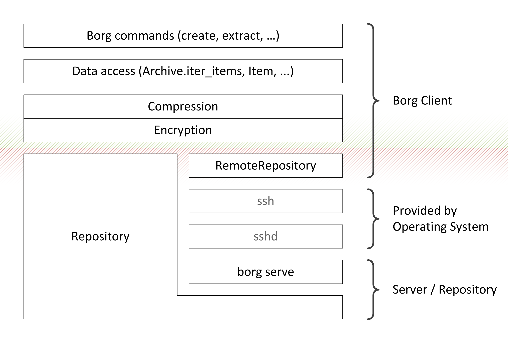

.. include:: global.rst.inc
.. _internals:

Internals
=========

This page documents the internal data structures and storage
mechanisms of |project_name|. It is partly based on `mailing list
discussion about internals`_ and also on static code analysis.

Borg uses a low-level, key-value store, the :ref:`repository`, and
implements a more complex data structure on top of it, which is made
up of the :ref:`manifest <manifest>`, :ref:`archives <archive>`,
:ref:`items <item>` and data :ref:`chunks`.

Each repository can hold multiple :ref:`archives <archive>`, which
represent individual backups that contain a full archive of the files
specified when the backup was performed.

Deduplication is performed globally across all data in the repository
(multiple backups and even multiple hosts), both on data and file
metadata, using :ref:`chunks` created by the chunker using the
Buzhash_ algorithm.

To actually perform the repository-wide deduplication, a hash of each
chunk is checked against the :ref:`chunks cache <cache>`, which is a
hash-table of all chunks that already exist.

    Layers in Borg. On the very top commands are implemented, using
    a data access layer provided by the Archive and Item classes.
    The "key" object provides both compression and authenticated
    encryption used by the data access layer. The "key" object represents
    the sole trust boundary in Borg.
    The lowest layer is the repository, either accessed directly
    (Repository) or remotely (RemoteRepository).

.. toctree::
    :caption: Internals contents

    internals/security
    internals/data-structures
    internals/frontends
