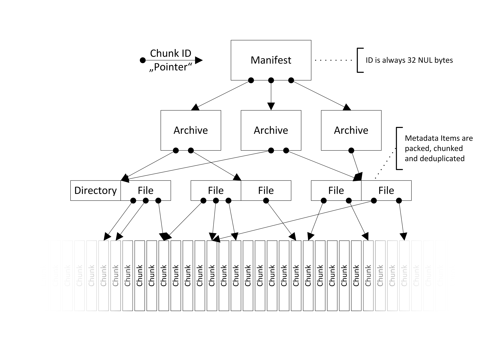
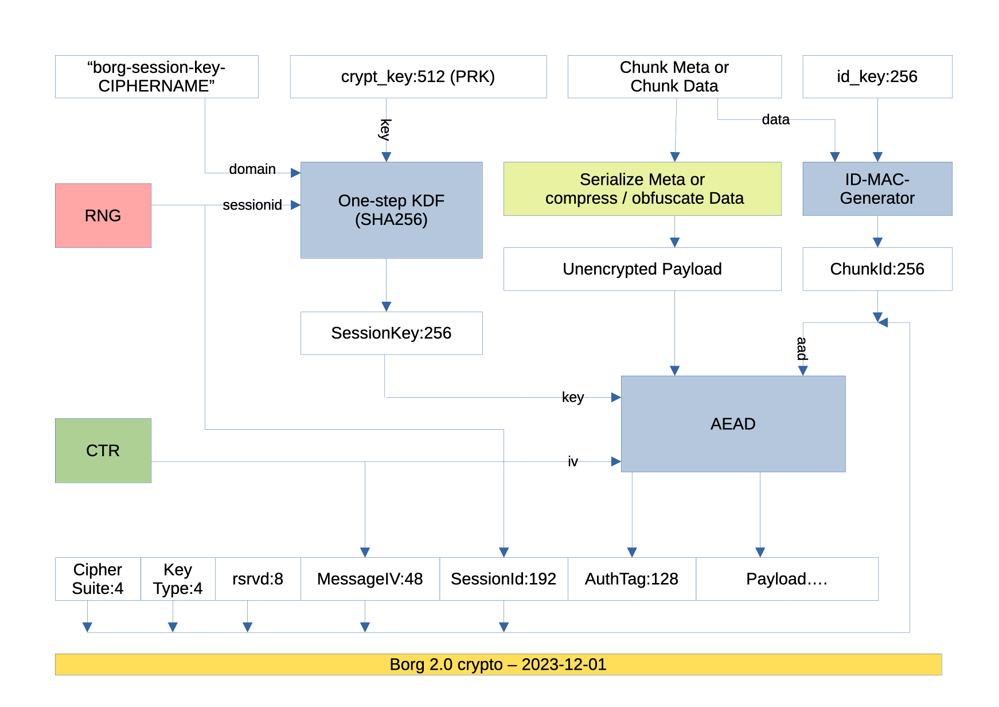

.. include:: ../global.rst.inc
.. highlight:: none

.. _data-structures:

Data structures and file formats
================================

This page documents the internal data structures and storage
mechanisms of Borg. It is partly based on mailing list
discussions and also on static code analysis.

.. todo:: Clarify terms, perhaps create a glossary.
          ID (client?) vs. key (repository?),
          chunks (blob of data in repo?) vs. object (blob of data in repo, referred to from another object?),

.. _repository:

Repository
----------

Borg stores its data in a `Repository`, which is a key-value store implemented
on top of ``borgstore`` (``borgstore.store.Store``, see ``repository.py``).
Store object names are organised in namespaces, and borg uses these:
``archives/``, ``cache/``, ``config/``, ``index/``, ``keys/``, ``locks/`` and
``packs/``.

Names within a namespace are flat, except for ``packs/``: it is configured
with one nesting level, so a pack file's name is prefixed with a directory
named after the first byte (2 hex digits) of the object name.

config/
  readme
    simple text object telling that this is a Borg repository
  id
    the unique repository ID encoded as hexadecimal number text
  version
    the repository version encoded as decimal number text
  manifest
    the manifest (see :ref:`manifest`), a repository object, binary
  space-reserve.N
    purely random binary data to reserve space, e.g. for disk-full emergencies.
    These objects are created and removed by ``borg repo-space``.

There is one pointer object per archive in this namespace, its name is the
hex-encoded archive ID (see :ref:`archive`):

archives/
  0000... .. ffff...

The (encrypted and compressed) repository objects are not stored one store
object each: many of them are batched into a **pack** file and that pack file
is stored as a single store object. Its name is the hex-encoded sha256 hash of
the pack file's content:

packs/
  00/ .. ff/
    0000... .. ffff...

index/
  0000... .. ffff...
    the chunks index (chunk ID -> location within a pack file), stored as a set
    of immutable, encrypted index fragments. A fragment's name is the
    hex-encoded sha256 hash of its content.

See :ref:`packs` for the pack file format, the ``index/`` namespace and how
both are written and compacted.

cache/
  checked-packs
    repository check results (pack id -> timestamp, result), as a hashtable with an
    appended integrity hash. Records are kept across checks: ``check --max-age``
    skips packs whose intact record is younger than the given age, and partial checks
    (``--max-duration``) verify the least-recently-checked packs first so repeated
    runs cover the whole repository. Records of corrupt packs are kept for repair and
    always re-verified. Records of packs no longer listed in packs/ are pruned when a
    check finishes.
  referenced-by-archive.<hex-encoded archive ID>
    what one archive references (object ID -> plaintext object size), plus the file
    count and content size of that archive, with an appended sha256 for integrity.
    It lets a following ``borg compact`` or ``borg analyze`` skip re-reading the items
    of an unchanged archive.
  chunkindex-invalid
    a marker object: while it is present, the chunks index in ``index/`` is considered
    invalid. It is written before deleting index fragments and removed after the last
    stale fragment is gone, so an interrupted run does not leave the remaining
    fragments looking like a complete index.

Note that this ``cache/`` namespace is inside the repository (and thus shared by
all clients); it is not the client-local cache described in
:ref:`the files cache <cache>`.

keys/
    When using repokey mode, the encrypted, passphrase protected borg keys are
    stored here as a base64 encoded text. The sha256 content hash of the
    stored borg key is used for the name.

    A repository may contain *multiple* such borg keys (one per passphrase) to
    support the :ref:`multiple borg keys <borgcrypto_multiple_keys>` feature.
    keyfile and repokey borg keys use the same format and naming (only the
    storage location differs).

locks/
  used by the locking system to manage shared and exclusive locks, see
  :ref:`storelocking`.

Keys
~~~~

Repository object IDs (which are used as key into the key-value store) are
byte strings of fixed length (256-bit, 32 bytes), computed like this::

  key = id = id_hash(plaintext_data)  # plain = not encrypted, not compressed, not obfuscated

For the **encrypted** modes (``aes256-ocb``, ``chacha20-poly1305``), the id_hash
function is selected via ``borg repo-create --id-hash``, independently of
``--encryption``. It is a keyed MAC over the plaintext (keyed by ``id_key``):
``sha256`` selects HMAC-SHA256, ``blake3`` selects a keyed BLAKE3.

For the modes **without encryption**, the id hash is what protects the data, so
it is part of the mode name and not separately selectable (giving ``--id-hash``
in addition is only accepted if it agrees with the mode name):

- ``authenticated-sha256`` / ``authenticated-blake3`` have key material and thus
  use the same keyed MACs as the encrypted modes.
- ``none-sha256`` / ``none-blake3`` have no key at all, so the id is a plain
  SHA-256 resp. BLAKE3 hash of the plaintext. All repositories of such a mode
  therefore deduplicate identically, see :ref:`tagged_envelope`.

As the id / key is used for deduplication, id_hash must be a cryptographically
strong hash or MAC.

Repository objects
~~~~~~~~~~~~~~~~~~

Repository objects are not stored as separate store objects. Many of them are
written into one **pack** file, which is then stored as a single store object
below ``packs/``. Where an object lives inside which pack is recorded in the
chunks index (see :ref:`index`), so reading one object is a single ranged read
from its pack file.

A repo object starts with a fixed-size, unencrypted header
(``RepoObj.obj_header``, a ``Struct("<8sB32sII")``, 49 bytes), followed by the
metadata and the data:

* magic, 8 bytes: ``BORG_OBJ``
* format version, 1 byte
* chunk id, 32 bytes
* meta size, 32-bit unsigned little-endian
* data size, 32-bit unsigned little-endian
* meta, meta size bytes
* data, data size bytes

The overall size of repository objects varies from very small (a small source
file will be stored as a single repository object) to medium (big source files will
be cut into medium-sized chunks of some MB).

Metadata and data are separately encrypted and authenticated (depending on
the user's choices), with the header bound into the authentication as
additional authenticated data. See :ref:`pack-format` for the details of the
header, the authentication and how objects are laid out within a pack file.

See :ref:`data-encryption` for a graphic outlining the anatomy of the
encryption.

Repo object metadata
~~~~~~~~~~~~~~~~~~~~

Metadata is a MessagePack-encoded (and encrypted/authenticated) dict with:

- type (the repo object type, a one-character string: ``M`` manifest,
  ``A`` archive metadata, ``C`` archive metadata stream chunk ids,
  ``S`` archive metadata stream chunk, ``F`` file content stream chunk -
  see the ``ROBJ_*`` constants)
- ctype (compression type 0..255)
- clevel (compression level, one byte, interpreted depending on ctype - see
  :ref:`data-compression`)
- csize (overall compressed (and maybe obfuscated) data size)
- psize (only when obfuscated: payload size without the obfuscation trailer)
- olevel (only when obfuscated: the obfuscation level)
- size (uncompressed size of the data)

Having this separately encrypted metadata makes it more efficient to query
the metadata without having to read, transfer and decrypt the (usually much
bigger) data part.

The compression `ctype` and `clevel` is explained in :ref:`data-compression`.

Compaction
~~~~~~~~~~

``borg compact`` is used to free repository space. It will:

- get all object IDs (and where they are stored) from the chunks index
- read all archives and determine which object IDs are in use
- report object IDs used by archives, but not present in the repository
  (data loss!)
- really delete the soft-deleted archives (unless objects are missing - then
  they are kept, so ``borg undelete`` stays possible until ``borg check
  --repair`` has run)
- free space one pack file at a time - a single object can not be removed from
  a pack file, only a whole pack file can be deleted or rewritten:

  - a pack file whose indexed objects are all unused is deleted
  - a pack file with some unused objects is rewritten without them, but only if
    the wasted bytes reach the ``--threshold`` percentage
  - very small pack files are merged into bigger ones
- update the chunks index in ``index/`` accordingly
- with ``--stats``, compute statistics about:

  - compression and deduplication factors
  - repository space usage and space freed

The object graph
----------------

On top of the simple key-value store offered by the Repository_,
Borg builds a much more sophisticated data structure that is essentially
a completely encrypted object graph. Objects, such as archives_, are referenced
by their chunk ID, which is cryptographically derived from their contents.
More on how this helps security in :ref:`security_structural_auth`.

.. _manifest:

The manifest
~~~~~~~~~~~~

The manifest is a repository object stored as the ``config/manifest`` store
object (see Repository_), so it is not inside a pack file and not in the chunks
index. Different from all other repository objects, the chunk id in its object
header is not the hash of its content, but all-zero
(``Manifest.MANIFEST_ID``).

The manifest is rewritten each time an archive is created, deleted,
or modified. It looks like this:

.. code-block:: python

    {
        'version': 2,
        'timestamp': '2017-05-05T12:42:23.042864',
        'archives': {},
        'config': {
            'item_keys': ['acl_access', 'acl_default', ...],
        },
    }

Borg 2 always writes *version* 2. Reading also accepts version 1, which is what
borg 1.x repositories have (they are supported read-only, e.g. for
``borg transfer``). The versions differ in the way feature flags are handled,
described below.

The *timestamp* field is used to avoid logical replay attacks where
the server just resets the repository to a previous state.

The *archives* dict is always empty: the list of archives is not part of the
manifest, each archive has its own pointer object in the ``archives/``
namespace, see :ref:`archive`.

*config* is a general-purpose location for additional metadata. All versions
of Borg preserve its contents. Borg stores these keys in there:

*config['item_keys']* is a list containing all Item_ keys that may be
encountered in the repository. It is used by *borg check*, which verifies that
all keys in all items are a subset of these keys. Thus, an older version of
*borg check* supporting this mechanism can correctly detect keys introduced in
later versions.

*config['feature_flags']* are the feature flags of the repository, see below.

Feature flags
+++++++++++++

Feature flags are used to add features to data structures without causing
corruption if older versions are used to access or modify them. The main issues
to consider for a feature flag oriented design are flag granularity,
flag storage, and cache_ invalidation.

Feature flags are divided in approximately three categories, detailed below.
Due to the nature of ID-based deduplication, write (i.e. creating archives) and
read access are not symmetric; it is possible to create archives referencing
chunks that are not readable with the current feature set. The third
category are operations that require accurate reference counts, for example
archive deletion and check.

As the manifest is always updated and always read, it is the ideal place to store
feature flags, comparable to the super-block of a file system. The only problem
is to recover from a lost manifest, i.e. how is it possible to detect which feature
flags are enabled, if there is no manifest to tell. This issue is left open at this time,
but is not expected to be a major hurdle; it doesn't have to be handled efficiently, it just
needs to be handled.

Lastly, cache_ invalidation is handled by noting which feature
flags were and which were not understood while manipulating a cache.
This allows borg to detect whether the cache needs to be invalidated,
i.e. rebuilt from scratch. See `Cache feature flags`_ below.

The *config* key stores the feature flags enabled on a repository:

.. code-block:: python

    config = {
        'feature_flags': {
            'read': {
                'mandatory': ['some_feature'],
            },
            'check': {
                'mandatory': ['other_feature'],
            }
            'write': ...,
            'delete': ...
        },
    }

The top-level distinction for feature flags is the operation the client intends
to perform,

| the *read* operation includes extraction and listing of archives,
| the *write* operation includes creating new archives,
| the *delete* (archives) operation,
| the *check* operation requires full understanding of everything in the repository.
|

These are weakly set-ordered; *check* will include everything required for *delete*,
*delete* will likely include *write* and *read*. However, *read* may require more
features than *write* (due to ID-based deduplication, *write* does not necessarily
require reading/understanding repository contents).

Each operation can contain several sets of feature flags. Only one set,
the *mandatory* set is currently defined.

Upon reading the manifest, the Borg client has already determined which operation
should be performed. If feature flags are found in the manifest, the set
of feature flags supported by the client is compared to the mandatory set
found in the manifest. If any unsupported flags are found (i.e. the mandatory set is
not a subset of the features supported by the Borg client used), the operation
is aborted with a *MandatoryFeatureUnsupported* error:

    Unsupported repository feature(s) {'some_feature'}. A newer version of borg is required to access this repository.

Older Borg releases do not have this concept and do not perform feature flags checks.
These are locked out with manifest version 2, which is what Borg 2 always writes:
the only difference between manifest versions 1 and 2 is that the latter is only
accepted by Borg releases implementing feature flags.

.. _Cache feature flags:
.. rubric:: Cache feature flags

:ref:`The local cache <cache>` does not have its separate set of feature flags.
Instead, Borg stores which flags were used to create or modify a cache (as the
*mandatory_features* / *ignored_features* keys in the cache ``config`` file).

All mandatory manifest features from all operations are gathered in one set.
Then, two sets of features are computed;

- those features that are supported by the client and mandated by the manifest
  are added to the *mandatory_features* set,
- the *ignored_features* set comprised of those features mandated by the manifest,
  but not supported by the client.

Because the client previously checked compliance with the mandatory set of features
required for the particular operation it is executing, the *mandatory_features* set
will contain all necessary features required for using the cache safely.

Conversely, the *ignored_features* set contains only those features which were not
relevant to operating the cache. Otherwise, the client would not pass the feature
set test against the manifest.

When opening a cache and the *mandatory_features* set is not a subset of the features
supported by the client, the cache is wiped out and rebuilt,
since a client not supporting a mandatory feature that the cache was built with
would be unable to update it correctly.
The assumption behind this behaviour is that any of the unsupported features could have
been reflected in the cache and there is no way for the client to discern whether
that is the case.
Meanwhile, it may not be practical for every feature to have clients using it track
whether the feature had an impact on the cache.
Therefore, the cache is wiped.

When opening a cache and the intersection of *ignored_features* and the features
supported by the client contains any elements, i.e. the client possesses features
that the previous client did not have and those new features are enabled in the repository,
the cache is wiped out and rebuilt.

While the former condition likely requires no tweaks, the latter condition is formulated
in an especially conservative way to play it safe. It seems likely that specific features
might be exempted from the latter condition.

.. rubric:: Defined feature flags

Currently no feature flags are defined.

From currently planned features, some examples follow,
these may/may not be implemented and purely serve as examples.

- A mandatory *read* feature could be using a different encryption scheme (e.g. session keys).
  This may not be mandatory for the *write* operation - reading data is not strictly required for
  creating an archive.
- Any additions to the way chunks are referenced (e.g. to support larger archives) would
  become a mandatory *delete* and *check* feature; *delete* implies knowing correct
  reference counts, so all object references need to be understood. *check* must
  discover the entire object graph as well, otherwise the "orphan chunks check"
  could delete data still in use.

.. _archive:

Archives
~~~~~~~~

Each archive is an object referenced by an entry below archives/ (see
Repository_). Such an entry is named after the hex-encoded archive ID and has
**empty content** - the name is all the information it carries, because the
archive ID is the chunk ID of the archive object. Deleting an archive only
soft-deletes that entry (``borgstore`` renames it, appending a ``.del``
suffix), so ``borg undelete`` can bring it back until ``borg compact`` removes
it for good.

The archive object itself does not store any of the data contained in the
archive it describes. Instead, it contains a list of chunks which form a
msgpacked stream of items_. The archive object itself further contains some
metadata:

* *version*, 2 for archives created by borg 2
* *name*, the archive name. As the archives/* entry only encodes the archive ID,
  this is the only place the name is stored. When :ref:`borg_check` finds an
  archive object that has no entry below archives/ (e.g. because the entry was
  lost), it recreates the missing entry - which needs the archive ID only.
* *item_ptrs*, a list of "pointer chunk" IDs.
  Each "pointer chunk" contains a list of chunk IDs of item metadata.
* *command_line*, the command line which was used to create the archive
* *hostname*
* *username*
* *cwd*, the current working directory borg was invoked in
* *time* is the nominal archive timestamp - usually the time the archive was
  started, but ``--timestamp`` overrides it. *start* and *end* are the
  timestamps of when creating the archive actually started and finished.
* *comment*, a user-specified archive comment
* *tags*, the list of the archive's tags
* *chunker_params* are the :ref:`chunker-params <chunker-params>` used for creating the archive.
  This is used by :ref:`borg_recreate` to determine whether a given archive needs rechunking.
* *size* and *nfiles*, the total size and the count of the source files in the
  archive
* *recreate_command_line*, the command line of the :ref:`borg_recreate` run
  that produced this archive (only present in archives that went through
  ``borg recreate``; ``borg transfer`` carries it over)

.. _item:

Items
~~~~~

Each item represents a file, directory or other file system item and is stored as a
dictionary created by the ``Item`` class that contains:

* path
* chunks, the list of data chunks (size: count * ~40B)
* size (only for items with a chunks list: the sum of the chunk sizes)
* user
* group
* uid
* gid
* mode (item type + permissions)
* target (for symlinks: the link target)
* hlid (for hardlinks)
* rdev (for device files)
* inode (the inode number, used by the files cache)
* mtime, atime, ctime, birthtime in nanoseconds
* xattrs
* acl_access, acl_default, acl_extended, acl_nfs4 (various OS-dependent fields)
* bsdflags (BSD-style file flags)
* digests, hash digests over the full content of a regular file, see :ref:`item_digests`

The full set of valid keys is ``ITEM_KEYS`` in ``constants.py``. It also
contains some keys borg 2 does not write, but still reads from borg 1.x
archives (e.g. when transferring them): *source* (borg 1.x symlink target, now:
*target*), *hardlink_master*, *chunks_healthy* and *part*.

.. _item_digests:

Item digests
~~~~~~~~~~~~

If asked to (``--digests ALGOS``, e.g. ``--digests=blake3``), ``borg create`` and
``borg import-tar`` compute hash digests over the full content of each regular file
and store them in the item's ``digests`` dict, mapping the hash algorithm name to
the digest, e.g. ``{"blake3": b"..."}`` (32 bytes / 256 bits for blake3). The digest
of the content is the same as the one an external tool like ``b3sum`` computes - in
contrast to the chunk ids, it does not depend on the chunker or on borg's key.

The same algorithms are available as ``borg list`` format keys, and
``borg list --format "{blake3}"`` uses a stored digest if the item has one (otherwise
it reads the file content to compute it).

Digests are off by default (``--digests=none``): the content is hashed while it is
read and processed anyway, mostly by a background thread (our hash implementations
release the GIL), so one hash algorithm usually does not make ``borg create`` slower
for bigger files - but many small files are hashed by the main thread, and several
algorithms are hashed one after the other, which the background thread may not be
able to hide.

Digests are not computed if borg does not read the full content of a file:

* an unchanged file (the files cache knows it) is not read again - borg takes the
  digests from the files cache. Files that are already in the files cache without
  digests only get them when they are read again (that is, when they change), so
  changing ``--digests`` only affects files that borg reads.
* the additional hard links to a file are not read again, they get the digests of
  the first one.
* ``borg create --reuse-from`` reuses chunks of a reference archive without reading
  them, so the resulting item does not have digests.

All items are serialized using msgpack and the resulting byte stream
is fed into the same chunker algorithm as used for regular file data
and turned into deduplicated chunks. The reference to these chunks is then added
to the archive metadata. To achieve a finer granularity on this metadata
stream, we use different chunker params for this chunker, which result in
smaller chunks.

A chunk is stored as an object as well, of course.

.. _chunks:
.. _chunker_details:

Chunks
~~~~~~

Borg has these chunkers (the default is "fastcdc"):

- "fixed": a simple, low cpu overhead, fixed blocksize chunker, optionally
  supporting a header block of different size.
- "fastcdc": variable, content-defined blocksize, uses the window-less, keyed
  Gear rolling hash (FastCDC_); faster than buzhash, same deduplication.
- "buzhash64": similar to "buzhash", but improved 64bit implementation
- "buzhash": variable, content-defined blocksize, uses a rolling hash
  computed by the Buzhash_ algorithm.
- "toeplitz-aes": like "rabin-aes", but the universal hash is a tabulated
  LFSR/Toeplitz hash (secret 2 KiB table, fixed public polynomial); same
  speed as "rabin-aes" with the best collision bound of the three.
- "rabin-aes": variable, content-defined blocksize; a rolling Rabin fingerprint
  (secret polynomial) post-processed with AES-128, so the cut decision only
  depends on the AES output ("UHF-then-PRF" construction). Strongest available
  protection against chunk-size fingerprinting attacks.
- "goldilocks-aes": like "rabin-aes", but the universal hash is a polynomial
  hash over the Goldilocks prime field (the reference construction of the
  underlying paper); about half the rabin-aes speed, mainly a comparison
  baseline.

All chunkers support sparse file processing (``borg create --sparse``): hole
ranges in the input file are then detected (via ``SEEK_HOLE``/``SEEK_DATA``)
and seeked over instead of being read, processing their content as all-zero.

For some more general usage hints see also ``--chunker-params``.

"fixed" chunker
+++++++++++++++

The fixed chunker triggers (chunks) at even-spaced offsets, e.g. every 4MiB,
producing chunks of same block size (the last chunk is not required to be
full-size).

Optionally, it supports processing a differently sized "header" first, before
it starts to cut chunks of the desired block size.
The default is not to have a differently sized header.

``borg create --chunker-params fixed,BLOCK_SIZE[,HEADER_SIZE]``

- BLOCK_SIZE: no default value, multiple of the system page size (usually 4096
  bytes) recommended. E.g.: 4194304 would cut 4MiB sized chunks.
- HEADER_SIZE: optional, defaults to 0 (no header).

"fastcdc" chunker
+++++++++++++++++

FastCDC_ content-defined chunker using the Gear rolling hash. Unlike buzhash it
is window-less (each byte's influence simply decays out of the hash), so its
update is cheaper and it chunks noticeably faster, while producing the same
deduplication and (with normalized chunking) the same chunk-size distribution.

Like "buzhash64", the Gear table is cryptographically derived from secret key
material, so chunk cut points are unpredictable without the key.

``borg create --chunker-params fastcdc,CHUNK_MIN_EXP,CHUNK_MAX_EXP,HASH_MASK_BITS,NC_LEVEL``
can be used to tune the chunker parameters, the default is:

- CHUNK_MIN_EXP = 19 (minimum chunk size = 2^19 B = 512 kiB)
- CHUNK_MAX_EXP = 23 (maximum chunk size = 2^23 B = 8 MiB)
- HASH_MASK_BITS = 21 (target chunk size ~= 2^21 B = 2 MiB)
- NC_LEVEL = 2 (normalized chunking level, 0 disables it)

There is no window size (Gear is window-less). Normalized chunking varies the
cut-point mask around the target size, which tightens the chunk-size
distribution and reduces clamping at the min./max. chunk size.

This is the default chunker (``fastcdc,19,23,21,2``), also used for the item
metadata stream (with a finer granularity, ``fastcdc,15,19,17,2``).

"buzhash64" chunker
+++++++++++++++++++

Similar to "buzhash", but using 64bit wide hash values.

The buzhash table is cryptographically derived from secret key material.

These changes should improve resistance against attacks and also solve
some of the issues of the original (32bit / XORed table) implementation.

"buzhash" chunker
+++++++++++++++++

The buzhash chunker triggers (chunks) when the last HASH_MASK_BITS bits of the
hash are zero, producing chunks with a target size of 2^HASH_MASK_BITS bytes.

Buzhash is **only** used for cutting the chunks at places defined by the
content, the buzhash value is **not** used as the deduplication criteria (we
use a cryptographically strong hash/MAC over the chunk contents for this, the
id_hash).

The idea of content-defined chunking is assigning every byte where a
cut *could* be placed a hash. The hash is based on some number of bytes
(the window size) before the byte in question. Chunks are cut
where the hash satisfies some condition
(usually "n numbers of trailing/leading zeroes"). This causes chunks to be cut
in the same location relative to the file's contents, even if bytes are inserted
or removed before/after a cut, as long as the bytes within the window stay the same.
This results in a high chance that a single cluster of changes to a file will only
result in 1-2 new chunks, aiding deduplication.

Using normal hash functions this would be extremely slow,
requiring hashing approximately ``window size * file size`` bytes.
A rolling hash is used instead, which allows to add a new input byte and
compute a new hash as well as *remove* a previously added input byte
from the computed hash. This makes the cost of computing a hash for each
input byte largely independent of the window size.

Borg defines minimum and maximum chunk sizes (CHUNK_MIN_EXP and CHUNK_MAX_EXP, respectively)
which narrows down where cuts may be made, greatly reducing the amount of data
that is actually hashed for content-defined chunking.

``borg create --chunker-params buzhash,CHUNK_MIN_EXP,CHUNK_MAX_EXP,HASH_MASK_BITS,HASH_WINDOW_SIZE``
can be used to tune the chunker parameters, the usual values are:

- CHUNK_MIN_EXP = 19 (minimum chunk size = 2^19 B = 512 kiB)
- CHUNK_MAX_EXP = 23 (maximum chunk size = 2^23 B = 8 MiB)
- HASH_MASK_BITS = 21 (target chunk size ~= 2^21 B = 2 MiB)
- HASH_WINDOW_SIZE = 4095 [B] (`0xFFF`) (must be an odd number)

The buzhash table is altered by XORing it with a seed randomly generated once
for the repository, and stored encrypted in the keyfile. This is to prevent
chunk size based fingerprinting attacks on your encrypted repo contents (to
guess what files you have based on a specific set of chunk sizes).

"toeplitz-aes" chunker
++++++++++++++++++++++

Like "rabin-aes", but the universal hash is a tabulated LFSR-based Toeplitz
hash (Krawczyk, CRYPTO '94): the digest of the 64-byte window is
sum_j x^(63-j) * T[b_j] over GF(2)[x] mod P, where T is a secret random
table of 256 64-bit values (2 KiB of key material) and P is a *fixed public*
irreducible polynomial of degree 64. The AES-128 PRF layer is the same as
for "rabin-aes". Two distinct windows collide with probability exactly
2^-64 over the choice of T - the best possible bound for a 64-bit digest,
and unconditional (no secret polynomial sampling). The rolling update
contains no secret-dependent memory access. Speed is on par with
"rabin-aes". See :doc:`chunker` for a comparison of all chunkers.

``borg create --chunker-params toeplitz-aes,CHUNK_MIN_EXP,CHUNK_MAX_EXP,HASH_MASK_BITS,NC_LEVEL``

The window size is fixed at 64 bytes. NC_LEVEL is the normalized chunking
level (0 disables it); 2 is a good default. E.g.: ``toeplitz-aes,19,23,21,2``.

"rabin-aes" chunker
+++++++++++++++++++

A "UHF-then-PRF" content-defined chunker, following the provably secure
construction of `Breaking and Fixing Content-Defined Chunking
<https://eprint.iacr.org/2025/558>`_ (Truong et al., 2025): a rolling Rabin
fingerprint over GF(2)[x]/P(x) - with P a secret, random, irreducible
polynomial of degree 64 - compresses the last 64 bytes into a digest
(a universal hash), and AES-128 with a secret key is applied to that digest.
The cut decision only looks at the AES output, so observed chunk boundaries
are pseudo-random and do not provide usable equations about the chunking
secrets, unlike chunkers that cut directly on (keyed) rolling hash bits.
Both secrets are derived from the repository key material.

This is the recommended chunker when resistance against chunk-size
fingerprinting attacks matters most. It is slower than "fastcdc" (one AES
block encryption per scanned byte), but still fast in absolute terms: the
implementation batches the AES work through OpenSSL or uses AES hardware
instructions (arm64 crypto extensions / x86-64 AES-NI) where available.

``borg create --chunker-params rabin-aes,CHUNK_MIN_EXP,CHUNK_MAX_EXP,HASH_MASK_BITS,NC_LEVEL``

The window size is fixed at 64 bytes. NC_LEVEL is the normalized chunking
level (0 disables it); 2 is a good default. E.g.: ``rabin-aes,19,23,21,2``.

"goldilocks-aes" chunker
++++++++++++++++++++++++

Like "rabin-aes", but the universal hash is the reference construction of the
same paper: a polynomial hash over the Goldilocks prime field GF(p) with
p = 2^64 - 2^32 + 1, evaluated at a secret random point K over the same
64-byte window. The AES-128 PRF layer and the security properties are the
same as for "rabin-aes" (the two-window collision bound is even slightly
better). It is about half as fast as "rabin-aes" - prime-field multiplies
instead of table lookups in the rolling hash - and is provided mainly as a
well-understood comparison baseline.

``borg create --chunker-params goldilocks-aes,CHUNK_MIN_EXP,CHUNK_MAX_EXP,HASH_MASK_BITS,NC_LEVEL``

The window size is fixed at 64 bytes. NC_LEVEL is the normalized chunking
level (0 disables it); 2 is a good default. E.g.: ``goldilocks-aes,19,23,21,2``.

.. _cache:

The files cache
---------------

The **files cache** is a client-local file, stored in the borg cache directory
of the repository (see :ref:`env_vars`) as ``files.<SUFFIX>``. SUFFIX is the
sha256 of the archive (series) name, so each archive series gets its own files
cache; ``BORG_FILES_CACHE_SUFFIX`` overrides it. The files cache is used at
backup time to quickly determine whether a given file is unchanged and we have
all its chunks.

In memory, the files cache is a key -> value mapping (a Python *dict*) and contains:

* key: id_hash of the encoded path (same path as seen in archive)
* value (``FileCacheEntry`` in ``cache.py``):

  - age (0 [newest], ..., BORG_FILES_CACHE_TTL - 1)
  - file inode number
  - file size
  - file ctime_ns
  - file mtime_ns
  - list of chunk (id, size) tuples representing the file's contents
  - digests, the file's content digests (see :ref:`item_digests`) or None

To determine whether a file has not changed, cached values are looked up via
the key in the mapping and compared to the current file attribute values.

If the file's size, timestamp and inode number is still the same, it is
considered not to have changed. In that case, we check that all file content
chunks are (still) present in the repository (we check that via the chunks
cache).

If everything is matching and all chunks are present, the file is not read /
chunked / hashed again (but still a file metadata item is written to the
archive, made from fresh file metadata read from the filesystem). This is
what makes borg so fast when processing unchanged files.

If there is a mismatch or a chunk is missing, the file is read / chunked /
hashed. Chunks already present in repo won't be transferred to repo again.

The inode number is stored and compared to make sure we distinguish between
different files, as a single path may not be unique across different
archives in different setups.

Not all filesystems have stable inode numbers. If that is the case, borg can
be told to ignore the inode number in the check via --files-cache.

The age value is used for cache management. If a file is "seen" in a backup
run, its age is reset to 0, otherwise its age is incremented by one.
If a file was not seen in BORG_FILES_CACHE_TTL backups, its cache entry is
removed.

The files cache is a python dictionary. To keep the memory overhead of python
objects low, the value is not kept as a python tuple, but in a "compressed" form:

- the chunks list is reduced from (256bit chunk id, 32bit size) tuples to bare
  32bit indexes into the chunks index (see ``ChunkIndex.k_to_idx``). The chunk
  id and size are looked up from the chunks index again when the entry is used.
  This only works while that chunks index is in memory.
- the resulting entry is then msgpacked, so one dict value is a single ``bytes``
  object instead of a nested structure of python objects.

Borg can also work without using the files cache (saves memory if you have a
lot of files or not much RAM free), then all files are assumed to have changed.
This is usually much slower than with files cache.

The on-disk format of the files cache is a stream of msgpacked tuples (key, value).
There, the chunks list is stored in its uncompressed form (chunk id and size), as
the chunks index indexes are only valid for one specific in-memory chunks index.
Loading the files cache involves reading the file, one msgpack object at a time,
unpacking it, and compressing the entry as described above.

.. _index:

The chunks index
----------------

The **chunks index** is persisted in the repository as index fragments and loaded in memory.
It is used to determine whether we already have a specific chunk.

The chunks index is a key -> value mapping and contains:

* key (32 bytes):

  - chunk id_hash
* value (48 bytes, ``ChunkIndexEntry`` in ``borg.hashindex``):

  - flags (32bit): ``F_USED`` (chunk is used / referenced), ``F_COMPRESS`` (chunk
    shall get re-compressed), ``F_PENDING`` (the chunk is still buffered in the pack
    writer, so its pack location is not resolved yet). The upper 8 bits are reserved
    for system flags (currently ``F_NEW``) and are not visible to users of the index.
  - size (32bit): plaintext chunk size, 0 if not known (see below)
  - pack_id (32 bytes): id of the pack file the chunk's blob is stored in
  - obj_offset (32bit): byte offset of the blob inside that pack file
  - obj_size (32bit): blob length (header + encrypted_meta + encrypted_data)

The last 3 values are the chunk's location, see :ref:`pack-index-entry`: reading a
chunk is one ranged read of ``[obj_offset, obj_offset + obj_size)`` from
``packs/<hex(pack_id)>``.

So a chunks index entry is 32 + 48 == 80 bytes, and that is also exactly what it
needs on disk (the serialized format is just key/value pairs, no padding, plus a
small header). In memory, there is some additional overhead, see below.

Not all of that is persisted, though: when an index fragment is written, flags and
size are zeroed (only the chunk id and the pack location are of interest there).
Thus, a chunks index that was just built from the repository has size == 0 for all
its entries, no matter whether it came from the index fragments or from the slow
rebuild (which reads the pack headers, where only the stored blob size is known,
not the plaintext size).

The plaintext size of an entry is only filled in while borg is running, for the
chunks it actually processes: by ``borg create`` when it adds or re-uses a chunk,
or when the files cache entries of a previous archive are loaded (their chunks
lists have the plaintext sizes). So code using the chunks index must be prepared
to see size == 0 and must not assume it is the real chunk size.

The chunks index is a HashIndex_.

.. _cache-memory-usage:

Indexes / Caches memory usage
-----------------------------

Here is the estimated memory usage of Borg - it's complicated::

  chunk_size ~= 2 ^ HASH_MASK_BITS  (content-defined chunkers, BLOCK_SIZE for fixed chunker)
  chunk_count ~= total_file_size / chunk_size

  chunks_index_usage = chunk_count * 100

  files_cache_usage = total_file_count * 230 + chunk_count * 6

  mem_usage ~= chunks_index_usage + files_cache_usage
             = chunk_count * 106 + total_file_count * 230

All units are Bytes.

The 100 Bytes per chunks index entry are the 80 Bytes of the entry itself plus
the overhead of the hash table it lives in (see HashIndex_): the keys/values
arrays are over-allocated by up to 30%, and the bucket table adds another 4 Bytes
per bucket at a load factor of 0.25 .. 0.5. So, depending on where between two
resizes the index currently is, the real value is somewhere between 88 and 120
Bytes per entry - 100 is a good average.

The files cache numbers are for CPython on a 64bit platform: the ~230 Bytes per file
cover the dict slot, the 32 Bytes path hash (as a python ``bytes`` object) and the
fixed part of the msgpacked value; the ~6 Bytes per chunk are one msgpacked 32bit
index into the chunks index.

Both data structures grow by re-allocating and copying, so there are short-time
peaks in memory usage while a resize happens (worst case about 2x the values
computed above for the structure being resized). Usually this does not happen for
all data structures at the same time, though.

It is assuming every chunk is referenced exactly once (if you have a lot of
duplicate chunks, you will have fewer chunks than estimated above).

It is also assuming that typical chunk size is 2^HASH_MASK_BITS (if you have
a lot of files smaller than this statistical medium chunk size, you will have
more chunks than estimated above, because 1 file is at least 1 chunk).

The chunks index and files cache are both implemented as hash tables (the chunks
index as a HashIndex_, the files cache as a python dict). A hash table must have a
significant amount of unused entries to be fast - the so-called load factor gives
the used/unused elements ratio.

E.g. backing up a total count of 1 Mi (IEC binary prefix i.e. 2^20) files with a total size of 1TiB.

a) with ``create --chunker-params fastcdc,10,23,16,2`` (custom):

  chunk_count = 16 Mi, chunks_index_usage = 1.56GiB, files_cache_usage = 0.32GiB

  mem_usage  =  1.9GiB

b) with ``create --chunker-params fastcdc,19,23,21,2`` (default):

  chunk_count = 512 Ki, chunks_index_usage = 0.05GiB, files_cache_usage = 0.23GiB

  mem_usage  =  0.28GiB

.. note:: There is also the ``--files-cache=disabled`` option to disable the files cache.
   You'll save some memory, but it will need to read / chunk all the files as
   it can not skip unmodified files then.

.. _internals_hashindex:

HashIndex
---------

The chunks index is implemented on top of ``borghash.HashTableNT``, which comes from
the separate `borghash <https://github.com/borgbackup/borghash>`_ package (Cython).
``borg.hashindex.ChunkIndex`` only adds the borg specific parts on top of it: the
``ChunkIndexEntry`` namedtuple / struct format and the handling of the system flags.

``HashTableNT`` packs/unpacks the namedtuple value to/from ``bytes`` using a
``struct.Struct`` and delegates the actual storage to ``borghash.HashTable``, which
is a fixed key size / fixed value size ``bytes -> bytes`` mapping.

Internally, ``HashTable`` is not one, but three arrays:

- the *bucket table*, an array of ``uint32_t`` indexes into the keys/values arrays.
  ``0xffffffff`` marks an empty bucket, ``0xfffffffe`` marks a deleted bucket
  (tombstone); everything ``>= 0xffffff00`` is reserved, so the usable index range
  (and thus the maximum number of entries) is a bit below 4Gi.
- the *keys* array, holding ``key_size`` (32 for the chunks index) Bytes per entry.
- the *values* array, holding ``value_size`` (48 for the chunks index) Bytes per entry.

Keys and values are appended to their arrays in insertion order, so the index of a
key in the keys array is stable while the hash table is in memory. The files cache
uses that to "compress" chunk ids to 32bit numbers, see ``ChunkIndex.k_to_idx``.

The bucket table has only one slot per bucket, spreading hash collisions to the
following buckets. As a consequence the hash is just a start position for a linear
search. If a key is looked up that is not in the table, then the bucket table is
searched from the start position (the hash) until the first empty bucket is reached.

This particular mode of operation is open addressing with linear probing.

The bucket table is grown (by 2x) when the number of used buckets plus tombstones
exceeds 50% of its capacity, and shrunken (to 40%, but never below 1000 buckets)
when the number of used buckets drops below 10% of its capacity. So its load factor
usually is between 0.25 and 0.5. That is cheap, because a bucket is only 4 Bytes -
the bulk of the data is in the keys/values arrays, which are not hash tables and
thus do not need any unused space for speed. They are just grown by 1.3x whenever
they are full.

If an element is deleted, its bucket is marked with a tombstone (the keys/values
array slots are zeroed, but not reclaimed until the next rebuild). Tombstones are
only removed by resizing / rebuilding the bucket table. They present the same load
to the hash table as a real entry (recall that linear probing for an element not in
the index stops at the first empty bucket), which is why they count towards the load
factor that triggers the growth.

Data in a HashIndex is stored in little-endian format, which increases efficiency
for almost everyone, since basically no one uses big-endian processors any more.

HashIndex does not use a hashing function, because all keys are outputs of a
cryptographic hash or MAC and thus already have excellent distribution.
Thus, HashIndex simply uses the first 32 bits of the key as its "hash".

The on-disk format does not mirror the in-memory layout - neither the bucket table
nor the unused space of the keys/values arrays are written. A serialized HashIndex is:

- First, a header: the eight byte ASCII string "BORGHASH", an ``uint32`` format
  version and an ``uint32`` length of the metadata block (all little-endian).
- Second, the metadata block, a JSON object with the key size, value size, byte
  order, the value namedtuple's name / fields / struct format, the bucket table
  capacity and the number of entries ("used").
- Third, "used" times a (key, value) pair, without any padding or separators.

So the on-disk size is ``entries * (key_size + value_size)`` plus a small header,
i.e. exactly 80 Bytes per entry for the chunks index.

.. _data-encryption:

Encryption
----------

.. seealso:: The :ref:`borgcrypto` section for an in-depth review.

AEAD modes
~~~~~~~~~~

For new repositories, borg only uses modern AEAD ciphers: AES-OCB or CHACHA20-POLY1305.

For each borg invocation, a new sessionkey is derived from the borg key material
and the 48bit IV starts from 0 again. The cipher blocks of a chunk do not consume
IVs here (CHACHA20-POLY1305 counts them in its internal 32bit block counter, AES-OCB
derives the per-block offsets from the IV), so we just count up by 1 per chunk.

The encryption layout is best seen at the bottom of this diagram:

No special IV/counter management is needed here due to the use of session keys.

The 48 bit IV limits the number of **messages** (chunks and metadata objects) that we
encrypt with one session key to 2^48 - borg refuses to encrypt more rather than reusing
an IV. That is way more than needed: even if you only backed up 4kiB chunks (2^12B),
2^48 messages would be 2^(12+48)B == 1.2 exabytes of input data, meaning you would run
against other limitations (RAM, storage, time) way before that.

How much **data** we may encrypt with one session key is a different question, which is
not answered by the IV size, but by the security bounds of the ciphers, see below.

.. _aead_usage_limits:

AEAD usage limits
~~~~~~~~~~~~~~~~~

The relevant quantities are the number of encrypted messages (q), the amount of data
encrypted with one key and the number of forgery attempts (v, decryptions of tampered
data that borg refuses). ``p`` is the attacker's success probability we still consider
acceptable. See issue #6501 for the details and for the computations.

- **Number of messages** (both ciphers): limited to 2^48 per session key by the IV size,
  see above. This is never the binding limit for either cipher.
- **Data volume** (AES-OCB): the attacker's advantage grows with the square of the amount
  of data encrypted using one key: about ``6 * sigma^2 / 2^128``, ``sigma`` being the
  number of 128bit cipher blocks, including the authenticated header. RFC 7253 derives
  from this bound that one key should encrypt at most 2^48 blocks (4PiB), which
  corresponds to p == 2^-32. borg aims higher and starts a new session after 2^37 blocks
  (2TiB), which corresponds to p == 2^-51 per session key.

  CHACHA20-POLY1305 does not have such a limit at all: its confidentiality bound does not
  depend on the amount of data encrypted.
- **Forgery attempts** (CHACHA20-POLY1305): ``v <= p * 2^103 / (L' + 1)``, ``L'`` being
  the message length (payload plus authenticated header) in 128bit blocks. For borg's
  biggest messages, that is about 2^33 forgery attempts at p == 2^-50, so an attacker
  would have to make borg read more than 100PiB of tampered data. Note that this is
  counted over **all** session keys, so - unlike the data volume limit - it can not be
  improved by starting more sessions.

  For AES-OCB, the corresponding limit is much higher (its 128bit authentication tag
  gives a term in the order of ``v * L / 2^128``), so the CHACHA20-POLY1305 limit is the
  one to look at.

We do **not** count or enforce the forgery attempts limit, we just document it here:
a failed decryption means we got tampered or corrupted data and borg refuses it, usually
aborting the whole command (``borg check`` and archive listing keep going, but only to
report the damage). Getting anywhere near the limit computed above would require feeding
borg a lot more tampered data than any real repository will ever hold.

Starting a new session just means computing a new random session id and deriving a new
session key from it (and counting the IV from 0 again). That is cheap and it does not
need any special handling when reading, because the session id is part of every chunk
header. Because the advantages of the individual session keys just add up, frequent
session key changes also keep the total advantage low over the lifetime of a borg key.

.. _tagged_envelope:

Modes without encryption
~~~~~~~~~~~~~~~~~~~~~~~~

The ``authenticated-*`` and ``none-*`` modes do not encrypt: the payload of a repository
object slot (the compressed chunk data resp. the packed metadata, see `Repository objects`_)
is stored as-is. Every slot still carries a 32 byte tag::

    TYPE(1) + reserved(1) + tag(32) + payload

``TYPE`` is the key type byte (which identifies the mode, see ``KeyType``), ``reserved`` is
zero. The tag is computed over the envelope header, the AAD and the payload::

    aad_full = aad + chunk_id
    tag = MAC(tag_key, TYPE || reserved || len16_be(aad_full) || aad_full || payload)

``aad`` is what ``RepoObj`` authenticates alongside the payload: the object header prefix
(magic, format version, chunk id) and the slot tag (``M`` for meta, ``D`` for data), see
:ref:`pack-format`. Consequently, the tag detects modification of the payload, of the
metadata, of the object header, a swap of the meta and the data slot, and an object slice
taken from a different object. The length prefix keeps the boundary between the AAD and the
payload unambiguous.

There is no nonce, no session and no other state: the tag is deterministic. Two repositories
with the same key material therefore store byte-identical objects for identical input, which
allows deduplicating them on the filesystem level (e.g. with CoW/dedup tools).

The modes differ in the tag algorithm and in whether they have a key at all:

- ``authenticated-sha256`` / ``authenticated-blake3``: the tag is a **MAC** (HMAC-SHA256 resp.
  keyed BLAKE3), so only somebody who has the borg key can compute it - this detects malicious
  tampering, not just accidental corruption. The MAC key is derived from ``crypt_key``::

      tag_key = sha256(crypt_key + b"borg-repoobj-mac-hmac-sha256")[:32]   # authenticated-sha256
      tag_key = sha256(crypt_key + b"borg-repoobj-mac-blake3")[:32]        # authenticated-blake3

  It is deliberately not derived from ``id_key``: chunk ids are public, and related repositories
  share the id key (see ``borg repo-create --other-repo``), which must not enable them to forge
  each other's objects. ``--copy-crypt-key`` shares ``crypt_key`` and thus opts into producing
  byte-identical objects across the related repositories.
- ``none-sha256`` / ``none-blake3``: there is no key at all, so the tag is an **unkeyed** hash
  (plain SHA-256 resp. BLAKE3 over the same input), i.e. a checksum. It detects accidental
  corruption and reads that returned the wrong bytes, but anybody who modifies an object can
  recompute it - it is no protection against malicious tampering. For the same reason, the chunk
  ids of these modes are unkeyed hashes of the plaintext, which makes all repositories of such a
  mode dedup identically.

Legacy modes
~~~~~~~~~~~~

Old repositories (which used AES-CTR mode) are supported read-only to be able to
``borg transfer`` their archives to new repositories (which use AEAD modes).

AES-CTR mode is not supported for new repositories and the related code will be
removed in a future release.

The same applies to the borg 1.x ``none`` and ``authenticated`` modes: their envelope is just
the type byte followed by the payload, so nothing about an object is verified except the chunk
id over the plaintext. They were replaced by the tagged modes described above.

All modes
~~~~~~~~~

Encryption keys (and other secrets) are kept either in the keys directory on
the client ('keyfile' mode) or under the keys/ namespace in the repository
('repokey' mode) using the sha256 of the borg key content as the name.

In both cases, the secrets are generated from random and then encrypted by a
key derived from your passphrase (this happens on the client before the key
is stored as keyfile or repokey).

keyfile and repokey borg keys use the **same** format; only the storage location
differs. Borg finds the correct key by trying each key against the supplied
passphrase. See :ref:`borgcrypto_multiple_keys`.

The passphrase is passed through the ``BORG_PASSPHRASE`` environment variable
or prompted for interactive usage.

.. _key_files:

Key files
---------

.. seealso:: The :ref:`key_encryption` section for an in-depth review of the key encryption.

When initializing a repository with one of the "keyfile" encryption modes,
Borg creates an associated key file in the keys subdirectory of the borg config
directory (see :ref:`env_vars` for platform-specific default paths).

The same key is also used in the "repokey" modes, which store it in the repository.

The internal data structure is as follows:

version
  currently always an integer, 2

repository_id
  the repository ID, as stored in the repository's ``config/id`` object,
  see Repository_.

crypt_key
  the initial key material used for the AEAD crypto (512 bits)

id_key
  the key used to MAC the plaintext chunk data to compute the chunk's id.
  The content-defined chunkers other than "buzhash" also derive their secret
  (table, polynomial, AES key) from it, each using its own domain.

chunk_seed
  the seed for the buzhash chunking table (signed 32 bit integer), only used
  by the "buzhash" chunker

These fields are packed using msgpack_. The utf-8 encoded passphrase
is processed with argon2_ to derive a 256 bit key encryption key (KEK).

Then the KEK is used to encrypt and authenticate the packed data using
the chacha20-poly1305 AEAD cipher.

The result is stored in a another msgpack_ formatted as follows:

version
  currently always an integer, 1

salt
  random 128 bits (``ARGON2_SALT_BYTES`` == 16) salt used to process the
  passphrase

argon2_*
  some parameters for the argon2 kdf

algorithm
  the algorithms used to process the passphrase
  (currently the string ``argon2 chacha20-poly1305``)

data
  The encrypted, packed fields.

label
  optional: a human-readable label for this borg key, e.g. ``admin`` for the
  borg key created by ``borg repo-create``. See
  :ref:`multiple borg keys <borgcrypto_multiple_keys>`.

The resulting msgpack_ is then encoded using base64 and written to the
key file, wrapped using the standard ``textwrap`` module with a header.
The header is a single line with a MAGIC string, a space and a hexadecimal
representation of the repository id.

.. _data-compression:

Compression
-----------

Borg supports the following compression methods, each identified by a ctype value
in the range between 0 and 255 (and augmented by a one-byte clevel value for the
compression level):

- none (no compression, pass through data 1:1), identified by 0x00
- lz4 (low compression, but super fast), identified by 0x01
- zstd (level -128..22 offering a wide range: level 22 is higher compression and lower
  speed, level 1 is lower compression and high speed, and the negative "fast" levels
  trade still more compression for still more speed) - identified by 0x03
- zlib (level 0-9, level 0 is no compression [but still adding zlib overhead],
  level 1 is low, level 9 is high compression), identified by 0x05
- lzma (level 0-9, level 0 is low, level 9 is high compression), identified
  by 0x02.

The type byte is followed by a byte indicating the compression level. How that byte is
interpreted depends on the compression type: for zstd it is an ``int8_t``, so that the
negative levels fit (level -1 is stored as 255, -128 as 128). For all other types it is
an unsigned byte, with 255 meaning "no level applies" (as for none and lz4). Levels 1..22
occupy the same byte values either way, so zstd data written by older borg versions keeps
its meaning.

Speed:  none > lz4 > zlib > lzma, lz4 > zstd
Compression: lzma > zlib > lz4 > none, zstd > lz4

Be careful, higher compression levels might use a lot of resources (CPU/memory).

The overall speed of course also depends on the speed of your target storage.
If that is slow, using a higher compression level might yield better overall
performance. You need to experiment a bit. Maybe just watch your CPU load, if
that is relatively low, increase compression until 1 core is 70-100% loaded.

Even if your target storage is rather fast, you might see interesting effects:
while doing no compression at all (none) is a operation that takes no time, it
likely will need to store more data to the storage compared to using lz4.
The time needed to transfer and store the additional data might be much more
than if you had used lz4 (which is super fast, but still might compress your
data about 2:1). This is assuming your data is compressible (if you back up
already compressed data, trying to compress them at backup time is usually
pointless).

Compression is applied after deduplication, thus using different compression
methods in one repo does not influence deduplication.

See ``borg create --help`` about how to specify the compression level and its default.

.. _storelocking:

Locks (storelocking)
--------------------

Borg locks the **repository**, so that concurrent borg runs (also from other
machines) do not disturb each other. This is the only lock borg takes: the
client-local cache (:ref:`the files cache <cache>` and its ``config``) is not
locked.

To implement locking based on ``borgstore``, borg stores objects below locks/.

The objects contain:

- a timestamp when lock was created (or refreshed), stamped by the clock of
  the machine writing the lock
- host / process / thread information about lock owner
- lock type: exclusive or shared

Where the storage backend provides object timestamps (file, sftp, s3 and
current rest servers - but not rclone), borg additionally uses the lock
object's store-side mtime, which is stamped by the storage's clock.

Using that information, borg implements:

- lock auto-removal if the owner process is dead. the primary purpose of this
  is to quickly get rid of stale locks by borg processes on the same machine.
- lock auto-expiry: if a lock is old and has not been refreshed in time,
  it will be automatically ignored and deleted. the primary purpose of this
  is to get rid of stale locks by borg processes on other machines. to never
  kill a healthy lock just because its writer's clock is skewed against ours
  (see :issue:`9870`), a lock is only expired by age if it looks stale both by
  the clients' clocks (content timestamp) and by the storage's clock
  (store-side mtime); store-side timestamps can veto an expiry, but never
  cause one.
- a warning if the clocks of concurrently active clients differ by more than
  a few minutes.
- telling the user which lock blocks them (type, host, pid, age) while waiting
  for it and in the error message if acquiring it times out.

See the module docstring of ``src/borg/storelocking.py`` for the details
(clock domains, how store "now" is derived, what happens without store-side
mtimes).

Breaking the lock
-----------------

In case you run into troubles with the repository lock, you can use the
``borg break-lock`` command after you first have made sure that no Borg process
is running on any machine that accesses this repository. Be very careful, the
repository might get damaged if multiple processes write to it at the same time.

Usually you do not need this: a stale lock resolves automatically (see above),
just retry later.

Checksumming data structures
----------------------------

As detailed in the previous sections, Borg generates and stores files
containing important meta data, currently the files cache.

Data corruption in the files cache could create incorrect archives, e.g. due
to wrong object IDs or sizes in the files cache.

Therefore, Borg calculates checksums when writing these files and tests checksums
when reading them. Checksums are generally 256-bit sha256 hashes.
Checksums are stored as hexadecimal ASCII strings.

For compatibility, checksums are not required and absent checksums do not trigger errors.
The mechanisms have been designed to avoid false-positives when various Borg
versions are used alternately on the same repositories.

Checksums are a data safety mechanism. They are not a security mechanism.

.. rubric:: Choice of algorithm

sha256 has been chosen for its wide availability on all platforms and hw acceleration on some.

Lower layer — file_integrity
~~~~~~~~~~~~~~~~~~~~~~~~~~~~

There is a lower layer (borg.crypto.file_integrity.IntegrityCheckedFile)
wrapping a file-like object, performing streaming calculation and comparison
of checksums.
Checksum errors are signalled by raising an exception at the earliest possible
moment (borg.crypto.file_integrity.FileIntegrityError).

.. rubric:: Calculating checksums

Before feeding the checksum algorithm any data, the file name (i.e. without any path)
is mixed into the checksum, since the name encodes the context of the data for Borg.

A file can be split into named *parts*, which IntegrityCheckedFile checksums
independently, so that e.g. a corrupted header can be detected without even
reading the data. When a part is signalled, the length of the part name is
mixed into the checksum state first (encoded as an ASCII string via `%10d`
printf format), then the name of the part is mixed in as an UTF-8 string.
Lastly, the current position (length) in the file is mixed in as well.

Borg 2 uses parts only when reading a borg 1.x repository (see ``borg
transfer``): its index and hints files have a ``HashHeader`` part. The files
cache is written and read as a single part.

The checksum state is not reset at part boundaries.

A final checksum is always calculated in the same way as the parts described above,
after seeking to the end of the file. The final checksum cannot prevent code
from processing corrupted data during reading, however, it prevents use of the
corrupted data.

.. rubric:: Serializing checksums

All checksums are compiled into a simple JSON structure called *integrity data*:

.. code-block:: json

    {
        "algorithm": "SHA256",
        "digests": {
            "HashHeader": "eab6802590ba39e3...",
            "final": "e2a7f132fc2e8b24..."
        }
    }

The *algorithm* key notes the used algorithm. When reading, integrity data containing
an unknown algorithm is not inspected further.

The *digests* key contains a mapping of part names to their digests. The
``final`` digest is always present, other entries only exist if the file was
written with parts (see above).

Integrity data is stored by the upper layer, introduced below. There is also a
DetachedIntegrityCheckedFile, which automatically writes and reads it from a
".integrity" file next to the data file - borg 2 does not currently use it.

Upper layer
~~~~~~~~~~~

.. rubric:: The files cache

The files cache is the only file borg 2 protects this way. Its integrity data
is stored in the ``[integrity]`` section of the cache ``config`` file, keyed by
the file's name (see :ref:`the files cache <cache>` about that name):

.. code-block:: none

    [cache]
    version = 1
    repository = 3c4...e59
    manifest = 10e...21c
    ignored_features =
    mandatory_features =

    [integrity]
    manifest = 10e...21c
    files.9f8...a08 = {"algorithm": "SHA256", "digests": {"final": "e2a...b24"}}

The chunks index is not in this list: it is not a local file, but lives in the
repository below ``index/`` and has its own integrity mechanism, see
:ref:`pack-index-namespace`.

The manifest ID is duplicated in the integrity section due to the way all Borg
versions handle the config file. Instead of creating a "new" config file from
an internal representation containing only the data understood by Borg,
the config file is read in entirety (using the Python ConfigParser) and modified.
This preserves all sections and values not understood by the Borg version
modifying it.

Thus, if an older versions uses a cache with integrity data, it would preserve
the integrity section and its contents. If a integrity-aware Borg version
would read this cache, it would incorrectly report checksum errors, since
the older version did not update the checksums.

However, by duplicating the manifest ID in the integrity section, it is
easy to tell whether the checksums concern the current state of the cache.
If they do not match, borg logs a warning and just does not use the integrity
data.

A files cache that fails its integrity check (or can not be read at all) is
discarded, not used: borg then rebuilds the files cache from the most recent
archive of the series in the repository, or, failing that, starts with an empty
files cache.

HardLinkManager and the hlid concept
------------------------------------

Dealing with hard links needs some extra care, implemented in borg within the HardLinkManager
class:

- At archive creation time, fs items with st_nlink > 1 indicate that they are a member of
  a group of hardlinks all pointing to the same inode. For such fs items, the archived item
  includes a hlid attribute (hardlink id), which is computed like H(st_dev, st_ino). Thus,
  if archived items have the same hlid value, they pointed to the same inode and form a
  group of hardlinks. Besides that, nothing special is done for any member of the group
  of hardlinks, meaning that e.g. for regular files, each archived item will have a
  chunks list.
- At extraction time, the presence of a hlid attribute indicates that there might be more
  hardlinks coming, pointing to the same content (inode), thus borg will remember the "hlid
  to extracted path" mapping, so it will know the correct path for extracting (hardlinking)
  the next hardlink of that group / with the same hlid.
- This symmetric approach (each item has all the information, e.g. the chunks list)
  simplifies dealing with such items a lot, especially for partial extraction, for the
  FUSE filesystem, etc.
- This is different from the asymmetric approach of old borg versions (< 2.0) and also from
  tar which have the concept of a main item (first hardlink, has the content) and content-less
  secondary items with by-name back references for each subsequent hardlink, causing lots
  of complications when dealing with them.
