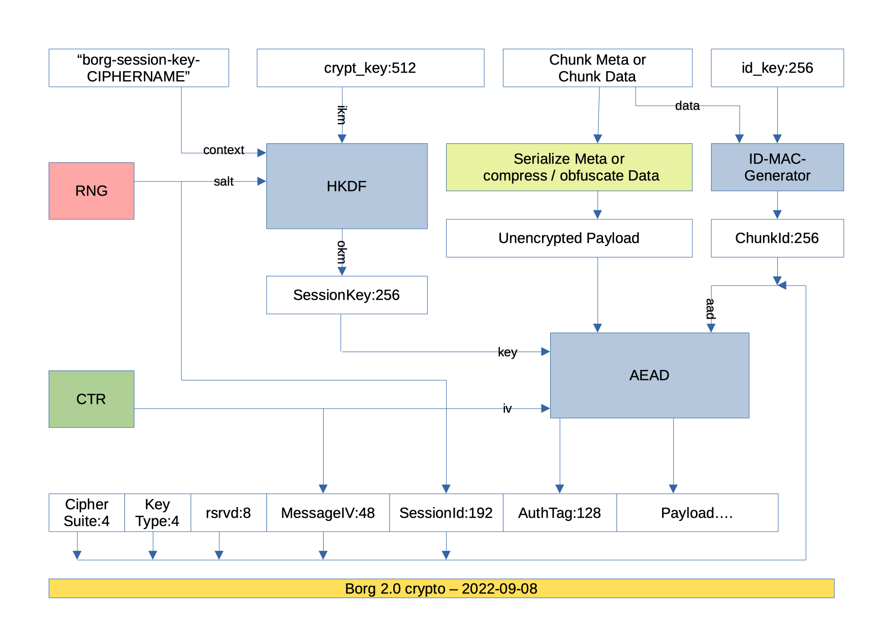

.. include:: ../global.rst.inc
.. highlight:: none

.. _data-structures:

Data structures and file formats
================================

This page documents the internal data structures and storage
mechanisms of Borg. It is partly based on `mailing list
discussion about internals`_ and also on static code analysis.

.. todo:: Clarify terms, perhaps create a glossary.
          ID (client?) vs. key (repository?),
          chunks (blob of data in repo?) vs. object (blob of data in repo, referred to from another object?),

.. _repository:

Repository
----------

Borg stores its data in a `Repository`, which is a key-value store and has
the following structure:

config/
  readme
    simple text object telling that this is a Borg repository
  id
    the unique repository ID encoded as hexadecimal number text
  version
    the repository version encoded as decimal number text
  manifest
    some data about the repository, binary
  last-key-checked
    repository check progress (partial checks, full checks' checkpointing),
    path of last object checked as text
  space-reserve.N
    purely random binary data to reserve space, e.g. for disk-full emergencies

There is a list of pointers to archive objects in this directory:

archives/
  0000... .. ffff...

The actual data is stored into a nested directory structure, using the full
object ID as name. Each (encrypted and compressed) object is stored separately.

data/
  00/ .. ff/
    00/ .. ff/
      0000... .. ffff...

keys/
  repokey
    When using encryption in repokey mode, the encrypted, passphrase protected
    key is stored here as a base64 encoded text.

locks/
  used by the locking system to manage shared and exclusive locks.

Keys
~~~~

Repository object IDs (which are used as key into the key-value store) are
byte-strings of fixed length (256bit, 32 bytes), computed like this::

  key = id = id_hash(plaintext_data)  # plain = not encrypted, not compressed, not obfuscated

The id_hash function depends on the :ref:`encryption mode <borg_repo-create>`.

As the id / key is used for deduplication, id_hash must be a cryptographically
strong hash or MAC.

Repository objects
~~~~~~~~~~~~~~~~~~

Each repository object is stored separately, under its ID into data/xx/yy/xxyy...

A repo object has a structure like this:

* 32bit meta size
* 32bit data size
* 64bit xxh64(meta)
* 64bit xxh64(data)
* meta
* data

The size and xxh64 hashes can be used for server-side corruption checks without
needing to decrypt anything (which would require the borg key).

The overall size of repository objects varies from very small (a small source
file will be stored as a single repo object) to medium (big source files will
be cut into medium sized chunks of some MB).

Metadata and data are separately encrypted and authenticated (depending on
the user's choices).

See :ref:`data-encryption` for a graphic outlining the anatomy of the
encryption.

Repo object metadata
~~~~~~~~~~~~~~~~~~~~

Metadata is a msgpacked (and encrypted/authenticated) dict with:

- ctype (compression type 0..255)
- clevel (compression level 0..255)
- csize (overall compressed (and maybe obfuscated) data size)
- psize (only when obfuscated: payload size without the obfuscation trailer)
- size (uncompressed size of the data)

Having this separately encrypted metadata makes it more efficient to query
the metadata without having to read, transfer and decrypt the (usually much
bigger) data part.

The compression `ctype` and `clevel` is explained in :ref:`data-compression`.

Compaction
~~~~~~~~~~

``borg compact`` is used to free repository space. It will:

- list all object IDs present in the repository
- read all archives and determine which object IDs are in use
- remove all unused objects from the repository
- inform / warn about anything remarkable it found:

  - warn about IDs used, but not present (data loss!)
  - inform about IDs that reappeared that were previously lost
- compute statistics about:

  - compression and deduplication factors
  - repository space usage and space freed

The object graph
----------------

On top of the simple key-value store offered by the Repository_,
Borg builds a much more sophisticated data structure that is essentially
a completely encrypted object graph. Objects, such as archives_, are referenced
by their chunk ID, which is cryptographically derived from their contents.
More on how this helps security in :ref:`security_structural_auth`.

.. figure:: object-graph.png
    :figwidth: 100%
    :width: 100%

.. _manifest:

The manifest
~~~~~~~~~~~~

Compared to borg 1.x:

- the manifest moved from object ID 0 to config/manifest
- the archives list has been moved from the manifest to archives/*

The manifest is rewritten each time an archive is created, deleted,
or modified. It looks like this:

.. code-block:: python

    {
        'version': 1,
        'timestamp': '2017-05-05T12:42:23.042864',
        'item_keys': ['acl_access', 'acl_default', ...],
        'config': {},
        'archives': {
            '2017-05-05-system-backup': {
                'id': b'<32 byte binary object ID>',
                'time': '2017-05-05T12:42:22.942864',
            },
        },
    }

The *version* field can be either 1 or 2. The versions differ in the
way feature flags are handled, described below.

The *timestamp* field is used to avoid logical replay attacks where
the server just resets the repository to a previous state.

*item_keys* is a list containing all Item_ keys that may be encountered in
the repository. It is used by *borg check*, which verifies that all keys
in all items are a subset of these keys. Thus, an older version of *borg check*
supporting this mechanism can correctly detect keys introduced in later versions.

*config* is a general-purpose location for additional metadata. All versions
of Borg preserve its contents.

Feature flags
+++++++++++++

Feature flags are used to add features to data structures without causing
corruption if older versions are used to access or modify them. The main issues
to consider for a feature flag oriented design are flag granularity,
flag storage, and cache_ invalidation.

Feature flags are divided in approximately three categories, detailed below.
Due to the nature of ID-based deduplication, write (i.e. creating archives) and
read access are not symmetric; it is possible to create archives referencing
chunks that are not readable with the current feature set. The third
category are operations that require accurate reference counts, for example
archive deletion and check.

As the manifest is always updated and always read, it is the ideal place to store
feature flags, comparable to the super-block of a file system. The only problem
is to recover from a lost manifest, i.e. how is it possible to detect which feature
flags are enabled, if there is no manifest to tell. This issue is left open at this time,
but is not expected to be a major hurdle; it doesn't have to be handled efficiently, it just
needs to be handled.

Lastly, cache_ invalidation is handled by noting which feature
flags were and which were not understood while manipulating a cache.
This allows borg to detect whether the cache needs to be invalidated,
i.e. rebuilt from scratch. See `Cache feature flags`_ below.

The *config* key stores the feature flags enabled on a repository:

.. code-block:: python

    config = {
        'feature_flags': {
            'read': {
                'mandatory': ['some_feature'],
            },
            'check': {
                'mandatory': ['other_feature'],
            }
            'write': ...,
            'delete': ...
        },
    }

The top-level distinction for feature flags is the operation the client intends
to perform,

| the *read* operation includes extraction and listing of archives,
| the *write* operation includes creating new archives,
| the *delete* (archives) operation,
| the *check* operation requires full understanding of everything in the repository.
|

These are weakly set-ordered; *check* will include everything required for *delete*,
*delete* will likely include *write* and *read*. However, *read* may require more
features than *write* (due to ID-based deduplication, *write* does not necessarily
require reading/understanding repository contents).

Each operation can contain several sets of feature flags. Only one set,
the *mandatory* set is currently defined.

Upon reading the manifest, the Borg client has already determined which operation
should be performed. If feature flags are found in the manifest, the set
of feature flags supported by the client is compared to the mandatory set
found in the manifest. If any unsupported flags are found (i.e. the mandatory set is
not a subset of the features supported by the Borg client used), the operation
is aborted with a *MandatoryFeatureUnsupported* error:

    Unsupported repository feature(s) {'some_feature'}. A newer version of borg is required to access this repository.

Older Borg releases do not have this concept and do not perform feature flags checks.
These can be locked out with manifest version 2. Thus, the only difference between
manifest versions 1 and 2 is that the latter is only accepted by Borg releases
implementing feature flags.

Therefore, as soon as any mandatory feature flag is enabled in a repository,
the manifest version must be switched to version 2 in order to lock out all
Borg releases unaware of feature flags.

.. _Cache feature flags:
.. rubric:: Cache feature flags

`The cache`_ does not have its separate set of feature flags. Instead, Borg stores
which flags were used to create or modify a cache.

All mandatory manifest features from all operations are gathered in one set.
Then, two sets of features are computed;

- those features that are supported by the client and mandated by the manifest
  are added to the *mandatory_features* set,
- the *ignored_features* set comprised of those features mandated by the manifest,
  but not supported by the client.

Because the client previously checked compliance with the mandatory set of features
required for the particular operation it is executing, the *mandatory_features* set
will contain all necessary features required for using the cache safely.

Conversely, the *ignored_features* set contains only those features which were not
relevant to operating the cache. Otherwise, the client would not pass the feature
set test against the manifest.

When opening a cache and the *mandatory_features* set is not a subset of the features
supported by the client, the cache is wiped out and rebuilt,
since a client not supporting a mandatory feature that the cache was built with
would be unable to update it correctly.
The assumption behind this behaviour is that any of the unsupported features could have
been reflected in the cache and there is no way for the client to discern whether
that is the case.
Meanwhile, it may not be practical for every feature to have clients using it track
whether the feature had an impact on the cache.
Therefore, the cache is wiped.

When opening a cache and the intersection of *ignored_features* and the features
supported by the client contains any elements, i.e. the client possesses features
that the previous client did not have and those new features are enabled in the repository,
the cache is wiped out and rebuilt.

While the former condition likely requires no tweaks, the latter condition is formulated
in an especially conservative way to play it safe. It seems likely that specific features
might be exempted from the latter condition.

.. rubric:: Defined feature flags

Currently no feature flags are defined.

From currently planned features, some examples follow,
these may/may not be implemented and purely serve as examples.

- A mandatory *read* feature could be using a different encryption scheme (e.g. session keys).
  This may not be mandatory for the *write* operation - reading data is not strictly required for
  creating an archive.
- Any additions to the way chunks are referenced (e.g. to support larger archives) would
  become a mandatory *delete* and *check* feature; *delete* implies knowing correct
  reference counts, so all object references need to be understood. *check* must
  discover the entire object graph as well, otherwise the "orphan chunks check"
  could delete data still in use.

.. _archive:

Archives
~~~~~~~~

Each archive is an object referenced by an entry below archives/.
The archive object itself does not store any of the data contained in the
archive it describes.

Instead, it contains a list of chunks which form a msgpacked stream of items_.
The archive object itself further contains some metadata:

* *version*
* *name*, which might differ from the name set in the archives/* object.
  When :ref:`borg_check` rebuilds the manifest (e.g. if it was corrupted) and finds
  more than one archive object with the same name, it adds a counter to the name
  in archives/*, but leaves the *name* field of the archives as they were.
* *item_ptrs*, a list of "pointer chunk" IDs.
  Each "pointer chunk" contains a list of chunk IDs of item metadata.
* *command_line*, the command line which was used to create the archive
* *hostname*
* *username*
* *time* and *time_end* are the start and end timestamps, respectively
* *comment*, a user-specified archive comment
* *chunker_params* are the :ref:`chunker-params <chunker-params>` used for creating the archive.
  This is used by :ref:`borg_recreate` to determine whether a given archive needs rechunking.
* Some other pieces of information related to recreate.

.. _item:

Items
~~~~~

Each item represents a file, directory or other file system item and is stored as a
dictionary created by the ``Item`` class that contains:

* path
* list of data chunks (size: count * ~40B)
* user
* group
* uid
* gid
* mode (item type + permissions)
* source (for symlinks)
* hlid (for hardlinks)
* rdev (for device files)
* mtime, atime, ctime, birthtime in nanoseconds
* xattrs
* acl (various OS-dependent fields)
* flags

All items are serialized using msgpack and the resulting byte stream
is fed into the same chunker algorithm as used for regular file data
and turned into deduplicated chunks. The reference to these chunks is then added
to the archive metadata. To achieve a finer granularity on this metadata
stream, we use different chunker params for this chunker, which result in
smaller chunks.

A chunk is stored as an object as well, of course.

.. _chunks:
.. _chunker_details:

Chunks
~~~~~~

Borg has these chunkers:

- "fixed": a simple, low cpu overhead, fixed blocksize chunker, optionally
  supporting a header block of different size.
- "buzhash": variable, content-defined blocksize, uses a rolling hash
  computed by the Buzhash_ algorithm.

For some more general usage hints see also ``--chunker-params``.

"fixed" chunker
+++++++++++++++

The fixed chunker triggers (chunks) at even-spaced offsets, e.g. every 4MiB,
producing chunks of same block size (the last chunk is not required to be
full-size).

Optionally, it supports processing a differently sized "header" first, before
it starts to cut chunks of the desired block size.
The default is not to have a differently sized header.

``borg create --chunker-params fixed,BLOCK_SIZE[,HEADER_SIZE]``

- BLOCK_SIZE: no default value, multiple of the system page size (usually 4096
  bytes) recommended. E.g.: 4194304 would cut 4MiB sized chunks.
- HEADER_SIZE: optional, defaults to 0 (no header).

The fixed chunker also supports processing sparse files (reading only the ranges
with data and seeking over the empty hole ranges).

``borg create --sparse --chunker-params fixed,BLOCK_SIZE[,HEADER_SIZE]``

"buzhash" chunker
+++++++++++++++++

The buzhash chunker triggers (chunks) when the last HASH_MASK_BITS bits of the
hash are zero, producing chunks with a target size of 2^HASH_MASK_BITS bytes.

Buzhash is **only** used for cutting the chunks at places defined by the
content, the buzhash value is **not** used as the deduplication criteria (we
use a cryptographically strong hash/MAC over the chunk contents for this, the
id_hash).

The idea of content-defined chunking is assigning every byte where a
cut *could* be placed a hash. The hash is based on some number of bytes
(the window size) before the byte in question. Chunks are cut
where the hash satisfies some condition
(usually "n numbers of trailing/leading zeroes"). This causes chunks to be cut
in the same location relative to the file's contents, even if bytes are inserted
or removed before/after a cut, as long as the bytes within the window stay the same.
This results in a high chance that a single cluster of changes to a file will only
result in 1-2 new chunks, aiding deduplication.

Using normal hash functions this would be extremely slow,
requiring hashing approximately ``window size * file size`` bytes.
A rolling hash is used instead, which allows to add a new input byte and
compute a new hash as well as *remove* a previously added input byte
from the computed hash. This makes the cost of computing a hash for each
input byte largely independent of the window size.

Borg defines minimum and maximum chunk sizes (CHUNK_MIN_EXP and CHUNK_MAX_EXP, respectively)
which narrows down where cuts may be made, greatly reducing the amount of data
that is actually hashed for content-defined chunking.

``borg create --chunker-params buzhash,CHUNK_MIN_EXP,CHUNK_MAX_EXP,HASH_MASK_BITS,HASH_WINDOW_SIZE``
can be used to tune the chunker parameters, the default is:

- CHUNK_MIN_EXP = 19 (minimum chunk size = 2^19 B = 512 kiB)
- CHUNK_MAX_EXP = 23 (maximum chunk size = 2^23 B = 8 MiB)
- HASH_MASK_BITS = 21 (target chunk size ~= 2^21 B = 2 MiB)
- HASH_WINDOW_SIZE = 4095 [B] (`0xFFF`)

The buzhash table is altered by XORing it with a seed randomly generated once
for the repository, and stored encrypted in the keyfile. This is to prevent
chunk size based fingerprinting attacks on your encrypted repo contents (to
guess what files you have based on a specific set of chunk sizes).

.. _cache:

The cache
---------

The **files cache** is stored in ``cache/files.<SUFFIX>`` and is used at backup
time to quickly determine whether a given file is unchanged and we have all its
chunks.

In memory, the files cache is a key -> value mapping (a Python *dict*) and contains:

* key: id_hash of the encoded path (same path as seen in archive)
* value:

  - age (0 [newest], ..., BORG_FILES_CACHE_TTL - 1)
  - file inode number
  - file size
  - file ctime_ns
  - file mtime_ns
  - list of chunk (id, size) tuples representing the file's contents

To determine whether a file has not changed, cached values are looked up via
the key in the mapping and compared to the current file attribute values.

If the file's size, timestamp and inode number is still the same, it is
considered not to have changed. In that case, we check that all file content
chunks are (still) present in the repository (we check that via the chunks
cache).

If everything is matching and all chunks are present, the file is not read /
chunked / hashed again (but still a file metadata item is written to the
archive, made from fresh file metadata read from the filesystem). This is
what makes borg so fast when processing unchanged files.

If there is a mismatch or a chunk is missing, the file is read / chunked /
hashed. Chunks already present in repo won't be transferred to repo again.

The inode number is stored and compared to make sure we distinguish between
different files, as a single path may not be unique across different
archives in different setups.

Not all filesystems have stable inode numbers. If that is the case, borg can
be told to ignore the inode number in the check via --files-cache.

The age value is used for cache management. If a file is "seen" in a backup
run, its age is reset to 0, otherwise its age is incremented by one.
If a file was not seen in BORG_FILES_CACHE_TTL backups, its cache entry is
removed.

The files cache is a python dictionary, storing python objects, which
generates a lot of overhead.

Borg can also work without using the files cache (saves memory if you have a
lot of files or not much RAM free), then all files are assumed to have changed.
This is usually much slower than with files cache.

The on-disk format of the files cache is a stream of msgpacked tuples (key, value).
Loading the files cache involves reading the file, one msgpack object at a time,
unpacking it, and msgpacking the value (in an effort to save memory).

The **chunks cache** is not persisted to disk, but dynamically built in memory
by querying the existing object IDs from the repository.
It is used to determine whether we already have a specific chunk.

The chunks cache is a key -> value mapping and contains:

* key:

  - chunk id_hash
* value:

  - reference count (always MAX_VALUE as we do not refcount anymore)
  - size (0 for prev. existing objects, we can't query their plaintext size)

The chunks cache is a HashIndex_.

.. _cache-memory-usage:

Indexes / Caches memory usage
-----------------------------

Here is the estimated memory usage of Borg - it's complicated::

  chunk_size ~= 2 ^ HASH_MASK_BITS  (for buzhash chunker, BLOCK_SIZE for fixed chunker)
  chunk_count ~= total_file_size / chunk_size

  chunks_cache_usage = chunk_count * 40

  files_cache_usage = total_file_count * 240 + chunk_count * 165

  mem_usage ~= chunks_cache_usage + files_cache_usage
             = chunk_count * 205 + total_file_count * 240

Due to the hashtables, the best/usual/worst cases for memory allocation can
be estimated like that::

  mem_allocation = mem_usage / load_factor  # l_f = 0.25 .. 0.75

  mem_allocation_peak = mem_allocation * (1 + growth_factor)  # g_f = 1.1 .. 2

All units are Bytes.

It is assuming every chunk is referenced exactly once (if you have a lot of
duplicate chunks, you will have fewer chunks than estimated above).

It is also assuming that typical chunk size is 2^HASH_MASK_BITS (if you have
a lot of files smaller than this statistical medium chunk size, you will have
more chunks than estimated above, because 1 file is at least 1 chunk).

The chunks cache and files cache are all implemented as hash tables.
A hash table must have a significant amount of unused entries to be fast -
the so-called load factor gives the used/unused elements ratio.

When a hash table gets full (load factor getting too high), it needs to be
grown (allocate new, bigger hash table, copy all elements over to it, free old
hash table) - this will lead to short-time peaks in memory usage each time this
happens. Usually does not happen for all hashtables at the same time, though.
For small hash tables, we start with a growth factor of 2, which comes down to
~1.1x for big hash tables.

E.g. backing up a total count of 1 Mi (IEC binary prefix i.e. 2^20) files with a total size of 1TiB.

a) with ``create --chunker-params buzhash,10,23,16,4095`` (custom):

  mem_usage  =  2.8GiB

b) with ``create --chunker-params buzhash,19,23,21,4095`` (default):

  mem_usage  =  0.31GiB

.. note:: There is also the ``--files-cache=disabled`` option to disable the files cache.
   You'll save some memory, but it will need to read / chunk all the files as
   it can not skip unmodified files then.

HashIndex
---------

The chunks cache is implemented as a hash table, with
only one slot per bucket, spreading hash collisions to the following
buckets. As a consequence the hash is just a start position for a linear
search. If a key is looked up that is not in the table, then the hash table
is searched from the start position (the hash) until the first empty
bucket is reached.

This particular mode of operation is open addressing with linear probing.

When the hash table is filled to 75%, its size is grown. When it's
emptied to 25%, its size is shrunken. Operations on it have a variable
complexity between constant and linear with low factor, and memory overhead
varies between 33% and 300%.

If an element is deleted, and the slot behind the deleted element is not empty,
then the element will leave a tombstone, a bucket marked as deleted. Tombstones
are only removed by insertions using the tombstone's bucket, or by resizing
the table. They present the same load to the hash table as a real entry,
but do not count towards the regular load factor.

Thus, if the number of empty slots becomes too low (recall that linear probing
for an element not in the index stops at the first empty slot), the hash table
is rebuilt. The maximum *effective* load factor, i.e. including tombstones, is 93%.

Data in a HashIndex is always stored in little-endian format, which increases
efficiency for almost everyone, since basically no one uses big-endian processors
any more.

HashIndex does not use a hashing function, because all keys (save manifest) are
outputs of a cryptographic hash or MAC and thus already have excellent distribution.
Thus, HashIndex simply uses the first 32 bits of the key as its "hash".

The format is easy to read and write, because the buckets array has the same layout
in memory and on disk. Only the header formats differ. The on-disk header is
``struct HashHeader``:

- First, the HashIndex magic, the eight byte ASCII string "BORG_IDX".
- Second, the signed 32-bit number of entries (i.e. buckets which are not deleted and not empty).
- Third, the signed 32-bit number of buckets, i.e. the length of the buckets array
  contained in the file, and the modulus for index calculation.
- Fourth, the signed 8-bit length of keys.
- Fifth, the signed 8-bit length of values. This has to be at least four bytes.

All fields are packed.

The HashIndex is *not* a general purpose data structure.
The value size must be at least 4 bytes, and these first bytes are used for in-band
signalling in the data structure itself.

The constant MAX_VALUE (defined as 2**32-1025 = 4294966271) defines the valid range for
these 4 bytes when interpreted as an uint32_t from 0 to MAX_VALUE (inclusive).
The following reserved values beyond MAX_VALUE are currently in use (byte order is LE):

- 0xffffffff marks empty buckets in the hash table
- 0xfffffffe marks deleted buckets in the hash table

HashIndex is implemented in C and wrapped with Cython in a class-based interface.
The Cython wrapper checks every passed value against these reserved values and
raises an AssertionError if they are used.

.. _data-encryption:

Encryption
----------

.. seealso:: The :ref:`borgcrypto` section for an in-depth review.

AEAD modes
~~~~~~~~~~

For new repositories, borg only uses modern AEAD ciphers: AES-OCB or CHACHA20-POLY1305.

For each borg invocation, a new sessionkey is derived from the borg key material
and the 48bit IV starts from 0 again (both ciphers internally add a 32bit counter
to our IV, so we'll just count up by 1 per chunk).

The encryption layout is best seen at the bottom of this diagram:

No special IV/counter management is needed here due to the use of session keys.

A 48 bit IV is way more than needed: If you only backed up 4kiB chunks (2^12B),
the IV would "limit" the data encrypted in one session to 2^(12+48)B == 2.3 exabytes,
meaning you would run against other limitations (RAM, storage, time) way before that.
In practice, chunks are usually bigger, for big files even much bigger, giving an
even higher limit.

Legacy modes
~~~~~~~~~~~~

Old repositories (which used AES-CTR mode) are supported read-only to be able to
``borg transfer`` their archives to new repositories (which use AEAD modes).

AES-CTR mode is not supported for new repositories and the related code will be
removed in a future release.

Both modes
~~~~~~~~~~

Encryption keys (and other secrets) are kept either in a key file on the client
('keyfile' mode) or in the repository under keys/repokey ('repokey' mode).
In both cases, the secrets are generated from random and then encrypted by a
key derived from your passphrase (this happens on the client before the key
is stored into the keyfile or as repokey).

The passphrase is passed through the ``BORG_PASSPHRASE`` environment variable
or prompted for interactive usage.

.. _key_files:

Key files
---------

.. seealso:: The :ref:`key_encryption` section for an in-depth review of the key encryption.

When initializing a repository with one of the "keyfile" encryption modes,
Borg creates an associated key file in ``$HOME/.config/borg/keys``.

The same key is also used in the "repokey" modes, which store it in the repository.

The internal data structure is as follows:

version
  currently always an integer, 2

repository_id
  the ``id`` field in the ``config`` ``INI`` file of the repository.

crypt_key
  the initial key material used for the AEAD crypto (512 bits)

id_key
  the key used to MAC the plaintext chunk data to compute the chunk's id

chunk_seed
  the seed for the buzhash chunking table (signed 32 bit integer)

These fields are packed using msgpack_. The utf-8 encoded passphrase
is processed with argon2_ to derive a 256 bit key encryption key (KEK).

Then the KEK is used to encrypt and authenticate the packed data using
the chacha20-poly1305 AEAD cipher.

The result is stored in a another msgpack_ formatted as follows:

version
  currently always an integer, 1

salt
  random 256 bits salt used to process the passphrase

argon2_*
  some parameters for the argon2 kdf

algorithm
  the algorithms used to process the passphrase
  (currently the string ``argon2 chacha20-poly1305``)

data
  The encrypted, packed fields.

The resulting msgpack_ is then encoded using base64 and written to the
key file, wrapped using the standard ``textwrap`` module with a header.
The header is a single line with a MAGIC string, a space and a hexadecimal
representation of the repository id.

.. _data-compression:

Compression
-----------

Borg supports the following compression methods, each identified by a ctype value
in the range between 0 and 255 (and augmented by a clevel 0..255 value for the
compression level):

- none (no compression, pass through data 1:1), identified by 0x00
- lz4 (low compression, but super fast), identified by 0x01
- zstd (level 1-22 offering a wide range: level 1 is lower compression and high
  speed, level 22 is higher compression and lower speed) - identified by 0x03
- zlib (level 0-9, level 0 is no compression [but still adding zlib overhead],
  level 1 is low, level 9 is high compression), identified by 0x05
- lzma (level 0-9, level 0 is low, level 9 is high compression), identified
  by 0x02.

The type byte is followed by a byte indicating the compression level.

Speed:  none > lz4 > zlib > lzma, lz4 > zstd
Compression: lzma > zlib > lz4 > none, zstd > lz4

Be careful, higher compression levels might use a lot of resources (CPU/memory).

The overall speed of course also depends on the speed of your target storage.
If that is slow, using a higher compression level might yield better overall
performance. You need to experiment a bit. Maybe just watch your CPU load, if
that is relatively low, increase compression until 1 core is 70-100% loaded.

Even if your target storage is rather fast, you might see interesting effects:
while doing no compression at all (none) is a operation that takes no time, it
likely will need to store more data to the storage compared to using lz4.
The time needed to transfer and store the additional data might be much more
than if you had used lz4 (which is super fast, but still might compress your
data about 2:1). This is assuming your data is compressible (if you back up
already compressed data, trying to compress them at backup time is usually
pointless).

Compression is applied after deduplication, thus using different compression
methods in one repo does not influence deduplication.

See ``borg create --help`` about how to specify the compression level and its default.

Lock files (fslocking)
----------------------

Borg uses filesystem locks to get (exclusive or shared) access to the cache.

The locking system is based on renaming a temporary directory
to `lock.exclusive` (for
exclusive locks). Inside this directory, there is a file indicating
hostname, process id and thread id of the lock holder.

There is also a json file `lock.roster` that keeps a directory of all shared
and exclusive lockers.

If the process is able to rename a temporary directory (with the
host/process/thread identifier prepared inside it) in the resource directory
to `lock.exclusive`, it has the lock for it. If renaming fails
(because this directory already exists and its host/process/thread identifier
denotes a thread on the host which is still alive), lock acquisition fails.

The cache lock is usually in `~/.cache/borg/REPOID/lock.*`.

Locks (storelocking)
--------------------

To implement locking based on ``borgstore``, borg stores objects below locks/.

The objects contain:

- a timestamp when lock was created (or refreshed)
- host / process / thread information about lock owner
- lock type: exclusive or shared

Using that information, borg implements:

- lock auto-expiry: if a lock is old and has not been refreshed in time,
  it will be automatically ignored and deleted. the primary purpose of this
  is to get rid of stale locks by borg processes on other machines.
- lock auto-removal if the owner process is dead. the primary purpose of this
  is to quickly get rid of stale locks by borg processes on the same machine.

Breaking the locks
------------------

In case you run into troubles with the locks, you can use the ``borg break-lock``
command after you first have made sure that no Borg process is
running on any machine that accesses this resource. Be very careful, the cache
or repository might get damaged if multiple processes use it at the same time.

If there is an issue just with the repository lock, it will usually resolve
automatically (see above), just retry later.

Checksumming data structures
----------------------------

As detailed in the previous sections, Borg generates and stores various files
containing important meta data, such as the files cache.

Data corruption in the files cache could create incorrect archives, e.g. due
to wrong object IDs or sizes in the files cache.

Therefore, Borg calculates checksums when writing these files and tests checksums
when reading them. Checksums are generally 64-bit XXH64 hashes.
The canonical xxHash representation is used, i.e. big-endian.
Checksums are stored as hexadecimal ASCII strings.

For compatibility, checksums are not required and absent checksums do not trigger errors.
The mechanisms have been designed to avoid false-positives when various Borg
versions are used alternately on the same repositories.

Checksums are a data safety mechanism. They are not a security mechanism.

.. rubric:: Choice of algorithm

XXH64 has been chosen for its high speed on all platforms, which avoids performance
degradation in CPU-limited parts (e.g. cache synchronization).
Unlike CRC32, it neither requires hardware support (crc32c or CLMUL)
nor vectorized code nor large, cache-unfriendly lookup tables to achieve good performance.
This simplifies deployment of it considerably (cf. src/borg/algorithms/crc32...).

Further, XXH64 is a non-linear hash function and thus has a "more or less" good
chance to detect larger burst errors, unlike linear CRCs where the probability
of detection decreases with error size.

The 64-bit checksum length is considered sufficient for the file sizes typically
checksummed (individual files up to a few GB, usually less).
xxHash was expressly designed for data blocks of these sizes.

Lower layer — file_integrity
~~~~~~~~~~~~~~~~~~~~~~~~~~~~

There is a lower layer (borg.crypto.file_integrity.IntegrityCheckedFile)
wrapping a file-like object, performing streaming calculation and comparison
of checksums.
Checksum errors are signalled by raising an exception at the earliest possible
moment (borg.crypto.file_integrity.FileIntegrityError).

.. rubric:: Calculating checksums

Before feeding the checksum algorithm any data, the file name (i.e. without any path)
is mixed into the checksum, since the name encodes the context of the data for Borg.

The various indices used by Borg have separate header and main data parts.
IntegrityCheckedFile allows borg to checksum them independently, which avoids
even reading the data when the header is corrupted. When a part is signalled,
the length of the part name is mixed into the checksum state first (encoded
as an ASCII string via `%10d` printf format), then the name of the part
is mixed in as an UTF-8 string. Lastly, the current position (length)
in the file is mixed in as well.

The checksum state is not reset at part boundaries.

A final checksum is always calculated in the same way as the parts described above,
after seeking to the end of the file. The final checksum cannot prevent code
from processing corrupted data during reading, however, it prevents use of the
corrupted data.

.. rubric:: Serializing checksums

All checksums are compiled into a simple JSON structure called *integrity data*:

.. code-block:: json

    {
        "algorithm": "XXH64",
        "digests": {
            "HashHeader": "eab6802590ba39e3",
            "final": "e2a7f132fc2e8b24"
        }
    }

The *algorithm* key notes the used algorithm. When reading, integrity data containing
an unknown algorithm is not inspected further.

The *digests* key contains a mapping of part names to their digests.

Integrity data is generally stored by the upper layers, introduced below. An exception
is the DetachedIntegrityCheckedFile, which automatically writes and reads it from
a ".integrity" file next to the data file.

Upper layer
~~~~~~~~~~~

.. rubric:: Main cache files: chunks and files cache

The integrity data of the ``files`` cache is stored in the cache ``config``.

The ``[integrity]`` section is used:

.. code-block:: none

    [cache]
    version = 1
    repository = 3c4...e59
    manifest = 10e...21c
    timestamp = 2017-06-01T21:31:39.699514
    key_type = 2
    previous_location = /path/to/repo

    [integrity]
    manifest = 10e...21c
    files = {"algorithm": "XXH64", "digests": {"HashHeader": "eab...39e3", "final": "e2a...b24"}}

The manifest ID is duplicated in the integrity section due to the way all Borg
versions handle the config file. Instead of creating a "new" config file from
an internal representation containing only the data understood by Borg,
the config file is read in entirety (using the Python ConfigParser) and modified.
This preserves all sections and values not understood by the Borg version
modifying it.

Thus, if an older versions uses a cache with integrity data, it would preserve
the integrity section and its contents. If a integrity-aware Borg version
would read this cache, it would incorrectly report checksum errors, since
the older version did not update the checksums.

However, by duplicating the manifest ID in the integrity section, it is
easy to tell whether the checksums concern the current state of the cache.

Integrity errors are fatal in these files, terminating the program,
and are not automatically corrected at this time.

HardLinkManager and the hlid concept
------------------------------------

Dealing with hard links needs some extra care, implemented in borg within the HardLinkManager
class:

- At archive creation time, fs items with st_nlink > 1 indicate that they are a member of
  a group of hardlinks all pointing to the same inode. For such fs items, the archived item
  includes a hlid attribute (hardlink id), which is computed like H(st_dev, st_ino). Thus,
  if archived items have the same hlid value, they pointed to the same inode and form a
  group of hardlinks. Besides that, nothing special is done for any member of the group
  of hardlinks, meaning that e.g. for regular files, each archived item will have a
  chunks list.
- At extraction time, the presence of a hlid attribute indicates that there might be more
  hardlinks coming, pointing to the same content (inode), thus borg will remember the "hlid
  to extracted path" mapping, so it will know the correct path for extracting (hardlinking)
  the next hardlink of that group / with the same hlid.
- This symmetric approach (each item has all the information, e.g. the chunks list)
  simplifies dealing with such items a lot, especially for partial extraction, for the
  FUSE filesystem, etc.
- This is different from the asymmetric approach of old borg versions (< 2.0) and also from
  tar which have the concept of a main item (first hardlink, has the content) and content-less
  secondary items with by-name back references for each subsequent hardlink, causing lots
  of complications when dealing with them.
