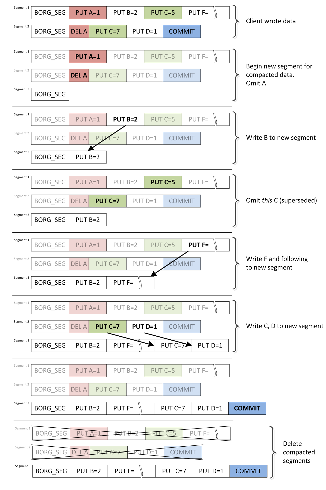
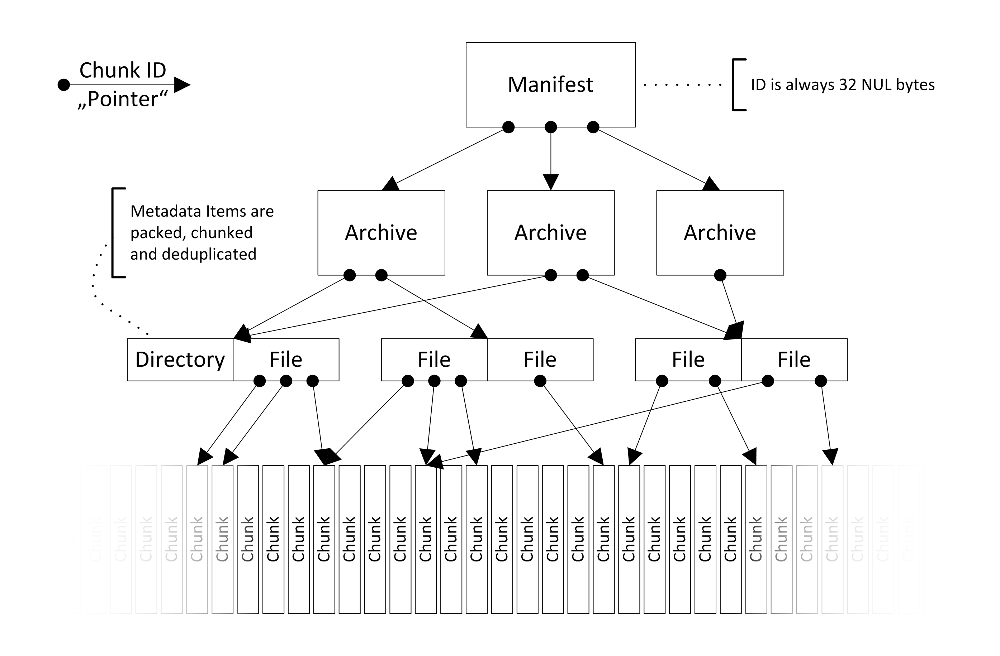
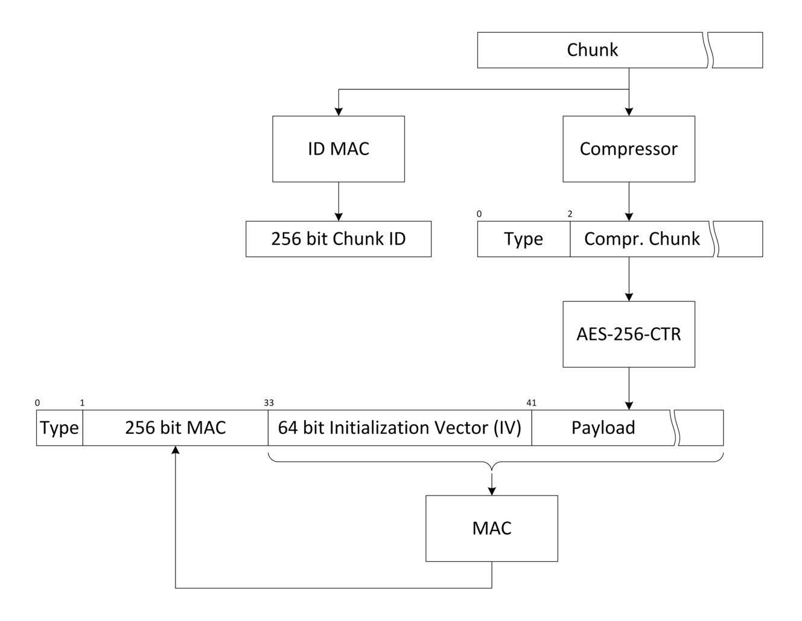

.. include:: ../global.rst.inc
.. highlight:: none

.. _data-structures:

Data structures and file formats
================================

This page documents the internal data structures and storage
mechanisms of Borg. It is partly based on `mailing list
discussion about internals`_ and also on static code analysis.

.. todo:: Clarify terms, perhaps create a glossary.
          ID (client?) vs. key (repository?),
          chunks (blob of data in repo?) vs. object (blob of data in repo, referred to from another object?),

.. _repository:

Repository
----------

.. Some parts of this description were taken from the Repository docstring

Borg stores its data in a `Repository`, which is a file system based
transactional key-value store. Thus the repository does not know about
the concept of archives or items.

Each repository has the following file structure:

README
  simple text file telling that this is a Borg repository

config
  repository configuration

data/
  directory where the actual data is stored

hints.%d
  hints for repository compaction

index.%d
  repository index

lock.roster and lock.exclusive/*
  used by the locking system to manage shared and exclusive locks

Transactionality is achieved by using a log (aka journal) to record changes. The log is a series of numbered files
called segments_. Each segment is a series of log entries. The segment number together with the offset of each
entry relative to its segment start establishes an ordering of the log entries. This is the "definition" of
time for the purposes of the log.

.. _config-file:

Config file
~~~~~~~~~~~

Each repository has a ``config`` file which which is a ``INI``-style file
and looks like this::

    [repository]
    version = 1
    segments_per_dir = 1000
    max_segment_size = 524288000
    id = 57d6c1d52ce76a836b532b0e42e677dec6af9fca3673db511279358828a21ed6

This is where the ``repository.id`` is stored. It is a unique
identifier for repositories. It will not change if you move the
repository around so you can make a local transfer then decide to move
the repository to another (even remote) location at a later time.

Keys
~~~~

Repository keys are byte-strings of fixed length (32 bytes), they
don't have a particular meaning (except for the Manifest_).

Normally the keys are computed like this::

  key = id = id_hash(unencrypted_data)

The id_hash function depends on the :ref:`encryption mode <borg_init>`.

As the id / key is used for deduplication, id_hash must be a cryptographically
strong hash or MAC.

Segments
~~~~~~~~

Objects referenced by a key are stored inline in files (`segments`) of approx.
500 MB size in numbered subdirectories of ``repo/data``. The number of segments
per directory is controlled by the value of ``segments_per_dir``. If you change
this value in a non-empty repository, you may also need to relocate the segment
files manually.

A segment starts with a magic number (``BORG_SEG`` as an eight byte ASCII string),
followed by a number of log entries. Each log entry consists of:

* 32-bit size of the entry
* CRC32 of the entire entry (for a PUT this includes the data)
* entry tag: PUT, DELETE or COMMIT
* PUT and DELETE follow this with the 32 byte key
* PUT follow the key with the data

Those files are strictly append-only and modified only once.

Tag is either ``PUT``, ``DELETE``, or ``COMMIT``.

When an object is written to the repository a ``PUT`` entry is written
to the file containing the object id and data. If an object is deleted
a ``DELETE`` entry is appended with the object id.

A ``COMMIT`` tag is written when a repository transaction is
committed. The segment number of the segment containing
a commit is the **transaction ID**.

When a repository is opened any ``PUT`` or ``DELETE`` operations not
followed by a ``COMMIT`` tag are discarded since they are part of a
partial/uncommitted transaction.

The size of individual segments is limited to 4 GiB, since the offset of entries
within segments is stored in a 32-bit unsigned integer in the repository index.

Index, hints and integrity
~~~~~~~~~~~~~~~~~~~~~~~~~~

The **repository index** is stored in ``index.<TRANSACTION_ID>`` and is used to
determine an object's location in the repository. It is a HashIndex_,
a hash table using open addressing. It maps object keys_ to two
unsigned 32-bit integers; the first integer gives the segment number,
the second indicates the offset of the object's entry within the segment.

The **hints file** is a msgpacked file named ``hints.<TRANSACTION_ID>``.
It contains:

* version
* list of segments
* compact

The **integrity file** is a msgpacked file named ``integrity.<TRANSACTION_ID>``.
It contains checksums of the index and hints files and is described in the
:ref:`Checksumming data structures <integrity_repo>` section below.

If the index or hints are corrupted, they are re-generated automatically.
If they are outdated, segments are replayed from the index state to the currently
committed transaction.

Compaction
~~~~~~~~~~

For a given key only the last entry regarding the key, which is called current (all other entries are called
superseded), is relevant: If there is no entry or the last entry is a DELETE then the key does not exist.
Otherwise the last PUT defines the value of the key.

By superseding a PUT (with either another PUT or a DELETE) the log entry becomes obsolete. A segment containing
such obsolete entries is called sparse, while a segment containing no such entries is called compact.

Since writing a ``DELETE`` tag does not actually delete any data and
thus does not free disk space any log-based data store will need a
compaction strategy (somewhat analogous to a garbage collector).

Borg uses a simple forward compacting algorithm,
which avoids modifying existing segments.
Compaction runs when a commit is issued with ``compact=True`` parameter, e.g.
by the ``borg compact`` command (unless the :ref:`append_only_mode` is active).
One client transaction can manifest as multiple physical transactions,
since compaction is transacted, too, and Borg does not distinguish between the two::

  Perspective| Time -->
  -----------+--------------
  Client     | Begin transaction - Modify Data - Commit | <client waits for repository> (done)
  Repository | Begin transaction - Modify Data - Commit | Compact segments - Commit   | (done)

The compaction algorithm requires two inputs in addition to the segments themselves:

(i) Which segments are sparse, to avoid scanning all segments (impractical).
    Further, Borg uses a conditional compaction strategy: Only those
    segments that exceed a threshold sparsity are compacted.

    To implement the threshold condition efficiently, the sparsity has
    to be stored as well. Therefore, Borg stores a mapping ``(segment
    id,) -> (number of sparse bytes,)``.

    The 1.0.x series used a simpler non-conditional algorithm,
    which only required the list of sparse segments. Thus,
    it only stored a list, not the mapping described above.
(ii) Each segment's reference count, which indicates how many live objects are in a segment.
     This is not strictly required to perform the algorithm. Rather, it is used to validate
     that a segment is unused before deleting it. If the algorithm is incorrect, or the reference
     count was not accounted correctly, then an assertion failure occurs.

These two pieces of information are stored in the hints file (`hints.N`)
next to the index (`index.N`).

When loading a hints file, Borg checks the version contained in the file.
The 1.0.x series writes version 1 of the format (with the segments list instead
of the mapping, mentioned above). Since Borg 1.0.4, version 2 is read as well.
The 1.1.x series writes version 2 of the format and reads either version.
When reading a version 1 hints file, Borg 1.1.x will
read all sparse segments to determine their sparsity.

This process may take some time if a repository has been kept in append-only mode
or ``borg compact`` has not been used for a longer time, which both has caused
the number of sparse segments to grow.

Compaction processes sparse segments from oldest to newest; sparse segments
which don't contain enough deleted data to justify compaction are skipped. This
avoids doing e.g. 500 MB of writing current data to a new segment when only
a couple kB were deleted in a segment.

Segments that are compacted are read in entirety. Current entries are written to
a new segment, while superseded entries are omitted. After each segment an intermediary
commit is written to the new segment. Then, the old segment is deleted
(asserting that the reference count diminished to zero), freeing disk space.

A simplified example (excluding conditional compaction and with simpler
commit logic) showing the principal operation of compaction:

(The actual algorithm is more complex to avoid various consistency issues, refer to
the ``borg.repository`` module for more comments and documentation on these issues.)

.. _internals_storage_quota:

Storage quotas
~~~~~~~~~~~~~~

Quotas are implemented at the Repository level. The active quota of a repository
is determined by the ``storage_quota`` `config` entry or a run-time override (via :ref:`borg_serve`).
The currently used quota is stored in the hints file. Operations (PUT and DELETE) during
a transaction modify the currently used quota:

- A PUT adds the size of the *log entry* to the quota,
  i.e. the length of the data plus the 41 byte header.
- A DELETE subtracts the size of the deleted log entry from the quota,
  which includes the header.

Thus, PUT and DELETE are symmetric and cancel each other out precisely.

The quota does not track on-disk size overheads (due to conditional compaction
or append-only mode). In normal operation the inclusion of the log entry headers
in the quota act as a faithful proxy for index and hints overheads.

By tracking effective content size, the client can *always* recover from a full quota
by deleting archives. This would not be possible if the quota tracked on-disk size,
since journaling DELETEs requires extra disk space before space is freed.
Tracking effective size on the other hand accounts DELETEs immediately as freeing quota.

.. rubric:: Enforcing the quota

The storage quota is meant as a robust mechanism for service providers, therefore
:ref:`borg_serve` has to enforce it without loopholes (e.g. modified clients).
The following sections refer to using quotas on remotely accessed repositories.
For local access, consider *client* and *serve* the same.
Accordingly, quotas cannot be enforced with local access,
since the quota can be changed in the repository config.

The quota is enforcible only if *all* :ref:`borg_serve` versions
accessible to clients support quotas (see next section). Further, quota is
per repository. Therefore, ensure clients can only access a defined set of repositories
with their quotas set, using ``--restrict-to-repository``.

If the client exceeds the storage quota the ``StorageQuotaExceeded`` exception is
raised. Normally a client could ignore such an exception and just send a ``commit()``
command anyway, circumventing the quota. However, when ``StorageQuotaExceeded`` is raised,
it is stored in the ``transaction_doomed`` attribute of the repository.
If the transaction is doomed, then commit will re-raise this exception, aborting the commit.

The transaction_doomed indicator is reset on a rollback (which erases the quota-exceeding
state).

.. rubric:: Compatibility with older servers and enabling quota after-the-fact

If no quota data is stored in the hints file, Borg assumes zero quota is used.
Thus, if a repository with an enabled quota is written to with an older ``borg serve``
version that does not understand quotas, then the quota usage will be erased.

The client version is irrelevant to the storage quota and has no part in it.
The form of error messages due to exceeding quota varies with client versions.

A similar situation arises when upgrading from a Borg release that did not have quotas.
Borg will start tracking quota use from the time of the upgrade, starting at zero.

If the quota shall be enforced accurately in these cases, either

- delete the ``index.N`` and ``hints.N`` files, forcing Borg to rebuild both,
  re-acquiring quota data in the process, or
- edit the msgpacked ``hints.N`` file (not recommended and thus not
  documented further).

The object graph
----------------

On top of the simple key-value store offered by the Repository_,
Borg builds a much more sophisticated data structure that is essentially
a completely encrypted object graph. Objects, such as archives_, are referenced
by their chunk ID, which is cryptographically derived from their contents.
More on how this helps security in :ref:`security_structural_auth`.

.. _manifest:

The manifest
~~~~~~~~~~~~

The manifest is the root of the object hierarchy. It references
all archives in a repository, and thus all data in it.
Since no object references it, it cannot be stored under its ID key.
Instead, the manifest has a fixed all-zero key.

The manifest is rewritten each time an archive is created, deleted,
or modified. It looks like this:

.. code-block:: python

    {
        b'version': 1,
        b'timestamp': b'2017-05-05T12:42:23.042864',
        b'item_keys': [b'acl_access', b'acl_default', ...],
        b'config': {},
        b'archives': {
            b'2017-05-05-system-backup': {
                b'id': b'<32 byte binary object ID>',
                b'time': b'2017-05-05T12:42:22.942864',
            },
        },
        b'tam': ...,
    }

The *version* field can be either 1 or 2. The versions differ in the
way feature flags are handled, described below.

The *timestamp* field is used to avoid logical replay attacks where
the server just resets the repository to a previous state.

*item_keys* is a list containing all Item_ keys that may be encountered in
the repository. It is used by *borg check*, which verifies that all keys
in all items are a subset of these keys. Thus, an older version of *borg check*
supporting this mechanism can correctly detect keys introduced in later versions.

The *tam* key is part of the :ref:`tertiary authentication mechanism <tam_description>`
(formerly known as "tertiary authentication for metadata") and authenticates
the manifest, since an ID check is not possible.

*config* is a general-purpose location for additional metadata. All versions
of Borg preserve its contents (it may have been a better place for *item_keys*,
which is not preserved by unaware Borg versions, releases predating 1.0.4).

Feature flags
+++++++++++++

Feature flags are used to add features to data structures without causing
corruption if older versions are used to access or modify them. The main issues
to consider for a feature flag oriented design are flag granularity,
flag storage, and cache_ invalidation.

Feature flags are divided in approximately three categories, detailed below.
Due to the nature of ID-based deduplication, write (i.e. creating archives) and
read access are not symmetric; it is possible to create archives referencing
chunks that are not readable with the current feature set. The third
category are operations that require accurate reference counts, for example
archive deletion and check.

As the manifest is always updated and always read, it is the ideal place to store
feature flags, comparable to the super-block of a file system. The only problem
is to recover from a lost manifest, i.e. how is it possible to detect which feature
flags are enabled, if there is no manifest to tell. This issue is left open at this time,
but is not expected to be a major hurdle; it doesn't have to be handled efficiently, it just
needs to be handled.

Lastly, cache_ invalidation is handled by noting which feature
flags were and which were not understood while manipulating a cache.
This allows borg to detect whether the cache needs to be invalidated,
i.e. rebuilt from scratch. See `Cache feature flags`_ below.

The *config* key stores the feature flags enabled on a repository:

.. code-block:: python

    config = {
        b'feature_flags': {
            b'read': {
                b'mandatory': [b'some_feature'],
            },
            b'check': {
                b'mandatory': [b'other_feature'],
            }
            b'write': ...,
            b'delete': ...
        },
    }

The top-level distinction for feature flags is the operation the client intends
to perform,

| the *read* operation includes extraction and listing of archives,
| the *write* operation includes creating new archives,
| the *delete* (archives) operation,
| the *check* operation requires full understanding of everything in the repository.
|

These are weakly set-ordered; *check* will include everything required for *delete*,
*delete* will likely include *write* and *read*. However, *read* may require more
features than *write* (due to ID-based deduplication, *write* does not necessarily
require reading/understanding repository contents).

Each operation can contain several sets of feature flags. Only one set,
the *mandatory* set is currently defined.

Upon reading the manifest, the Borg client has already determined which operation
should be performed. If feature flags are found in the manifest, the set
of feature flags supported by the client is compared to the mandatory set
found in the manifest. If any unsupported flags are found (i.e. the mandatory set is
not a subset of the features supported by the Borg client used), the operation
is aborted with a *MandatoryFeatureUnsupported* error:

    Unsupported repository feature(s) {'some_feature'}. A newer version of borg is required to access this repository.

Older Borg releases do not have this concept and do not perform feature flags checks.
These can be locked out with manifest version 2. Thus, the only difference between
manifest versions 1 and 2 is that the latter is only accepted by Borg releases
implementing feature flags.

Therefore, as soon as any mandatory feature flag is enabled in a repository,
the manifest version must be switched to version 2 in order to lock out all
Borg releases unaware of feature flags.

.. _Cache feature flags:
.. rubric:: Cache feature flags

`The cache`_ does not have its separate set of feature flags. Instead, Borg stores
which flags were used to create or modify a cache.

All mandatory manifest features from all operations are gathered in one set.
Then, two sets of features are computed;

- those features that are supported by the client and mandated by the manifest
  are added to the *mandatory_features* set,
- the *ignored_features* set comprised of those features mandated by the manifest,
  but not supported by the client.

Because the client previously checked compliance with the mandatory set of features
required for the particular operation it is executing, the *mandatory_features* set
will contain all necessary features required for using the cache safely.

Conversely, the *ignored_features* set contains only those features which were not
relevant to operating the cache. Otherwise, the client would not pass the feature
set test against the manifest.

When opening a cache and the *mandatory_features* set is not a subset of the features
supported by the client, the cache is wiped out and rebuilt,
since a client not supporting a mandatory feature that the cache was built with
would be unable to update it correctly.
The assumption behind this behaviour is that any of the unsupported features could have
been reflected in the cache and there is no way for the client to discern whether
that is the case.
Meanwhile, it may not be practical for every feature to have clients using it track
whether the feature had an impact on the cache.
Therefore, the cache is wiped.

When opening a cache and the intersection of *ignored_features* and the features
supported by the client contains any elements, i.e. the client possesses features
that the previous client did not have and those new features are enabled in the repository,
the cache is wiped out and rebuilt.

While the former condition likely requires no tweaks, the latter condition is formulated
in an especially conservative way to play it safe. It seems likely that specific features
might be exempted from the latter condition.

.. rubric:: Defined feature flags

Currently no feature flags are defined.

From currently planned features, some examples follow,
these may/may not be implemented and purely serve as examples.

- A mandatory *read* feature could be using a different encryption scheme (e.g. session keys).
  This may not be mandatory for the *write* operation - reading data is not strictly required for
  creating an archive.
- Any additions to the way chunks are referenced (e.g. to support larger archives) would
  become a mandatory *delete* and *check* feature; *delete* implies knowing correct
  reference counts, so all object references need to be understood. *check* must
  discover the entire object graph as well, otherwise the "orphan chunks check"
  could delete data still in use.

.. _archive:

Archives
~~~~~~~~

Each archive is an object referenced by the manifest. The archive object
itself does not store any of the data contained in the archive it describes.

Instead, it contains a list of chunks which form a msgpacked stream of items_.
The archive object itself further contains some metadata:

* *version*
* *name*, which might differ from the name set in the manifest.
  When :ref:`borg_check` rebuilds the manifest (e.g. if it was corrupted) and finds
  more than one archive object with the same name, it adds a counter to the name
  in the manifest, but leaves the *name* field of the archives as it was.
* *items*, a list of chunk IDs containing item metadata (size: count * ~34B)
* *cmdline*, the command line which was used to create the archive
* *hostname*
* *username*
* *time* and *time_end* are the start and end timestamps, respectively
* *comment*, a user-specified archive comment
* *chunker_params* are the :ref:`chunker-params <chunker-params>` used for creating the archive.
  This is used by :ref:`borg_recreate` to determine whether a given archive needs rechunking.
* Some other pieces of information related to recreate.

.. _archive_limitation:

.. rubric:: Note about archive limitations

The archive is currently stored as a single object in the repository
and thus limited in size to MAX_OBJECT_SIZE (20MiB).

As one chunk list entry is ~40B, that means we can reference ~500.000 item
metadata stream chunks per archive.

Each item metadata stream chunk is ~128kiB (see hardcoded ITEMS_CHUNKER_PARAMS).

So that means the whole item metadata stream is limited to ~64GiB chunks.
If compression is used, the amount of storable metadata is bigger - by the
compression factor.

If the medium size of an item entry is 100B (small size file, no ACLs/xattrs),
that means a limit of ~640 million files/directories per archive.

If the medium size of an item entry is 2kB (~100MB size files or more
ACLs/xattrs), the limit will be ~32 million files/directories per archive.

If one tries to create an archive object bigger than MAX_OBJECT_SIZE, a fatal
IntegrityError will be raised.

A workaround is to create multiple archives with fewer items each, see
also :issue:`1452`.

.. _item:

Items
~~~~~

Each item represents a file, directory or other file system item and is stored as a
dictionary created by the ``Item`` class that contains:

* path
* list of data chunks (size: count * ~40B)
* user
* group
* uid
* gid
* mode (item type + permissions)
* source (for symlinks, and for hardlinks within one archive)
* rdev (for device files)
* mtime, atime, ctime in nanoseconds
* xattrs
* acl (various OS-dependent fields)
* flags

All items are serialized using msgpack and the resulting byte stream
is fed into the same chunker algorithm as used for regular file data
and turned into deduplicated chunks. The reference to these chunks is then added
to the archive metadata. To achieve a finer granularity on this metadata
stream, we use different chunker params for this chunker, which result in
smaller chunks.

A chunk is stored as an object as well, of course.

.. _chunks:
.. _chunker_details:

Chunks
~~~~~~

Borg has these chunkers:

- "fixed": a simple, low cpu overhead, fixed blocksize chunker, optionally
  supporting a header block of different size.
- "buzhash": variable, content-defined blocksize, uses a rolling hash
  computed by the Buzhash_ algorithm.

For some more general usage hints see also ``--chunker-params``.

"fixed" chunker
+++++++++++++++

The fixed chunker triggers (chunks) at even-spaced offsets, e.g. every 4MiB,
producing chunks of same block size (the last chunk is not required to be
full-size).

Optionally, it can cut the first "header" chunk with a different size (the
default is not to have a differently sized header chunk).

``borg create --chunker-params fixed,BLOCK_SIZE[,HEADER_SIZE]``

- BLOCK_SIZE: no default value, multiple of the system page size (usually 4096
  bytes) recommended. E.g.: 4194304 would cut 4MiB sized chunks.
- HEADER_SIZE: optional, defaults to 0 (no header chunk).

"buzhash" chunker
+++++++++++++++++

The buzhash chunker triggers (chunks) when the last HASH_MASK_BITS bits of the
hash are zero, producing chunks with a target size of 2^HASH_MASK_BITS Bytes.

Buzhash is **only** used for cutting the chunks at places defined by the
content, the buzhash value is **not** used as the deduplication criteria (we
use a cryptographically strong hash/MAC over the chunk contents for this, the
id_hash).

``borg create --chunker-params buzhash,CHUNK_MIN_EXP,CHUNK_MAX_EXP,HASH_MASK_BITS,HASH_WINDOW_SIZE``
can be used to tune the chunker parameters, the default is:

- CHUNK_MIN_EXP = 19 (minimum chunk size = 2^19 B = 512 kiB)
- CHUNK_MAX_EXP = 23 (maximum chunk size = 2^23 B = 8 MiB)
- HASH_MASK_BITS = 21 (target chunk size ~= 2^21 B = 2 MiB)
- HASH_WINDOW_SIZE = 4095 [B] (`0xFFF`)

The buzhash table is altered by XORing it with a seed and shuffling its
elements. The XOR seed and shuffle pattern are randomly generated once for
the repository, and stored encrypted in the keyfile. This is to prevent
chunk size based fingerprinting attacks on your encrypted repo contents (to
guess what files you have based on a specific set of chunk sizes).

.. _cache:

The cache
---------

The **files cache** is stored in ``cache/files`` and is used at backup time to
quickly determine whether a given file is unchanged and we have all its chunks.

In memory, the files cache is a key -> value mapping (a Python *dict*) and contains:

* key: id_hash of the encoded, absolute file path
* value:

  - file inode number
  - file size
  - file mtime_ns
  - age (0 [newest], 1, 2, 3, ..., BORG_FILES_CACHE_TTL - 1)
  - list of chunk ids representing the file's contents

To determine whether a file has not changed, cached values are looked up via
the key in the mapping and compared to the current file attribute values.

If the file's size, mtime_ns and inode number is still the same, it is
considered to not have changed. In that case, we check that all file content
chunks are (still) present in the repository (we check that via the chunks
cache).

If everything is matching and all chunks are present, the file is not read /
chunked / hashed again (but still a file metadata item is written to the
archive, made from fresh file metadata read from the filesystem). This is
what makes borg so fast when processing unchanged files.

If there is a mismatch or a chunk is missing, the file is read / chunked /
hashed. Chunks already present in repo won't be transferred to repo again.

The inode number is stored and compared to make sure we distinguish between
different files, as a single path may not be unique across different
archives in different setups.

Not all filesystems have stable inode numbers. If that is the case, borg can
be told to ignore the inode number in the check via --ignore-inode.

The age value is used for cache management. If a file is "seen" in a backup
run, its age is reset to 0, otherwise its age is incremented by one.
If a file was not seen in BORG_FILES_CACHE_TTL backups, its cache entry is
removed. See also: :ref:`always_chunking` and :ref:`a_status_oddity`

The files cache is a python dictionary, storing python objects, which
generates a lot of overhead.

Borg can also work without using the files cache (saves memory if you have a
lot of files or not much RAM free), then all files are assumed to have changed.
This is usually much slower than with files cache.

The on-disk format of the files cache is a stream of msgpacked tuples (key, value).
Loading the files cache involves reading the file, one msgpack object at a time,
unpacking it, and msgpacking the value (in an effort to save memory).

The **chunks cache** is stored in ``cache/chunks`` and is used to determine
whether we already have a specific chunk, to count references to it and also
for statistics.

The chunks cache is a key -> value mapping and contains:

* key:

  - chunk id_hash
* value:

  - reference count
  - size
  - encrypted/compressed size

The chunks cache is a HashIndex_. Due to some restrictions of HashIndex,
the reference count of each given chunk is limited to a constant, MAX_VALUE
(introduced below in HashIndex_), approximately 2**32.
If a reference count hits MAX_VALUE, decrementing it yields MAX_VALUE again,
i.e. the reference count is pinned to MAX_VALUE.

.. _cache-memory-usage:

Indexes / Caches memory usage
-----------------------------

Here is the estimated memory usage of Borg - it's complicated::

  chunk_size ~= 2 ^ HASH_MASK_BITS  (for buzhash chunker, BLOCK_SIZE for fixed chunker)
  chunk_count ~= total_file_size / chunk_size

  repo_index_usage = chunk_count * 40

  chunks_cache_usage = chunk_count * 44

  files_cache_usage = total_file_count * 240 + chunk_count * 80

  mem_usage ~= repo_index_usage + chunks_cache_usage + files_cache_usage
             = chunk_count * 164 + total_file_count * 240

Due to the hashtables, the best/usual/worst cases for memory allocation can
be estimated like that::

  mem_allocation = mem_usage / load_factor  # l_f = 0.25 .. 0.75

  mem_allocation_peak = mem_allocation * (1 + growth_factor)  # g_f = 1.1 .. 2

All units are Bytes.

It is assuming every chunk is referenced exactly once (if you have a lot of
duplicate chunks, you will have fewer chunks than estimated above).

It is also assuming that typical chunk size is 2^HASH_MASK_BITS (if you have
a lot of files smaller than this statistical medium chunk size, you will have
more chunks than estimated above, because 1 file is at least 1 chunk).

If a remote repository is used the repo index will be allocated on the remote side.

The chunks cache, files cache and the repo index are all implemented as hash
tables. A hash table must have a significant amount of unused entries to be
fast - the so-called load factor gives the used/unused elements ratio.

When a hash table gets full (load factor getting too high), it needs to be
grown (allocate new, bigger hash table, copy all elements over to it, free old
hash table) - this will lead to short-time peaks in memory usage each time this
happens. Usually does not happen for all hashtables at the same time, though.
For small hash tables, we start with a growth factor of 2, which comes down to
~1.1x for big hash tables.

E.g. backing up a total count of 1 Mi (IEC binary prefix i.e. 2^20) files with a total size of 1TiB.

a) with ``create --chunker-params buzhash,10,23,16,4095`` (custom, like borg < 1.0 or attic):

  mem_usage  =  2.8GiB

b) with ``create --chunker-params buzhash,19,23,21,4095`` (default):

  mem_usage  =  0.31GiB

.. note:: There is also the ``--files-cache=disabled`` option to disable the files cache.
   You'll save some memory, but it will need to read / chunk all the files as
   it can not skip unmodified files then.

HashIndex
---------

The chunks cache and the repository index are stored as hash tables, with
only one slot per bucket, spreading hash collisions to the following
buckets. As a consequence the hash is just a start position for a linear
search. If a key is looked up that is not in the table, then the hash table
is searched from the start position (the hash) until the first empty
bucket is reached.

This particular mode of operation is open addressing with linear probing.

When the hash table is filled to 75%, its size is grown. When it's
emptied to 25%, its size is shrinked. Operations on it have a variable
complexity between constant and linear with low factor, and memory overhead
varies between 33% and 300%.

If an element is deleted, and the slot behind the deleted element is not empty,
then the element will leave a tombstone, a bucket marked as deleted. Tombstones
are only removed by insertions using the tombstone's bucket, or by resizing
the table. They present the same load to the hash table as a real entry,
but do not count towards the regular load factor.

Thus, if the number of empty slots becomes too low (recall that linear probing
for an element not in the index stops at the first empty slot), the hash table
is rebuilt. The maximum *effective* load factor, i.e. including tombstones, is 93%.

Data in a HashIndex is always stored in little-endian format, which increases
efficiency for almost everyone, since basically no one uses big-endian processors
any more.

HashIndex does not use a hashing function, because all keys (save manifest) are
outputs of a cryptographic hash or MAC and thus already have excellent distribution.
Thus, HashIndex simply uses the first 32 bits of the key as its "hash".

The format is easy to read and write, because the buckets array has the same layout
in memory and on disk. Only the header formats differ. The on-disk header is
``struct HashHeader``:

- First, the HashIndex magic, the eight byte ASCII string "BORG_IDX".
- Second, the signed 32-bit number of entries (i.e. buckets which are not deleted and not empty).
- Third, the signed 32-bit number of buckets, i.e. the length of the buckets array
  contained in the file, and the modulus for index calculation.
- Fourth, the signed 8-bit length of keys.
- Fifth, the signed 8-bit length of values. This has to be at least four bytes.

All fields are packed.

The HashIndex is *not* a general purpose data structure.
The value size must be at least 4 bytes, and these first bytes are used for in-band
signalling in the data structure itself.

The constant MAX_VALUE (defined as 2**32-1025 = 4294966271) defines the valid range for
these 4 bytes when interpreted as an uint32_t from 0 to MAX_VALUE (inclusive).
The following reserved values beyond MAX_VALUE are currently in use (byte order is LE):

- 0xffffffff marks empty buckets in the hash table
- 0xfffffffe marks deleted buckets in the hash table

HashIndex is implemented in C and wrapped with Cython in a class-based interface.
The Cython wrapper checks every passed value against these reserved values and
raises an AssertionError if they are used.

Encryption
----------

.. seealso:: The :ref:`borgcrypto` section for an in-depth review.

AES_-256 is used in CTR mode (so no need for padding). A 64 bit initialization
vector is used, a MAC is computed on the encrypted chunk
and both are stored in the chunk. Encryption and MAC use two different keys.
Each chunk consists of ``TYPE(1)`` + ``MAC(32)`` + ``NONCE(8)`` + ``CIPHERTEXT``:

In AES-CTR mode you can think of the IV as the start value for the counter.
The counter itself is incremented by one after each 16 byte block.
The IV/counter is not required to be random but it must NEVER be reused.
So to accomplish this Borg initializes the encryption counter to be
higher than any previously used counter value before encrypting new data.

To reduce payload size, only 8 bytes of the 16 bytes nonce is saved in the
payload, the first 8 bytes are always zeros. This does not affect security but
limits the maximum repository capacity to only 295 exabytes (2**64 * 16 bytes).

Encryption keys (and other secrets) are kept either in a key file on the client
('keyfile' mode) or in the repository config on the server ('repokey' mode).
In both cases, the secrets are generated from random and then encrypted by a
key derived from your passphrase (this happens on the client before the key
is stored into the keyfile or as repokey).

The passphrase is passed through the ``BORG_PASSPHRASE`` environment variable
or prompted for interactive usage.

.. _key_files:

Key files
---------

.. seealso:: The :ref:`key_encryption` section for an in-depth review of the key encryption.

When initialized with the ``init -e keyfile`` command, Borg
needs an associated file in ``$HOME/.config/borg/keys`` to read and write
the repository. The format is based on msgpack_, base64 encoding and
PBKDF2_ SHA256 hashing, which is then encoded again in a msgpack_.

The same data structure is also used in the "repokey" modes, which store
it in the repository in the configuration file.

The internal data structure is as follows:

version
  currently always an integer, 1

repository_id
  the ``id`` field in the ``config`` ``INI`` file of the repository.

enc_key
  the key used to encrypt data with AES (256 bits)

enc_hmac_key
  the key used to HMAC the encrypted data (256 bits)

id_key
  the key used to HMAC the plaintext chunk data to compute the chunk's id

chunk_seed
  the seed for the buzhash chunking table (signed 32 bit integer)

chunk_permutation
  the permutation for shuffling the buzhash table (256 bytes)

These fields are packed using msgpack_. The utf-8 encoded passphrase
is processed with PBKDF2_ (SHA256_, 100000 iterations, random 256 bit salt)
to derive a 256 bit key encryption key (KEK).

A `HMAC-SHA256`_ checksum of the packed fields is generated with the KEK,
then the KEK is also used to encrypt the same packed fields using AES-CTR.

The result is stored in a another msgpack_ formatted as follows:

version
  currently always an integer, 1

salt
  random 256 bits salt used to process the passphrase

iterations
  number of iterations used to process the passphrase (currently 100000)

algorithm
  the hashing algorithm used to process the passphrase and do the HMAC
  checksum (currently the string ``sha256``)

hash
  HMAC-SHA256 of the *plaintext* of the packed fields.

data
  The encrypted, packed fields.

The resulting msgpack_ is then encoded using base64 and written to the
key file, wrapped using the standard ``textwrap`` module with a header.
The header is a single line with a MAGIC string, a space and a hexadecimal
representation of the repository id.

Compression
-----------

Borg supports the following compression methods:

- none (no compression, pass through data 1:1)
- lz4 (low compression, but super fast)
- zstd (level 1-22 offering a wide range: level 1 is lower compression and high
  speed, level 22 is higher compression and lower speed) - since borg 1.1.4
- zlib (level 0-9, level 0 is no compression [but still adding zlib overhead],
  level 1 is low, level 9 is high compression)
- lzma (level 0-9, level 0 is low, level 9 is high compression).

Speed:  none > lz4 > zlib > lzma, lz4 > zstd
Compression: lzma > zlib > lz4 > none, zstd > lz4

Be careful, higher compression levels might use a lot of resources (CPU/memory).

The overall speed of course also depends on the speed of your target storage.
If that is slow, using a higher compression level might yield better overall
performance. You need to experiment a bit. Maybe just watch your CPU load, if
that is relatively low, increase compression until 1 core is 70-100% loaded.

Even if your target storage is rather fast, you might see interesting effects:
while doing no compression at all (none) is a operation that takes no time, it
likely will need to store more data to the storage compared to using lz4.
The time needed to transfer and store the additional data might be much more
than if you had used lz4 (which is super fast, but still might compress your
data about 2:1). This is assuming your data is compressible (if you backup
already compressed data, trying to compress them at backup time is usually
pointless).

Compression is applied after deduplication, thus using different compression
methods in one repo does not influence deduplication.

See ``borg create --help`` about how to specify the compression level and its default.

Lock files
----------

Borg uses locks to get (exclusive or shared) access to the cache and
the repository.

The locking system is based on renaming a temporary directory
to `lock.exclusive` (for
exclusive locks). Inside this directory, there is a file indicating
hostname, process id and thread id of the lock holder.

There is also a json file `lock.roster` that keeps a directory of all shared
and exclusive lockers.

If the process is able to rename a temporary directory (with the
host/process/thread identifier prepared inside it) in the resource directory
to `lock.exclusive`, it has the lock for it. If renaming fails
(because this directory already exists and its host/process/thread identifier
denotes a thread on the host which is still alive), lock acquisition fails.

The cache lock is usually in `~/.cache/borg/REPOID/lock.*`.
The repository lock is in `repository/lock.*`.

In case you run into troubles with the locks, you can use the ``borg break-lock``
command after you first have made sure that no Borg process is
running on any machine that accesses this resource. Be very careful, the cache
or repository might get damaged if multiple processes use it at the same time.

Checksumming data structures
----------------------------

As detailed in the previous sections, Borg generates and stores various files
containing important meta data, such as the repository index, repository hints,
chunks caches and files cache.

Data corruption in these files can damage the archive data in a repository,
e.g. due to wrong reference counts in the chunks cache. Only some parts of Borg
were designed to handle corrupted data structures, so a corrupted files cache
may cause crashes or write incorrect archives.

Therefore, Borg calculates checksums when writing these files and tests checksums
when reading them. Checksums are generally 64-bit XXH64 hashes.
The canonical xxHash representation is used, i.e. big-endian.
Checksums are stored as hexadecimal ASCII strings.

For compatibility, checksums are not required and absent checksums do not trigger errors.
The mechanisms have been designed to avoid false-positives when various Borg
versions are used alternately on the same repositories.

Checksums are a data safety mechanism. They are not a security mechanism.

.. rubric:: Choice of algorithm

XXH64 has been chosen for its high speed on all platforms, which avoids performance
degradation in CPU-limited parts (e.g. cache synchronization).
Unlike CRC32, it neither requires hardware support (crc32c or CLMUL)
nor vectorized code nor large, cache-unfriendly lookup tables to achieve good performance.
This simplifies deployment of it considerably (cf. src/borg/algorithms/crc32...).

Further, XXH64 is a non-linear hash function and thus has a "more or less" good
chance to detect larger burst errors, unlike linear CRCs where the probability
of detection decreases with error size.

The 64-bit checksum length is considered sufficient for the file sizes typically
checksummed (individual files up to a few GB, usually less).
xxHash was expressly designed for data blocks of these sizes.

Lower layer — file_integrity
~~~~~~~~~~~~~~~~~~~~~~~~~~~~

To accommodate the different transaction models used for the cache and repository,
there is a lower layer (borg.crypto.file_integrity.IntegrityCheckedFile)
wrapping a file-like object, performing streaming calculation and comparison of checksums.
Checksum errors are signalled by raising an exception (borg.crypto.file_integrity.FileIntegrityError)
at the earliest possible moment.

.. rubric:: Calculating checksums

Before feeding the checksum algorithm any data, the file name (i.e. without any path)
is mixed into the checksum, since the name encodes the context of the data for Borg.

The various indices used by Borg have separate header and main data parts.
IntegrityCheckedFile allows borg to checksum them independently, which avoids
even reading the data when the header is corrupted. When a part is signalled,
the length of the part name is mixed into the checksum state first (encoded
as an ASCII string via `%10d` printf format), then the name of the part
is mixed in as an UTF-8 string. Lastly, the current position (length)
in the file is mixed in as well.

The checksum state is not reset at part boundaries.

A final checksum is always calculated in the same way as the parts described above,
after seeking to the end of the file. The final checksum cannot prevent code
from processing corrupted data during reading, however, it prevents use of the
corrupted data.

.. rubric:: Serializing checksums

All checksums are compiled into a simple JSON structure called *integrity data*:

.. code-block:: json

    {
        "algorithm": "XXH64",
        "digests": {
            "HashHeader": "eab6802590ba39e3",
            "final": "e2a7f132fc2e8b24"
        }
    }

The *algorithm* key notes the used algorithm. When reading, integrity data containing
an unknown algorithm is not inspected further.

The *digests* key contains a mapping of part names to their digests.

Integrity data is generally stored by the upper layers, introduced below. An exception
is the DetachedIntegrityCheckedFile, which automatically writes and reads it from
a ".integrity" file next to the data file.
It is used for archive chunks indexes in chunks.archive.d.

Upper layer
~~~~~~~~~~~

Storage of integrity data depends on the component using it, since they have
different transaction mechanisms, and integrity data needs to be
transacted with the data it is supposed to protect.

.. rubric:: Main cache files: chunks and files cache

The integrity data of the ``chunks`` and ``files`` caches is stored in the
cache ``config``, since all three are transacted together.

The ``[integrity]`` section is used:

.. code-block:: ini

    [cache]
    version = 1
    repository = 3c4...e59
    manifest = 10e...21c
    timestamp = 2017-06-01T21:31:39.699514
    key_type = 2
    previous_location = /path/to/repo

    [integrity]
    manifest = 10e...21c
    chunks = {"algorithm": "XXH64", "digests": {"HashHeader": "eab...39e3", "final": "e2a...b24"}}

The manifest ID is duplicated in the integrity section due to the way all Borg
versions handle the config file. Instead of creating a "new" config file from
an internal representation containing only the data understood by Borg,
the config file is read in entirety (using the Python ConfigParser) and modified.
This preserves all sections and values not understood by the Borg version
modifying it.

Thus, if an older versions uses a cache with integrity data, it would preserve
the integrity section and its contents. If a integrity-aware Borg version
would read this cache, it would incorrectly report checksum errors, since
the older version did not update the checksums.

However, by duplicating the manifest ID in the integrity section, it is
easy to tell whether the checksums concern the current state of the cache.

Integrity errors are fatal in these files, terminating the program,
and are not automatically corrected at this time.

.. rubric:: chunks.archive.d

Indices in chunks.archive.d are not transacted and use DetachedIntegrityCheckedFile,
which writes the integrity data to a separate ".integrity" file.

Integrity errors result in deleting the affected index and rebuilding it.
This logs a warning and increases the exit code to WARNING (1).

.. _integrity_repo:

.. rubric:: Repository index and hints

The repository associates index and hints files with a transaction by including the
transaction ID in the file names. Integrity data is stored in a third file
("integrity.<TRANSACTION_ID>"). Like the hints file, it is msgpacked:

.. code-block:: python

    {
        b'version': 2,
        b'hints': b'{"algorithm": "XXH64", "digests": {"final": "411208db2aa13f1a"}}',
        b'index': b'{"algorithm": "XXH64", "digests": {"HashHeader": "846b7315f91b8e48", "final": "cb3e26cadc173e40"}}'
    }

The *version* key started at 2, the same version used for the hints. Since Borg has
many versioned file formats, this keeps the number of different versions in use
a bit lower.

The other keys map an auxiliary file, like *index* or *hints* to their integrity data.
Note that the JSON is stored as-is, and not as part of the msgpack structure.

Integrity errors result in deleting the affected file(s) (index/hints) and rebuilding the index,
which is the same action taken when corruption is noticed in other ways (e.g. HashIndex can
detect most corrupted headers, but not data corruption). A warning is logged as well.
The exit code is not influenced, since remote repositories cannot perform that action.
Raising the exit code would be possible for local repositories, but is not implemented.

Unlike the cache design this mechanism can have false positives whenever an older version
*rewrites* the auxiliary files for a transaction created by a newer version,
since that might result in a different index (due to hash-table resizing) or hints file
(hash ordering, or the older version 1 format), while not invalidating the integrity file.

For example, using 1.1 on a repository, noticing corruption or similar issues and then running
``borg-1.0 check --repair``, which rewrites the index and hints, results in this situation.
Borg 1.1 would erroneously report checksum errors in the hints and/or index files and trigger
an automatic rebuild of these files.
