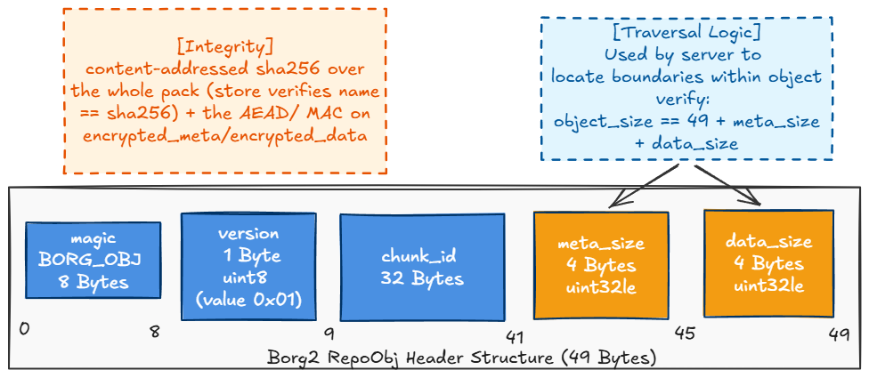
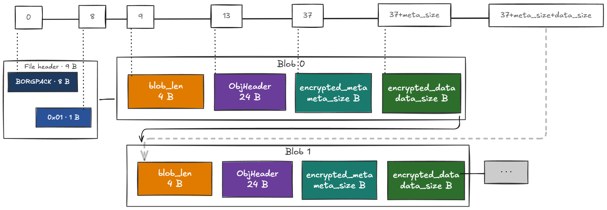
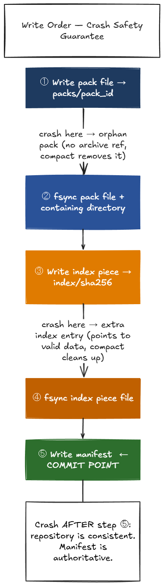

.. include:: ../global.rst.inc
.. highlight:: none

.. _packs:

Pack files
==========

Without pack files, each repository chunk is stored as a separate borgstore object.
For large repositories this means millions of individual objects, each requiring its
own I/O round trip to read or write. On high-latency backends (SFTP, cloud object
storage) this overhead dominates backup and restore times.

Pack files address this by grouping multiple chunks into a single store object. A
reader that needs one chunk does a partial read (range request) at a known offset
instead of fetching a separate file. Store object count drops from one-per-chunk to
one-per-pack.

.. _pack-format:

Pack File Format
----------------

There is no separate file header. Each blob starts with the 8-byte ``OBJ_MAGIC``
(``BORG_OBJ``), so a forward scanner can locate blob boundaries and identify
each chunk using only the pack file bytes with no external index.

Per-blob layout
~~~~~~~~~~~~~~~

Each blob is a self-contained unit::

    Offset (relative to blob start)  Size              Type     Field
    --------------------------------  ----------------  -------  -----
    0                                 len(OBJ_MAGIC)    bytes    OBJ_MAGIC = ASCII b"BORG_OBJ"
    8                                 1                 uint8    Format version: 0x01
    9                                 32                bytes    chunk_id
    41                                4                 uint32le meta_size
    45                                4                 uint32le data_size
    49                                meta_size         bytes    encrypted_meta
    49 + meta_size                    data_size         bytes    encrypted_data

``chunk_id`` is the ID hash of the plaintext data (``id_hash(plaintext_data)``).
Storing it in the unencrypted header lets a scanner rebuild the
``chunk_id → location`` index without decrypting any blob.

``chunk_id`` is also written into ``encrypted_meta`` (the meta dict). The header
copy enables key-free scanning and recovery; the meta copy lets future code read
``chunk_id`` through the normal meta dict API without parsing the raw header layout.

The fixed part of each blob header is 49 bytes (``REPOOBJ_HEADER_SIZE``):
``len(OBJ_MAGIC)`` + 1 version + 32 chunk_id + 4 meta_size + 4 data_size.
``REPOOBJ_HEADER_SIZE = len(OBJ_MAGIC) + 1 + 32 + 4 + 4 = 49``

The header stays cleartext (traversal must be possible without a key). Format version ``0x02``
(``OBJ_VERSION_HEADER_AAD``) binds its first 41 bytes (``OBJ_MAGIC`` + version + ``chunk_id`` --
``REPOOBJ_HEADER_AAD_SIZE``) into the AEAD authentication of ``encrypted_meta`` and ``encrypted_data``
as additional authenticated data (AAD: data that is authenticated together with the ciphertext, but
not itself encrypted). ``meta_size`` and ``data_size`` are not included in the AAD, since they are
only known after encryption; tampering with them still fails authentication, because it changes the
length of the ciphertext slice being decrypted. A forged ``chunk_id``, version, or magic byte
therefore fails AEAD authentication in ``RepoObj.parse()``/``parse_meta()``.

Format version ``0x01`` (``OBJ_VERSION_NO_HEADER_AAD``) authenticates ``encrypted_meta`` and
``encrypted_data`` with ``aad=chunk_id`` only, without the header bound in. ``RepoObj.format()``
writes version ``0x02``; ``parse()``/``parse_meta()`` accept both versions.

``iter_headers()`` (used for pack recovery/compaction, see below) reads the header without
decrypting, so it does not check header AAD authentication.

    The fixed 49-byte blob header. ``meta_size`` and ``data_size`` drive
    traversal; integrity comes from the content-addressed pack name and the
    per-blob AEAD, which authenticates magic/version/chunk_id as additional
    authenticated data.

A reader locates the next blob by advancing::

    next_blob_offset = current_blob_offset + REPOOBJ_HEADER_SIZE + meta_size + data_size

The per-blob magic limits the blast radius of corrupted length fields: if
``meta_size`` or ``data_size`` is damaged, the scanner loses at most one blob.
Once it finds the next ``OBJ_MAGIC`` sequence it resumes. Other corruption
(payload bit flips) is caught by AEAD on that blob without losing position.

Blobs follow one another contiguously with no padding::

    OBJ_MAGIC | version=0x01 | chunk_id_0 | meta_size_0 | data_size_0 | encrypted_meta_0 | encrypted_data_0
    OBJ_MAGIC | version=0x01 | chunk_id_1 | meta_size_1 | data_size_1 | encrypted_meta_1 | encrypted_data_1
    ...

    A pack file: self-describing objects concatenated back to back. Object
    boundaries are found by walking each 49-byte header
    (``offset += 49 + meta_size + data_size``).

Pack ID
~~~~~~~

The pack ID is the SHA-256 of the pack file's bytes::

    pack_id = sha256(pack_bytes)

Content-addressing the file by its own bytes makes the name commit to the
content, so borgstore can verify and cache it and ``borg check`` can detect
silent corruption of the stored file.

Namespace
~~~~~~~~~

Pack files are stored under the ``packs/`` namespace in borgstore, using a
single directory level keyed on the first byte of the pack ID (hex-encoded)::

    packs/
      00/ .. ff/
        <pack_id_hex>

.. _pack-index-entry:

Pack Index Entry
----------------

A pack usually holds many blobs, so locating a chunk needs which pack it is in,
where inside that pack its blob starts, and how long the blob is. The ChunkIndex
maps each chunk to a full pack location::

    chunk_id  →  (..., pack_id, obj_offset, obj_size)

``obj_offset`` is the byte offset of the blob from the start of the pack file and
``obj_size`` is the total blob length (header + encrypted_meta + encrypted_data).
A reader fetches a single chunk with one range request::

    read packs/<hex(pack_id)> at [obj_offset, obj_offset + obj_size)

The full ChunkIndex entry is ``(flags, size, pack_id, obj_offset, obj_size)``
(``ChunkIndexEntry`` in ``borg.hashindex``), where ``size`` is the plaintext
chunk size. While a chunk is buffered in the pack writer but not yet flushed, its
entry carries the ``F_PENDING`` flag and its pack location is unresolved.

.. _pack-write-order:

    The archive pointer write (``archives/<archive_id>``) is the commit point; a
    crash before it leaves only unreferenced objects that ``borg compact``
    reclaims.

Pack data must be stored before any archive pointer references it.
The required write order is:

1. Store the pack file to ``packs/<pack_id>`` via borgstore.
2. Store the partial index file to ``index/<index_id>`` (see :ref:`pack-index-namespace`).
3. Write the archive metadata object into a pack, then write the archive pointer
   ``archives/<hex(archive_id)>``. This pointer write is the sole commit point.

A crash between steps 1 and 2 leaves orphan pack files in ``packs/``. No archive
references these chunks; ``borg compact`` removes them on the next run.

A crash between steps 2 and 3 leaves a partial index file covering packs not yet
committed to any archive. The extra index entries point to valid, fully-written pack
data; they are harmless and will be cleaned up by the next ``borg compact``.

A crash after step 3 cannot leave the repository in an inconsistent state. The
archive pointer write is the commit point: archives are listed from the
``archives/`` namespace, so data not referenced by any archive pointer is
unreachable and treated as garbage by ``borg compact``.

Only ``borg compact`` and ``borg check --repair`` delete pack files. When compact
determines via mark-and-sweep that none of a pack's blobs are referenced by any
archive, it removes the whole file. Individual blobs cannot be removed without
rewriting the entire pack, so deletion always operates at pack granularity.

.. _pack-index-namespace:

Index Namespace
---------------

Chunk-to-location mappings are stored as a separate set of encrypted partial index
files under the ``index/`` namespace.

Each partial index file covers the packs written in one backup session. Its name is
the SHA-256 digest of its own content. A first backup of a large dataset may produce
a large partial index file; using the same medium-sized file writer as compact for
``borg create`` would bound that. That is the intended direction.

::

    index/
      <sha256_of_content_hex>

Content-addressed naming makes each partial index file self-verifying and idempotent:
writing the same index data twice produces the same filename, so a repeated write is
a no-op.

Partial index files are write-once. A session stores new partial index files via
borgstore; existing files are never modified. On repository open all files under
``index/`` are loaded via borgstore, decrypted, and merged into the in-memory ChunkIndex
(a ``borghash`` ``HashTableNT`` keyed on ``chunk_id``). The merge is commutative and
idempotent; order does not matter.

``borg compact`` rewrites the ``index/`` namespace: it identifies live chunks via
mark-and-sweep, consolidates the surviving mappings into medium-sized replacement
files (targeting roughly 10–100 packs per file), and removes the files it supersedes.
Medium-sized files keep the open-time merge cost bounded while avoiding the
cache-invalidation traffic on other clients that a single all-in-one index would
cause.

If the entire ``index/`` namespace is lost or corrupt, the ChunkIndex can be rebuilt
by scanning pack files directly; see :ref:`pack-recovery`.

.. _pack-recovery:

Recovery Path
-------------

When ``borg check --repair`` detects a missing or incomplete ChunkIndex it rebuilds
it by forward-scanning all pack files in ``packs/``.

Each blob's unencrypted header supplies the ``OBJ_MAGIC`` (for re-sync after
corruption), the ``chunk_id``, and the size fields needed to locate the next blob.
The scan produces a complete ``chunk_id → (pack_id, offset, length)`` mapping
without decrypting any blob and without the repository key.

.. _pack-repo-version:

Repository Version and Feature Flags
--------------------------------------

Repositories using pack files require repository version **4**. Clients that only
accept version 3 refuse to open a version 4 repository with an unsupported-version
error before any data is read.

In addition, the repository ``config.feature_flags`` must include ``pack_files`` in
the mandatory set for all access modes:

.. code-block:: python

    config = {
        "feature_flags": {
            "read":  {"mandatory": ["pack_files"]},
            "write": {"mandatory": ["pack_files"]},
            "check": {"mandatory": ["pack_files"]},
        }
    }

A client that does not recognise the ``pack_files`` feature flag will refuse to open
the repository with a ``MandatoryFeatureUnsupported`` error regardless of the version
number. The two guards cover different failure modes: the version bump stops clients
that predate feature-flag support entirely; the feature flag gives a clearer error
message to clients that understand feature flags but don't know about packs yet.

There is no migration path from version 3 repositories to version 4. Users of the
version 3 beta format must create a new repository with ``borg repo-create``.
