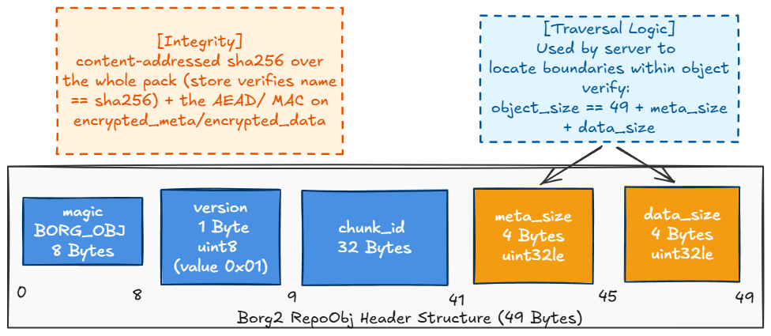
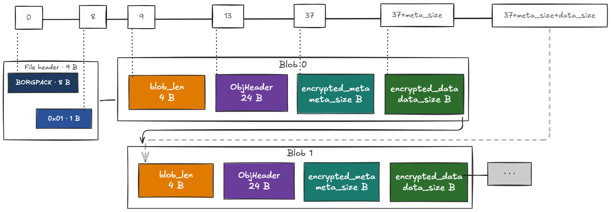
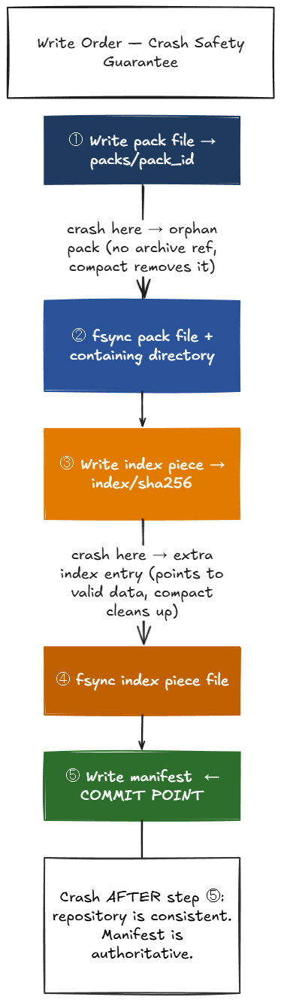

.. include:: ../global.rst.inc
.. highlight:: none

.. _packs:

Pack files
==========

Without pack files, each repository chunk is stored as a separate borgstore object.
For large repositories this means millions of individual objects, each requiring its
own I/O round trip to read or write. On high-latency backends (SFTP, cloud object
storage) this overhead dominates backup and restore times.

Pack files address this by grouping multiple chunks into a single store object. A
reader that needs one chunk does a partial read (range request) at a known offset
instead of fetching a separate file. Store object count drops from one-per-chunk to
one-per-pack.

.. _pack-format:

Pack File Format
----------------

There is no separate file header. Each blob starts with the 8-byte ``OBJ_MAGIC``
(``BORG_OBJ``), so a forward scanner can locate blob boundaries and identify
each chunk using only the pack file bytes with no external index.

Per-blob layout
~~~~~~~~~~~~~~~

Each blob is a self-contained unit::

    Offset (relative to blob start)  Size              Type     Field
    --------------------------------  ----------------  -------  -----
    0                                 len(OBJ_MAGIC)    bytes    OBJ_MAGIC = ASCII b"BORG_OBJ"
    8                                 1                 uint8    Format version: 0x02 (0x01 still readable)
    9                                 32                bytes    chunk_id
    41                                4                 uint32le meta_size
    45                                4                 uint32le data_size
    49                                meta_size         bytes    encrypted_meta
    49 + meta_size                    data_size         bytes    encrypted_data

``chunk_id`` is the ID hash of the plaintext data (``id_hash(plaintext_data)``).
Storing it in the unencrypted header lets a scanner rebuild the
``chunk_id → location`` index without decrypting any blob.

``chunk_id`` is *not* duplicated into ``encrypted_meta``: the header is its only
place in the object. ``RepoObj.format()`` puts the object type and the compression
bookkeeping into the meta dict (``type``, ``ctype``, ``clevel``, ``csize``, ``size``,
plus ``psize``/``olevel`` when the ``obfuscate`` pseudo compressor is used), nothing
else. What keeps the plaintext header copy honest is that it is bound into the
authentication of both encrypted slots, see below.

The fixed part of each blob header is 49 bytes (``REPOOBJ_HEADER_SIZE``):
``len(OBJ_MAGIC)`` + 1 version + 32 chunk_id + 4 meta_size + 4 data_size.
``REPOOBJ_HEADER_SIZE = len(OBJ_MAGIC) + 1 + 32 + 4 + 4 = 49``

Format version ``0x02`` (``OBJ_VERSION_HEADER_AAD``) binds the header's first 41 bytes (``OBJ_MAGIC``
+ version + ``chunk_id`` -- ``REPOOBJ_HEADER_AAD_SIZE``) into the authentication of
``encrypted_meta`` and ``encrypted_data`` as additional authenticated data (AAD: data that is
authenticated together with the ciphertext, but not itself encrypted). This applies to all borg 2
modes: the AEAD encryption modes (AES-256-OCB, ChaCha20-Poly1305) authenticate it with their AEAD
tag, the ``authenticated-*`` modes with their MAC and the ``none-*`` modes with their (unkeyed)
checksum, see :ref:`tagged_envelope`. ``meta_size`` and ``data_size`` are excluded from
the AAD; tampering with either still fails the check, because it changes the length of the
slice being read. A forged ``chunk_id``, version, or magic byte therefore fails
authentication in ``RepoObj.parse()``/``parse_meta()``.

``encrypted_meta`` and ``encrypted_data`` each add a one-byte slot tag on top of the shared header
AAD -- ``b"M"`` for ``encrypted_meta``, ``b"D"`` for ``encrypted_data`` -- binding each ciphertext to
its slot. This stops an attacker controlling repo storage from swapping the two ciphertexts (adjusting
``meta_size``/``data_size`` to match): decrypting a ciphertext under the wrong slot's AAD fails
authentication.

Format version ``0x01`` (``OBJ_VERSION_NO_HEADER_AAD``) authenticates ``encrypted_meta`` and
``encrypted_data`` with ``aad=chunk_id`` only, without the header bound in. ``RepoObj.format()``
writes version ``0x02``; ``parse()``/``parse_meta()`` accept both versions.

``iter_headers()`` (used for pack recovery/compaction, see below) reads the header without
decrypting, so it does not check header AAD authentication.

    The fixed 49-byte blob header. ``meta_size`` and ``data_size`` drive
    traversal; integrity comes from the content-addressed pack name and the
    per-blob tag, which authenticates magic/version/chunk_id as additional
    authenticated data.

A reader locates the next blob by advancing::

    next_blob_offset = current_blob_offset + REPOOBJ_HEADER_SIZE + meta_size + data_size

``iter_headers()`` checks every header it walks: it must have ``OBJ_MAGIC``, a
supported version, and sizes that keep the blob inside the pack. A header that
fails these checks means a corrupt pack, and ``IntegrityError`` is raised.

The per-blob magic limits the blast radius of corrupted length fields. The
repair walk (``iter_headers(validate=...)``, used when ``borg check --repair``
rebuilds the chunks index from the packs) scans forward for the next blob and
resumes there, so the blobs after the damaged part of the pack are still found.

``OBJ_MAGIC`` occurs inside the payloads as well, and in ``none`` and
``authenticated`` mode the payloads are user content stored as it is, so a
backed up file can contain something shaped like a blob. The scan therefore
accepts a candidate only if it parses. For the AEAD keys it reads the header and
the encrypted metadata, a few hundred bytes: decrypting the metadata
authenticates it together with the header's magic, version and chunk_id, which
are its AAD (additional authenticated data: authenticated with the ciphertext,
but not encrypted). The other keys authenticate by ``chunk_id == id_hash(content)``
(``KeyBase.id_check_is_authentication``), which needs the blob's data, so for
those the scan reads the whole blob. The key is needed either way; a repair that
cannot read the manifest walks without scanning.

``data_size`` is not part of that AAD, so accepting a candidate authenticates
its chunk id, and its size only as far as the blob fits into the pack. Bit flips
in the data are caught when the blob is read, on that blob alone.

Blobs follow one another contiguously with no padding::

    OBJ_MAGIC | version=0x02 | chunk_id_0 | meta_size_0 | data_size_0 | encrypted_meta_0 | encrypted_data_0
    OBJ_MAGIC | version=0x02 | chunk_id_1 | meta_size_1 | data_size_1 | encrypted_meta_1 | encrypted_data_1
    ...

    A pack file: self-describing objects concatenated back to back. Object
    boundaries are found by walking each 49-byte header
    (``offset += 49 + meta_size + data_size``).

Pack ID
~~~~~~~

The pack ID is the SHA-256 of the pack file's bytes::

    pack_id = sha256(pack_bytes)

Content-addressing the file by its own bytes makes the name commit to the
content, so borgstore can verify and cache it and ``borg check`` can detect
silent corruption of the stored file.

Namespace
~~~~~~~~~

Pack files are stored under the ``packs/`` namespace in borgstore, using a
single directory level keyed on the first byte of the pack ID (hex-encoded)::

    packs/
      00/ .. ff/
        <pack_id_hex>

.. _pack-index-entry:

Pack Index Entry
----------------

A pack usually holds many blobs, so locating a chunk needs which pack it is in,
where inside that pack its blob starts, and how long the blob is. The ChunkIndex
maps each chunk to a full pack location::

    chunk_id  →  (..., pack_id, obj_offset, obj_size)

``obj_offset`` is the byte offset of the blob from the start of the pack file and
``obj_size`` is the total blob length (header + encrypted_meta + encrypted_data).
A reader fetches a single chunk with one range request::

    read packs/<hex(pack_id)> at [obj_offset, obj_offset + obj_size)

The full ChunkIndex entry is ``(flags, size, pack_id, obj_offset, obj_size)``
(``ChunkIndexEntry`` in ``borg.hashindex``), where ``size`` is the plaintext
chunk size. While a chunk is buffered in the pack writer but not yet flushed, its
entry carries the ``F_PENDING`` flag and its pack location is unresolved.

.. _pack-write-order:

    The archive pointer write (``archives/<archive_id>``) is the commit point; a
    crash before it leaves only unreferenced objects that ``borg compact``
    reclaims.

Pack data must be stored before any archive pointer references it.
The required write order is:

1. Store the pack files to ``packs/<pack_id>`` via borgstore. The archive metadata
   object goes into a (usually tiny) pack of its own, stored last.
2. Store index fragment(s) covering all objects the session stored -- the archive
   metadata object included -- to ``index/<index_id>`` (see :ref:`pack-index-namespace`).
3. Write the archive pointer ``archives/<hex(archive_id)>``. This pointer write is
   the sole commit point.

A crash between steps 1 and 2 leaves orphan pack files in ``packs/``. No archive
references these chunks; ``borg compact`` removes them on the next run.

A crash between steps 2 and 3 leaves a partial index file covering packs not yet
committed to any archive. The extra index entries point to valid, fully-written pack
data; they are harmless and will be cleaned up by the next ``borg compact``.

A crash after step 3 cannot leave the repository in an inconsistent state. The
archive pointer write is the commit point: archives are listed from the
``archives/`` namespace, so data not referenced by any archive pointer is
unreachable and treated as garbage by ``borg compact``.

Pack files are removed by ``borg compact`` (dropping packs whose indexed objects are
all unused, rewriting packs above ``--threshold`` and merging tiny packs),
``borg check --repair`` (when it drops a defective object), ``borg repo-compress``
(``Repository.transform_pack`` stores the re-compressed pack under its new
content-addressed name and deletes the old one) and ``borg debug delete-obj``. A
single blob cannot be removed from a pack in place: all of these paths write a new
pack file without it and then delete the old one, so store-level deletion always
operates at pack granularity.

.. _pack-index-namespace:

Index Namespace
---------------

Chunk-to-location mappings are stored as a separate set of objects under the
``index/`` namespace, called *index fragments*.

A fragment is a serialized ``ChunkIndex`` (a ``borghash`` ``HashTableNT`` keyed on
``chunk_id``) holding only the pack location; the ``flags`` and the plaintext ``size``
of each entry are zeroed before serializing. Fragments are **not** encrypted: they map
``chunk_id`` to ``(pack_id, obj_offset, obj_size)``, which anyone with access to the
repository could equally well read out of the unencrypted blob headers (see
:ref:`pack-recovery`). A fragment's name is the SHA-256 digest of its own content::

    index/
      <sha256_of_content_hex>

An ordinary backup writes only the entries that are new in that session; a full
rewrite (e.g. by ``borg compact``) writes all of them. In both cases the write is
split into fragments of at most ``CHUNKINDEX_FRAGMENT_ENTRIES_MAX`` (400000 entries,
roughly 32MB), so no single fragment gets too large -- not even the one large write a
first backup of a big dataset produces. The split selects and sorts the keys one
leading-key-bits partition at a time, so the same set of entries always yields the
same fragments, no matter in which order the entries were inserted.

Content-addressed naming makes each fragment self-verifying and idempotent: writing
the same index data twice produces the same name, and such a write is skipped.

Index fragments are write-once; an existing fragment is never modified. The in-memory
ChunkIndex is built lazily, on the first access to ``Repository.chunks``: everything
under ``index/`` is listed, loaded, checked against its content hash and merged
(``build_chunkindex_from_repo``). The merge is commutative and idempotent; order does
not matter. It has to succeed for *all* fragments or not at all, because a partially
merged index would be missing chunks that do exist in the repository: a fragment that
vanishes mid-merge (a concurrent consolidation replaced it) restarts the merge, and a
persistently unreadable one falls back to the rebuild from the pack files.

Because every backup appends a fragment, small fragments would pile up over time.
``repack_chunkindex()`` (run at cache close, and by anything that loads the index and
persists it, e.g. ``borg compact``) merges the fragments below
``CHUNKINDEX_FRAGMENT_ENTRIES_MIN`` (100000 entries, roughly 8MB) into fragments of up
to ``CHUNKINDEX_FRAGMENT_ENTRIES_MAX`` entries and deletes the small sources.
Fragments already within that range are left untouched, so they stay immutable -- and,
once ``index/`` is cache-backed, stay cached for every client, instead of being
invalidated by an all-in-one consolidation. The merge is deferred until it can seal at
least one full fragment, or until more than ``CHUNKINDEX_SMALL_FRAGMENT_CAP`` (15)
small fragments have accumulated, so a slowly growing fragment is not rewritten on
every backup.

``borg compact`` rewrites the ``index/`` namespace as a whole: it determines the live
chunks via mark-and-sweep, writes the complete surviving index as bounded fragments,
and deletes all the fragments it supersedes.

A deletion that could drop entries -- dropping the index entirely, or the full rewrite
above -- is guarded by a marker object, ``cache/chunkindex-invalid``, written before
the first deletion and removed after the last one. While the marker is present,
leftover fragments could be an incomplete index, so they are not merged; the index is
rebuilt from the pack files on the next load instead. A consolidation needs no marker:
the entries of the small fragments it deletes are already contained in the merged
fragments it wrote before deleting them.

If the entire ``index/`` namespace is lost or corrupt, the ChunkIndex can be rebuilt
by scanning pack files directly; see :ref:`pack-recovery`.

.. _pack-recovery:

Recovery Path
-------------

The ChunkIndex can always be reconstructed by forward-scanning all pack files in
``packs/``. The archives phase of ``borg check --repair`` does that unconditionally
(it has to work from the real packs, so it can find archives referencing chunks whose
pack has gone missing), and the same rebuild is the fallback whenever the ``index/``
fragments cannot be loaded completely (see :ref:`pack-index-namespace`).

Each blob's unencrypted header supplies the ``OBJ_MAGIC`` (for re-sync after
corruption), the ``chunk_id``, and the size fields needed to locate the next blob.
The scan produces a complete ``chunk_id → (pack_id, offset, length)`` mapping
without decrypting any blob and without the repository key.

.. _pack-repo-version:

Repository Version
------------------

Repositories using pack files require repository version **4**, and the version is the
only gate for the pack format.

``Repository.create()`` stores ``4`` as the ``config/version`` store object.
``Repository.open()`` reads it back and, if it is not in
``Repository.acceptable_repo_versions`` (currently ``(4,)``), closes the store again
and raises ``InvalidRepositoryConfig`` -- before any repository data is read. A borg
version that only accepts version 3 rejects a version 4 repository the same way, so
the version bump alone locks out every client that does not know about packs.

Borg does have a feature flag mechanism for locking out clients more selectively
(``Manifest.check_repository_compatibility()``, fed from a ``feature_flags`` entry in
the manifest ``config`` -- see :ref:`manifest`), but it currently defines no flags at
all: ``Manifest.SUPPORTED_REPO_FEATURES`` is the empty set, and no borg code writes a
``feature_flags`` entry. On a repository borg creates, the compatibility check is
therefore a no-op; there is in particular no ``pack_files`` feature flag.

There is no migration path from version 3 repositories to version 4. Users of the
version 3 beta format must create a new repository with ``borg repo-create``.
