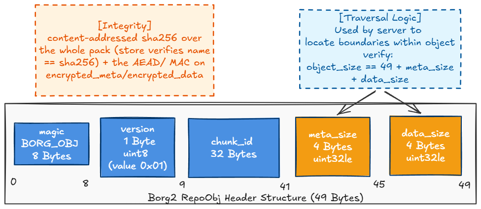
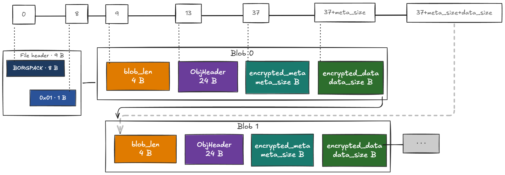
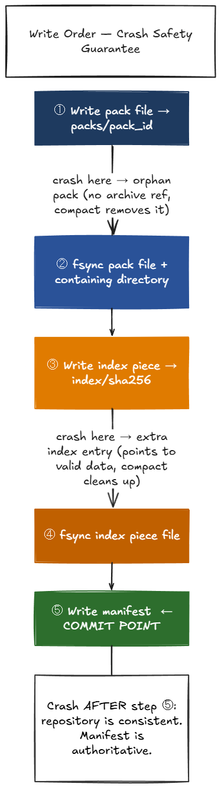

.. include:: ../global.rst.inc
.. highlight:: none

.. _packs:

Pack files
==========

Without pack files, each repository chunk is stored as a separate borgstore object.
For large repositories this means millions of individual objects, each requiring its
own I/O round trip to read or write. On high-latency backends (SFTP, cloud object
storage) this overhead dominates backup and restore times.

Pack files address this by grouping multiple chunks into a single store object. A
reader that needs one chunk does a partial read (range request) at a known offset
instead of fetching a separate file. Store object count drops from one-per-chunk to
one-per-pack.

.. _pack-format:

Pack File Format
----------------

There is no separate file header. Each blob starts with the 8-byte ``OBJ_MAGIC``
(``BORG_OBJ``), so a forward scanner can locate blob boundaries and identify
each chunk using only the pack file bytes with no external index.

Per-blob layout
~~~~~~~~~~~~~~~

Each blob is a self-contained unit::

    Offset (relative to blob start)  Size              Type     Field
    --------------------------------  ----------------  -------  -----
    0                                 len(OBJ_MAGIC)    bytes    OBJ_MAGIC = ASCII b"BORG_OBJ"
    8                                 1                 uint8    Format version: 0x02
    9                                 32                bytes    chunk_id
    41                                4                 uint32le meta_size
    45                                4                 uint32le data_size
    49                                meta_size         bytes    encrypted_meta
    49 + meta_size                    data_size         bytes    encrypted_data

``chunk_id`` is the ID hash of the plaintext data (``id_hash(plaintext_data)``).
Storing it in the unencrypted header lets a scanner rebuild the
``chunk_id → location`` index without decrypting any blob.

``chunk_id`` is *not* duplicated into ``encrypted_meta``: the header is its only
place in the object. ``RepoObj.format()`` puts the object type and the compression
bookkeeping into the meta dict (``type``, ``ctype``, ``clevel``, ``csize``, ``size``,
plus ``psize``/``olevel`` when the ``obfuscate`` pseudo compressor is used), nothing
else. What keeps the plaintext header copy honest is that it is bound into the
authentication of both encrypted slots, see below.

The fixed part of each blob header is 49 bytes (``REPOOBJ_HEADER_SIZE``):
``len(OBJ_MAGIC)`` + 1 version + 32 chunk_id + 4 meta_size + 4 data_size.
``REPOOBJ_HEADER_SIZE = len(OBJ_MAGIC) + 1 + 32 + 4 + 4 = 49``

The format version is ``0x02`` (``OBJ_VERSION_HEADER_AAD``), the only version ``RepoObj.format()``
writes and ``parse()``/``parse_meta()`` accept. It binds the header's first 41 bytes (``OBJ_MAGIC``
+ version + ``chunk_id`` -- ``REPOOBJ_HEADER_AAD_SIZE``) into the authentication of
``encrypted_meta`` and ``encrypted_data`` as additional authenticated data (AAD: data that is
authenticated together with the ciphertext, but not itself encrypted). This applies to all borg 2
modes: the AEAD encryption modes (AES-256-OCB, ChaCha20-Poly1305) authenticate it with their AEAD
tag, the ``authenticated-*`` modes with their MAC, see :ref:`tagged_envelope`.
``meta_size`` and ``data_size`` are excluded from the AAD.
``RepoObj.parse()`` reads both slots, so tampering with either size still fails the check, by
changing the length of the slice being read. ``parse_meta()`` reads the metadata slot alone: it
catches a changed ``meta_size`` the same way, but not a changed ``data_size``, which the repair
walk described below pins separately. A forged ``chunk_id``, version, or magic byte fails
authentication in both.

``encrypted_meta`` and ``encrypted_data`` each add a one-byte slot tag on top of the shared header
AAD -- ``b"M"`` for ``encrypted_meta``, ``b"D"`` for ``encrypted_data`` -- binding each ciphertext to
its slot. This stops an attacker controlling repo storage from swapping the two ciphertexts (adjusting
``meta_size``/``data_size`` to match): decrypting a ciphertext under the wrong slot's AAD fails
authentication.

``iter_headers()`` (used for pack recovery/compaction, see below) reads the header without
decrypting, so it does not check header AAD authentication. The repair walk described below is the
exception: given a validator it reads and decrypts each metadata slot, and thus does check it.

    The fixed 49-byte blob header. ``meta_size`` and ``data_size`` drive
    traversal; integrity comes from the content-addressed pack name and the
    per-blob tag, which authenticates magic/version/chunk_id as additional
    authenticated data.

TODO: redraw this figure: it shows sha256 instead of the store hash, and the format
version ``0x01`` instead of ``0x02``.

A reader locates the next blob by advancing::

    next_blob_offset = current_blob_offset + REPOOBJ_HEADER_SIZE + meta_size + data_size

``iter_headers()`` checks every header it walks: it must have ``OBJ_MAGIC``, a
supported version, and sizes that keep the blob inside the pack and within
``MAX_DATA_SIZE``. A header that fails these checks means a corrupt pack, and
``IntegrityError`` is raised, naming which check it failed. A chunks index
rebuild without a repair walk (see below) would be incomplete from that point
on, so it turns that into ``CorruptPack``, telling the user to run
``borg check --repair``.

The per-blob magic limits the blast radius of corrupted length fields. The repair
walk (``iter_headers(validate=...)``, used when ``borg check`` rebuilds the chunks
index from the packs and when ``borg check --repair`` re-reads the packs it wrote)
validates every header it walks, reading the metadata slot along with it: the slot's
tag covers the slot itself and the chunk id, and at version ``0x02`` the header AAD
described above, so a corrupted chunk id or ``meta_size`` fails it; a corrupted magic
fails the magic check, and a corrupted version fails because the version decides
which AAD the slot is parsed with. ``data_size`` - the one header field outside the
tag at either version - must equal ``csize`` (the data payload size recorded in the
tagged metadata) plus the key's fixed envelope overhead. A header with a
``meta_size`` above 64 KiB (``MAX_VALIDATED_META_SIZE``) fails without the slot being
read. A header that fails makes the walk scan for the next blob that validates and
resume there, so the blobs after the damaged one are still found; the damaged blob
itself is dropped, it can not be read back.

The walk rebuilds the index from the pack as it is: the damaged bytes stay where
they are, as a gap no index entry covers. A pack is named by the store hash of its
content, so a pack damaged in the store keeps failing the store-level check that
``borg check`` runs over ``packs/`` until it is rewritten. ``borg check --repair``
rewrites it before any index rebuild: it replaces the pack by one holding only the
blobs the walk finds and whose metadata and data slots both authenticate, which
drops the damaged bytes (see ``Repository.salvage_pack``). A pack in which no blob
authenticates is left as it is.

``OBJ_MAGIC`` occurs inside the payloads as well, so the scan accepts a candidate
only when it validates like any walked header. Validating needs the key, which
``borg check`` always loads: it aborts if it can not.

In the ``authenticated-*`` modes the tag binds a blob to its chunk id and nothing
else (see :ref:`security_structural_auth`), so validating does not establish there
that this repository wrote the blob. These modes also store payloads as they are, so a
backed up file can contain something that validates - the blobs of a repository
sharing the key, for instance. Such a blob reads back as itself, adding a chunk
nothing references, but the extent its ``data_size`` claims covers whatever
follows it at that offset, which the walk then skips. The scan reaches a payload
only after the blob owning it failed to validate, so a corrupt header is what
makes this reachable.

Bit flips in the data are caught when the blob is read, on that blob alone.

Blobs follow one another contiguously with no padding::

    OBJ_MAGIC | version=0x02 | chunk_id_0 | meta_size_0 | data_size_0 | encrypted_meta_0 | encrypted_data_0
    OBJ_MAGIC | version=0x02 | chunk_id_1 | meta_size_1 | data_size_1 | encrypted_meta_1 | encrypted_data_1
    ...

    A pack file: self-describing objects concatenated back to back. Object
    boundaries are found by walking each 49-byte header
    (``offset += 49 + meta_size + data_size``).

Pack ID
~~~~~~~

The pack ID is the :ref:`store hash <store_hash>` of the pack file's bytes::

    pack_id = store_hash(pack_bytes)

Content-addressing the file by its own bytes makes the name commit to the
content, so borgstore can verify and cache it and ``borg check`` can detect
silent corruption of the stored file.

Namespace
~~~~~~~~~

Pack files are stored under the ``packs/`` namespace in borgstore, using a
single directory level keyed on the first byte of the pack ID (hex-encoded)::

    packs/
      00/ .. ff/
        <pack_id_hex>

Writing packs
~~~~~~~~~~~~~

``Repository.put()`` adds each blob to the in-memory buffer of the pack writer
(``PackWriter``). When the buffered blobs reach the pack limit, the buffer is
stored as one pack. By default the limit is a size of 50 MB (``DEFAULT_PACK_MAX_SIZE``).
``BORG_PACK_MAX_SIZE`` sets the size limit and ``BORG_PACK_MAX_COUNT`` a blob count
limit; with only ``BORG_PACK_MAX_COUNT`` set, packs are bound by count only, see
:ref:`env_vars`. The blob that reaches the limit is part of that pack, so a pack can
be larger than the size limit by less than one blob.

A full pack is hashed and stored by a background thread, while the pack writer
buffers the blobs of the next pack. At most one pack is stored at a time: the
pack writer waits for that thread (joins it) before it hands over the next full
pack. The ChunkIndex gets the pack locations of a pack's blobs when the thread
storing it is joined. ``Repository.flush()`` joins that thread and stores the
partially filled buffer as a pack, so afterwards every blob put before it has its
pack location (see ``F_PENDING`` in :ref:`pack-index-entry`).
``BORG_PACK_ASYNC=no`` stores each full pack in the calling thread instead, a
debugging aid.

.. _pack-index-entry:

Pack Index Entry
----------------

A pack usually holds many blobs, so locating a chunk needs which pack it is in,
where inside that pack its blob starts, and how long the blob is. The ChunkIndex
maps each chunk to a full pack location::

    chunk_id  →  (..., pack_id, obj_offset, obj_size)

``obj_offset`` is the byte offset of the blob from the start of the pack file and
``obj_size`` is the total blob length (header + encrypted_meta + encrypted_data).
A reader fetches a single chunk with one range request::

    read packs/<hex(pack_id)> at [obj_offset, obj_offset + obj_size)

The full ChunkIndex entry is ``(flags, size, pack_id, obj_offset, obj_size)``
(``ChunkIndexEntry`` in ``borg.hashindex``), where ``size`` is the plaintext
chunk size. While a chunk is buffered in the pack writer but not yet flushed, its
entry carries the ``F_PENDING`` flag and its pack location is unresolved.
When an operation aborts (an exception unwinds out of the repository context),
chunks still buffered in the pack writer were never stored: they are discarded
together with their pending index entries, while a pack already handed to the
store is still recorded if its store succeeded.

Reading a chunk whose entry is ``F_PENDING`` first joins the thread storing its
pack. A chunk that is still in the buffer has no pack location, reading it raises
``PackLocationUnknown``.

``Repository.get()`` reads one blob with one range request, or slices it from the
whole pack if ``get_many()`` already loaded that pack. With ``read_data=False`` it
reads only the blob header and the metadata slot. Two methods read many blobs:

- ``get_many()`` loads the whole pack of each requested chunk and keeps the
  ``PACK_READER_CACHE_SIZE`` (3) most recently used packs in memory, for reading
  most blobs of a pack.
- ``gather_many()`` reads the ranges of up to 1000 blobs (or about 16 MiB) from any
  number of packs with one ``store.gather`` call, for many small blobs spread over
  many packs, like the archive metadata objects and the item metadata chunks of an
  archive (stored in the same packs as the file content chunks). Reading an archive's
  items uses it, so it does not load the whole packs around them.

With ``BORG_STORE_CACHE``, borgstore loads a whole pack into a local cache directory
on a cache miss and serves later reads of that pack from there.

.. _pack-write-order:

    The archive pointer write (``archives/<archive_id>``) is the commit point; a
    crash before it leaves only objects no archive references.

TODO: redraw this figure: it shows sha256 instead of the store hash, and says the
objects a crash leaves are "reclaimed by borg compact", which holds for blobs no
index entry covers only after ``borg check --repair``, see below.

Pack data must be stored before any archive pointer references it.
The required write order is:

1. Store the pack files to ``packs/<pack_id>`` via borgstore. The archive metadata
   object goes into a (usually tiny) pack of its own, stored last.
2. Store index fragment(s) covering all objects the session stored -- the archive
   metadata object included -- to ``index/<index_id>`` (see :ref:`pack-index-namespace`).
3. Write the archive pointer ``archives/<hex(archive_id)>``. This pointer write is
   the sole commit point.

Step 2 also runs while chunks are added: when 10 minutes have passed since the last
index write, the pack writer is flushed and the chunks not yet in any fragment are
stored as index fragment(s).

A crash between steps 1 and 2 leaves blobs in ``packs/`` that no index entry covers
(see `Gap bytes`_). No archive references these chunks. As the index does not
list them, a later backup stores the chunks it needs again, which makes those blobs
superseded duplicates. ``borg compact`` reclaims unused indexed objects and superseded
duplicates; the other blobs no index entry covers stay.

A full ``borg check --repair`` (``--repository-only`` rebuilds the index only if it
is corrupt) rebuilds the index from the packs (see :ref:`pack-recovery`) and indexes
one copy per chunk id, so the blobs whose chunk id had no index entry become indexed,
and ``borg compact`` reclaims them once unused. The other copies stay superseded
duplicates, which ``borg compact`` reclaims as well.

A crash between steps 2 and 3 leaves index entries for objects no archive
references. They point to valid, fully-written pack data, and ``borg compact``
reclaims them like any other unused objects.

A crash after step 3 cannot leave the repository in an inconsistent state. The
archive pointer write is the commit point: archives are listed from the
``archives/`` namespace, so data not referenced by any archive pointer is
unreachable, and ``borg compact`` treats its indexed objects as unused.

Pack files are removed by ``borg compact`` (dropping packs that hold only unused
objects and superseded gap blobs, see `Gap bytes`_, rewriting packs above
``--threshold`` and merging tiny packs),
``borg check --repair`` (when it drops a defective object, and when it salvages a
pack recorded corrupt), ``borg repo-compress`` (``Repository.transform_pack`` stores
the re-compressed pack under its new content-addressed name and deletes the old one)
and ``borg debug delete-obj``. A single blob cannot be removed from a pack in place:
all of these paths write a new pack file without it and then delete the old one, so
store-level deletion always operates at pack granularity.
``borg compact`` (rewriting, merging) and ``borg repo-compress`` skip packs recorded
corrupt in ``cache/checked-packs``: the rewritten pack would get a new content-addressed
name that passes ``borg check``, hiding the corruption. ``borg compact`` still deletes
such a pack if all its bytes are indexed and unused.
``borg repo-compress`` also skips packs without any indexed object.

Gap bytes
~~~~~~~~~

The *gaps* of a pack are its byte ranges that no chunks index entry covers. They hold chunk
copies that were stored again in another pack, and blobs of a backup that crashed before
writing its index. A gap blob is *superseded* when the index maps its chunk id to another
location. Equal chunk ids mean equal plaintext, so a superseded blob is redundant, whatever
the stored size of the indexed copy (compression and obfuscation padding change it).

Rewriting a pack (``compact_pack``, ``transform_pack``) drops the superseded gap blobs whose
header and metadata slot validate, checked as in the repair walk above
(``repoobj.object_validator``), and copies all other gap bytes into the new pack.
Validation covers ``meta_size`` and ``data_size``, so a dropped range is exactly one blob.
Without a validator (``validate=None``), no gap bytes are dropped. A superseded blob is
also kept when its indexed copy may be unreadable: ``borg compact`` and ``borg repo-compress``
keep it when that copy is in a pack that is missing from the store, recorded corrupt, or
whose index entries overlap or reach past the end of the pack file,
``borg check --repair --verify-data`` when that copy is in a missing pack or in a pack holding
a defect chunk. Merging packs (``merge_packs``) copies
whole pack files, so it keeps all gap bytes.

``borg compact`` walks the gaps of every pack not recorded corrupt and adds the superseded
gap blobs to the pack's unused indexed bytes. The sum decides whether the pack is rewritten
(``--threshold``), and a pack holding only unused indexed objects and superseded gap blobs is
deleted. A rewrite drops the superseded gap blobs that this walk found. ``borg compact``
checks the index entries of every pack: a pack in which they overlap or reach past the end
of the pack file is logged as an error and left unchanged; its gaps are not walked, and a
gap blob whose indexed copy is in such a pack is kept. If the space to reclaim in the whole
repository is too small for ``borg compact`` to delete or rewrite packs, a tiny pack whose
indexed objects are all used is merged, superseded gap blobs included.

The walk over a gap steps from header to header by the blob size each header states. A read
starts at a blob header. It is ``GAP_READ_SIZE`` (64 kiB) at the start of a gap and after a
blob smaller than that, so small blobs share a store request, and ``META_READ_SIZE`` (1 kiB)
after a larger blob. The walk ends at a header that does not parse or that reaches past the gap. The rest of
that gap is kept, and so is a superseded blob that does not validate; both are logged as a
warning with the pack id and the offset.

.. _pack-index-namespace:

Index Namespace
---------------

Chunk-to-location mappings are stored as a separate set of objects under the
``index/`` namespace, called *index fragments*.

A fragment is a serialized ``ChunkIndex`` (a ``borghash`` ``HashTableNT`` keyed on
``chunk_id``) holding only the pack location; the ``flags`` and the plaintext ``size``
of each entry are zeroed before serializing. The fragment is stored in the key's
:ref:`store object envelope <store_object_envelope>`: encrypted and authenticated in
the encrypting modes, authenticated only in the ``authenticated-*`` modes. A
fragment's name is the store hash of the stored envelope, so ``borg check`` and
borgstore can verify it without the key, like any other content-addressed object::

    index/
      <store_hash_of_envelope_hex>

An ordinary backup writes only the entries that are new in that session; a full
rewrite (e.g. by ``borg compact``) writes all of them. In both cases the write is
split into fragments of at most ``CHUNKINDEX_FRAGMENT_ENTRIES_MAX`` (400000 entries,
roughly 32MB), so no single fragment gets too large -- not even the one large write a
first backup of a big dataset produces. The split selects and sorts the keys one
leading-key-bits partition at a time, so the same set of entries always yields the
same fragments, no matter in which order the entries were inserted.

Content-addressed naming makes each fragment self-verifying. In the ``authenticated-*``
modes, the envelope is deterministic, so the same entries produce the same name. In the
encrypting modes, the envelope is randomized, so the same entries produce a
differently named fragment each time they are stored. So that writing the same index
data twice does not store it twice, the client remembers the plaintext store hash
(the store hash of the serialized index, before the envelope is added) of every
fragment it read or stored in the session, and a write (unless forced) skips a fragment
whose content is already present in the repository. Duplicate fragments that are
left anyway (e.g. two clients consolidating the same small fragments at the same
time) are harmless, as the merge (see below) is idempotent; the next ``borg compact``
removes them.

Index fragments are write-once; an existing fragment is never modified. The in-memory
ChunkIndex is built lazily, on the first access to ``Repository.chunks``: everything
under ``index/`` is listed, loaded, authenticated and merged
(``build_chunkindex_from_repo``). Loading does not hash a fragment to verify its name:
the authentication of the envelope already proves its content (``borg check``
verifies the names). The merge is commutative and idempotent; order does not matter.
It has to succeed for *all* fragments or not at all, because a partially merged index
would be missing chunks that do exist in the repository. The merge is attempted up to
``CHUNKINDEX_MERGE_ATTEMPTS`` (3) times: a fragment that vanishes mid-merge (a
concurrent consolidation replaced it) ends the attempt, and after the last attempt
the index is rebuilt from the pack files. A corrupt fragment (it fails the
authentication or does not deserialize) aborts the command: run
``borg check --repair`` to rebuild the index from the pack files. Only the commands
that rewrite the whole index anyway, under an exclusive lock (``borg compact``
without ``--dry-run``, ``borg repo-compress``), rebuild it from the pack files
instead of aborting.

Because every backup appends a fragment, small fragments would pile up over time.
``repack_chunkindex()`` (run at cache close, and by anything that loads the index and
persists it, e.g. ``borg compact``) merges the fragments below
``CHUNKINDEX_FRAGMENT_ENTRIES_MIN`` (100000 entries, roughly 8MB) into fragments of up
to ``CHUNKINDEX_FRAGMENT_ENTRIES_MAX`` entries and deletes the small sources.
Fragments already within that range are left untouched, so they stay immutable -- and,
once ``index/`` is cache-backed, stay cached for every client, instead of being
invalidated by an all-in-one consolidation. The merge is deferred until it can seal at
least one full fragment, or until more than ``CHUNKINDEX_SMALL_FRAGMENT_CAP`` (15)
small fragments have accumulated, so a slowly growing fragment is not rewritten on
every backup.

``borg compact`` flags the chunks the archives reference as used; the other indexed
chunks are unused (see :ref:`write order <pack-write-order>` for which packs it
changes). ``borg compact`` and ``borg repo-compress`` rewrite the ``index/``
namespace as a whole: before their first change to the pack files, they delete all
fragments, and after their last one, they store the complete index as bounded
fragments. After a crash in between, there are no fragments, so the next load
rebuilds the index from the pack files.

A deletion that could drop entries -- dropping the index entirely, or the full rewrite
above -- is guarded by a marker object, ``cache/chunkindex-invalid``, written before
the first deletion and removed after the last one. A single-object delete writes the
marker just before it removes the old pack, and ``borg check --repair`` writes it
after storing packs, before it re-reads them and stores the index; both remove it
once the index is stored. While the marker is present, the fragments may be missing
entries or point at deleted packs, so they are not merged; the index is rebuilt from
the pack files on the next load instead. A consolidation needs no marker: the entries
of the small fragments it deletes are already contained in the merged fragments it
wrote before deleting them.

If the entire ``index/`` namespace is lost, the ChunkIndex is rebuilt by scanning
pack files directly; a corrupt one is rebuilt that way by ``borg check --repair``, see
:ref:`pack-recovery`.

.. _pack-recovery:

Recovery Path
-------------

The ChunkIndex can always be reconstructed by forward-scanning all pack files in
``packs/``. A command rebuilds it this way when there are no ``index/`` fragments,
the ``cache/chunkindex-invalid`` marker is present, or fragments kept vanishing while
being merged (see :ref:`pack-index-namespace`). ``borg compact`` (without
``--dry-run``) and ``borg repo-compress`` also rebuild it this way when a fragment is
corrupt. The repository phase of ``borg check --repair`` rebuilds it when the index
is corrupt and every pack passed the check. The archives phase of
``borg check --repair`` always rebuilds it from the packs, so it can find archives
referencing chunks whose pack has gone missing.

Each blob's unencrypted header supplies the ``OBJ_MAGIC``, the ``chunk_id``, and the
size fields needed to locate the next blob. The rebuild of a command other than
``borg check`` uses these headers alone, without decrypting any blob; a corrupt header
aborts it with ``CorruptPack``. ``borg check`` rebuilds with the repair walk (see
:ref:`pack-format`): it also parses each blob's metadata slot, which needs the key,
and after a corrupt header it continues at the next blob that validates.

.. _pack-repo-version:

Repository Version
------------------

Repositories using pack files require repository version **5** or later, and the version
is the only gate for the pack format.

``Repository.save_config()`` stores the version in the repository config (see
:ref:`repo_config`; currently ``5``, which also introduced the config object itself).
``Repository.open()`` reads it back and, if it is not in
``Repository.acceptable_repo_versions`` (currently ``(5,)``), closes the store again
and raises ``InvalidRepositoryConfig`` -- before any repository data is read.
