# We Are Borg — A Joke Collection

A copy of the jokes from
[borgbackup/borg#10000](https://github.com/borgbackup/borg/issues/10000),
kept here so they survive independently of the issue tracker.

The graphic is [`we_are_borg.svg`](we_are_borg.svg) — a self-contained SVG.
The "WE ARE BORG" headline is set in the borg logo typeface (Black Ops One,
James Grieshaber, SIL OFL 1.1 — see `docs/_static/logo_font.txt`) and stored
as outlines, so no font needs to be installed or downloaded to render it.

## First Contact

> **We are Borg. Your data will be assimilated. Your biological and
> technological distinctiveness will be added to our own chunk store.**

- "Resistance is futile." — Redundancy is futile, too. We deduplicate.
- Lower your shields and surrender your files. We will add your uniqueness
  to our own — in fact, your uniqueness is the *only* thing we keep.
- The Star Trek Borg add your distinctiveness to their own.
  borgbackup discards everything that *isn't* distinct.
  Somehow it's the same amount of terrifying.

## Life in the Collective

- The Borg Queen is just the repository lock: there can only be one,
  everything blocks while she holds it, and when she goes stale,
  chaos ensues.
- `borg compact`: when the cube visibly shrinks after the dead drones
  are finally swept out.

## Locutus Speaks

- The Federation never managed to crack Borg encryption either.
  AEAD, presumably.
- Species 8472: the only thing `borg check --repair` can't fix.

## Q&A

- **Q:** What does the Collective run every night at 02:00?
  **A:** `borg create assimilation-{now}`.
- **Q:** What's the difference between the Borg Collective and a borg
  repository?
  **A:** Only one of them lets you leave with your data intact.

## Closing Transmission

> We are borg.
> You will back up.
> Restores are **not** futile.

## The Fortress (that OTHER kind of Borg)

- In Scandinavian languages, a *borg* is a fortress.
  Fitting: thick walls (AES-OCB), a single gate (your passphrase),
  and a moat (append-only mode).
- Why is a borg repo like a medieval castle?
  Storming it takes brute force, and brute force takes a few
  billion years. Bring provisions.
- Medieval siege engineers hated one weird trick:
  the defenders kept an off-site borg.
- A castle without a backup is just a ruin waiting to be scheduled.
