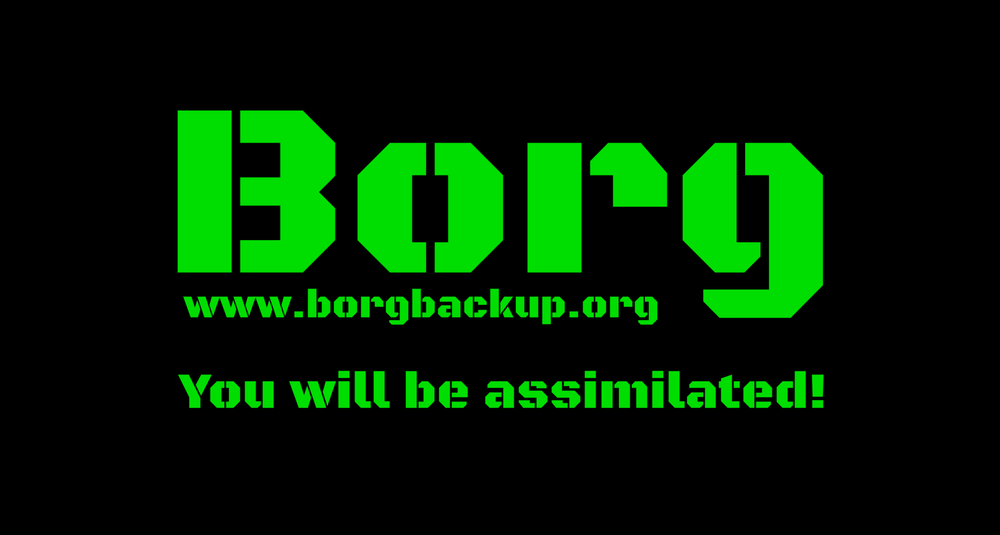

# Borg sticker

This is the design source for the BorgBackup laptop sticker (design "C" in
[borgbackup/borg#1902](https://github.com/borgbackup/borg/issues/1902)).

Design by [@klawdhfzasjhaa](https://github.com/klawdhfzasjhaa), thank you!

## Files

- `borg-sticker.xcf`: GIMP source, 8000 x 4280 px, layers:
  - black background
  - "Borg"
  - "www.borgbackup.org"
  - "You will be assimilated!"

  All text layers are editable GIMP text layers.
- `borg-sticker.png`: preview, rendered from the XCF.

## Design

- Font: Black Ops One (SIL Open Font License 1.1), the same font as the borg logo, see
  `docs/_static/logo_font.txt`. Install it before editing the text layers.
- Colours: green `#00DD00` on black.
- Shape: rectangular. The "You will be assimilated!" line sits below the logo and URL, so
  people can cut it off and still have a complete sticker. Hiding that layer gives the
  variant without the motto (design "B" in the ticket).

## Printing

- Print shops usually want CMYK. `#00DD00` is outside the CMYK gamut and will print as a
  duller green; a mix like C 61 / M 0 / Y 100 / K 0 comes reasonably close.
- Use a rich (4-colour) black for the background to get maximum contrast.
- A7 landscape (105 x 74 mm) is a good laptop sticker size; A8 is too small.
- Check the shop's artwork requirements (bleed, safety margin, resolution) and adjust the
  canvas and margins accordingly before exporting the print file.
